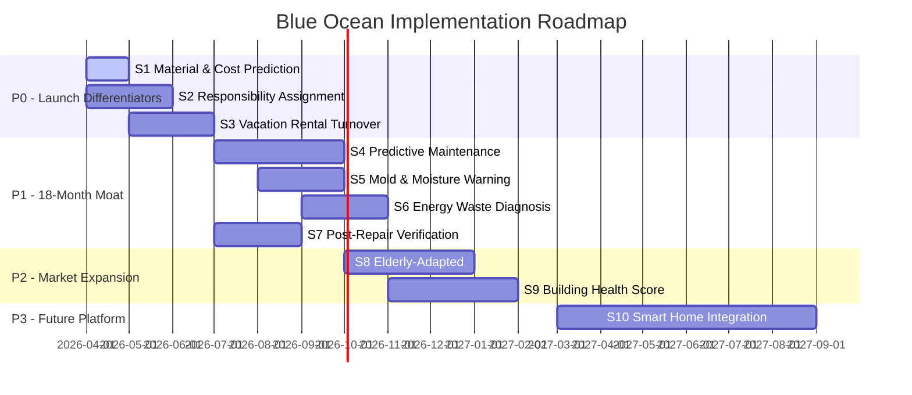

# House Maint AI — Blue Ocean: AI-Unpopularized × Commercially Validated Scenarios

**Date:** 2026-03-08  
**Framework:** Incremental Demand in Incremental Markets (增量市场 × 增量需求)  
**Purpose:** Identify areas where AI has **not yet been popularized** in Chinese property maintenance, but where the demand is **commercially validated** in adjacent markets — creating defensible blue ocean opportunities.

---

## Methodology

Each scenario is scored on two axes:

| Axis | Definition |
|---|---|
| **AI Unpopularized** (1-5) | How little AI penetration exists in this specific scenario in China today. 5 = nobody doing it |
| **Commercially Validated** (1-5) | How proven the demand is in adjacent markets (US, other verticals, or traditional Chinese methods). 5 = revenue already flowing |

> [!TIP]
> **Sweet spot: scenarios scoring ≥4 on BOTH axes.** These are the "incremental demand in incremental market" plays — real money in places AI hasn't reached yet.

---

## Scenario Map

```
                    ┌─────────────────────────────────────────────────┐
  Commercially      │                                                 │
  Validated    5    │  ★S1  ★S2  ★S3                                  │
               4    │  ★S4  ★S5  ★S6  ★S7                            │
               3    │       ★S8  ★S9                                  │
               2    │            ★S10                                  │
               1    │                                                 │
                    └─────────────────────────────────────────────────┘
                         1     2     3     4     5
                              AI Unpopularized →
```

---

## ★ S1 — AI Pre-Repair Material & Cost Prediction (材料清单 + 预估报价)

| AI Unpopularized | Commercially Validated | Priority |
|---|---|---|
| 5 — No Chinese player does photo→BOM→price | 5 — Servwizee proved "virtual quoting" eliminates $150/trip free estimates in US | **🔴 P0** |

### The Gap
Workers (师傅) currently bring wrong parts 30-40% of the time, requiring a second trip. No Chinese platform generates a materials BOM (Bill of Materials) from a photo. Existing platforms like 58同城 and Meituan Home Services show only flat rate or "quote on site."

### The Opportunity
- **AI ingests photo** → identifies brand/model of appliance and damage type → generates:
  - Part list with Taobao/JD links and prices
  - Estimated repair cost range (¥xxx–¥xxx)
  - Suggested tools needed
- **Worker receives** a pre-filled material checklist before accepting the job
- **Tenant sees** transparent pricing before dispatch — builds trust

### Commercial Validation
- Servwizee (US) charges contractors for AI-structured leads with pre-quotes
- Thumbtack's "Instant Estimate" algorithm drives premium lead pricing
- 闲鱼 repair listings show that price transparency is the #1 user complaint

### Implementation in House Maint AI
- **Already have:** `solutionGeneration()` in `ai.ts`, `extractRepairPattern()` with `parts_spec` field
- **Gap:** No BOM generation agent, no Chinese-localized price DB, no Taobao SKU matching

---

## ★ S2 — AI Responsibility Assignment (责任判定: 房东 vs 租户)

| AI Unpopularized | Commercially Validated | Priority |
|---|---|---|
| 5 — No Chinese platform does photo-based fault attribution | 5 — Quaala proved this is the #1 value driver for US property managers | **🔴 P0** |

### The Gap
Disputes between landlords and tenants over who caused the damage (natural wear vs. tenant negligence) cause enormous friction. This is resolved manually via arguments, WeChat voice messages, or in-person inspections. Zero AI solutions exist in China.

### The Opportunity
- **AI analyzes** damage photos and tenant-reported timeline
- **Outputs:** "Normal Wear and Tear" (房东责任) vs. "Tenant-Caused Damage" (租户责任) with confidence score and evidence explanation
- **Property managers** get automated dispute resolution → fewer lawsuits, faster deposit settlements
- **Absentee Sanya landlords** get remote fault attribution without flying to inspect

### Commercial Validation
- Quaala: responsibility assignment is the single most requested PM feature
- Chinese rental deposit disputes: 30%+ of all small claims cases in Chinese courts involve rental deposit conflicts (Beijing Court data)
- Insurance companies pay for this data in US/UK markets

### Implementation in House Maint AI
- **Already have:** `diagnosisAgent` with severity and category classification
- **Gap:** No fault attribution model, no wear-vs-damage training data, no legal standard mapping

---

## ★ S3 — Sanya Vacation Rental Turnover AI (度假房交接 AI)

| AI Unpopularized | Commercially Validated | Priority |
|---|---|---|
| 5 — Zero AI solutions for rental property condition logging in China | 5 — Airbnb, Booking, Tujia all face ¥billions in damage dispute costs | **🔴 P0** |

### The Gap
Sanya's economy runs on vacation rentals (度假短租). After each guest checkout, condition checks are done by cleaning staff with zero documentation. When damage is discovered, there's no evidence to charge the guest. Airbnb/Tujia host forums are full of complaints about this.

### The Opportunity
- **Pre/post-checkout AI scan:** Staff takes photos at check-in and checkout
- AI **diff-compares** condition between sessions, flags new damage automatically
- Generates a **damage report** with timestamped evidence for the booking platform's dispute system
- PM dashboard shows **maintenance cost per property per year** trends

### Commercial Validation
- Tujia (途家): China's largest vacation rental platform; hosts manage 1M+ properties
- Sanya has ~40,000 vacation rental units — highest density in China
- US: Properly, Breezeway, and TurnoverBnB already charge $15-30/month for turnover management

### Implementation in House Maint AI
- **Already have:** Photo upload, AI vision diagnosis, PIPL face blurring
- **Gap:** No before/after comparison agent, no integration with Tujia/Airbnb APIs, no batch property scanning UI

---

## ★ S4 — Predictive Maintenance via Usage Patterns (基于使用数据的预测性维修)

| AI Unpopularized | Commercially Validated | Priority |
|---|---|---|
| 4 — Exists for industrial HVAC, zero penetration in residential China | 5 — BrainBox AI, Conservation Labs prove 40% reduction in emergency repairs | **🟡 P1** |

### The Gap
Chinese residential buildings use the same hot water heaters, air conditioners (Gree/Midea), and plumbing fixtures for 15-20 years. Failures are 100% reactive — nothing predicts them. Industrial predictive maintenance AI is mature, but **nobody applies it to residential apartments.**

### The Opportunity
- Track **repair history patterns** across buildings: "Unit 12B's Midea AC fails every 18 months → schedule proactive service at month 16"
- AI learns from **all completed repairs** in the pattern database (already have `patterns` table!) to predict failure curves by equipment type × climate × age
- **Sanya amplifier:** tropical humid + salt-air corrosion = accelerated equipment decay = higher prediction accuracy

### Commercial Validation
- BrainBox AI: $120M raised, reduces HVAC failures 40% in commercial buildings
- Conservation Labs: IoT + AI water monitoring for multifamily, $2-3/unit/month pricing
- China: Gree and Midea both sell IoT-connected AC units with zero predictive maintenance layer

### Implementation in House Maint AI
- **Already have:** `learningService.evaluatePerformance()`, `patterns` table, repair history
- **Gap:** No failure-curve prediction model, no equipment age tracking, no time-series analysis

---

## ★ S5 — Mold & Moisture AI Early Warning (霉菌/潮湿预警 AI)

| AI Unpopularized | Commercially Validated | Priority |
|---|---|---|
| 4 — Emerging in US commercial spaces, zero in Chinese residential | 4 — Mold remediation is ¥5,000-50,000/incident; prevention = massive savings | **🟡 P1** |

### The Gap
Sanya's average humidity is 80%+. Mold is the #1 chronic property damage issue, causing both health problems and structural decay. Currently discovered only when visible, by which time remediation costs 10x prevention.

### The Opportunity
- **Photo-based mold risk scoring:** tenant uploads photo of wall/ceiling → AI detects early moisture staining, paint bubbling, discoloration that precedes visible mold
- **Climate-correlated alerts:** "Sanya enters rainy season next week + your unit is north-facing ground floor → 85% mold probability → open windows 2h/day"
- Integration with Sanya weather API for predictive warnings per property orientation

### Commercial Validation
- US: mold-related insurance claims average $30,000-$100,000
- China: mold remediation services on 58同城 average ¥8,000-15,000 per room
- Infrared camera mold detection: commercially available but never combined with AI scheduling

### Implementation in House Maint AI
- **Already have:** Gemini Vision diagnosis, `MaintenanceAuditSkill` for proactive checks
- **Gap:** No mold-specific CV model, no climate/humidity correlation engine, no orientation-based risk modeling

---

## ★ S6 — AI Energy Waste Diagnosis (用能诊断 AI)

| AI Unpopularized | Commercially Validated | Priority |
|---|---|---|
| 4 — Exists for commercial buildings only; zero residential deployment in China | 4 — 20-40% energy savings validated by Verdigris, Verde Solutions | **🟡 P1** |

### The Gap
Chinese residential buildings waste 20-40% of electricity due to poorly maintained HVAC, old window seals, and improper insulation. Energy audits exist for commercial buildings but **zero** consumer-facing AI energy diagnosis tools exist in China. Residents pay ¥200-800/month electricity with no understanding of waste sources.

### The Opportunity
- Tenant takes **photo of electricity bill + living space** → AI identifies:
  - "Your Gree AC is 12 years old, consuming 40% more than equivalent new unit"
  - "Window seal deterioration visible in photo → estimated ¥300/year heat loss"
  - "Water heater running 24/7 → switch to timer mode, save ¥50/month"
- PM dashboard: **building-wide energy efficiency score** → selling point for green-minded owners

### Commercial Validation
- Verdigris Technologies: AI energy monitoring for commercial buildings, funded $10M+
- China carbon-neutral mandates: government subsidies for energy-efficient building upgrades
- Electricity prices rising 5-8% YoY in Hainan → energy savings sell themselves

### Implementation in House Maint AI
- **Already have:** Photo diagnosis pipeline, multilingual (EN/ZH) prompts
- **Gap:** No energy-specific diagnosis prompts, no utility bill OCR, no appliance efficiency database

---

## ★ S7 — Post-Repair Quality Verification AI (维修质量 AI 验收)

| AI Unpopularized | Commercially Validated | Priority |
|---|---|---|
| 4 — No Chinese platform verifies repair quality via AI | 4 — First-time fix rate is the #1 worker quality metric globally | **🟡 P1** |

### The Gap
After a 师傅 completes a repair, verification is entirely trust-based. The tenant has no expertise to know if the repair was done properly. 30% of repairs fail within 90 days. No platform verifies quality.

### The Opportunity
- Worker submits **post-repair photo** → AI compares against pre-repair state and repair standards
- AI flags: "Pipe joint needs Teflon tape — not visible in photo" or "Sealant inadequately applied"
- **Quality score** feeds back into worker ranking algorithm → better workers get more jobs
- **Warranty trigger:** if AI detects substandard repair, system auto-flags for PM review

### Commercial Validation
- First-time fix rate (FTFR ≥ 70%) is a P0 launch criterion in our own OKRs
- Construction quality inspection: AI adoption growing 30% YoY in China commercial sector
- Our existing `matchingService` weights worker rating at 30% — quality verification feeds this

### Implementation in House Maint AI
- **Already have:** `learning.ts` processes completed reports, `patterns` table, worker rating system
- **Gap:** No before/after photo comparison agent, no repair standards database, no quality scoring model

---

## ★ S8 — Elderly-Adapted Maintenance (适老化维修 AI)

| AI Unpopularized | Commercially Validated | Priority |
|---|---|---|
| 3 — Some smart home for elderly exists, but not maintenance-specific | 4 — China's 200M+ elderly population, government pushing aging-in-place | **🟢 P2** |

### The Gap
China has 200+ million people over 60. Government policy is shifting from institutional care to aging-in-place (居家养老). But no platform helps elderly residents navigate home maintenance issues — existing apps require smartphone fluency and typing.

### The Opportunity
- **Voice-first maintenance reporting:** Elderly resident speaks in local dialect → AI converts to structured maintenance ticket
- **Simplified UI / large text:** Family members receive notification and can monitor remotely
- **Safety-critical prioritization:** AI auto-escalates gas leaks, electrical hazards, fall risk items (loose tiles, broken handrails)
- **Remote family dashboard:** Adult children in other cities get alerts about parents' home issues

### Commercial Validation
- China "9073" policy: 90% elderly age at home → massive government spending on home adaptation
- Smart home for elderly: ¥50B market in China by 2027 (CITIC Securities)
- Voice-based AI assistants: 40M+ smart speakers sold in China 2025

---

## ★ S9 — Building Health Score (房屋体检 AI)

| AI Unpopularized | Commercially Validated | Priority |
|---|---|---|
| 4 — AI building inspections emerging in US commercial, zero in China residential | 3 — Home inspections are a ¥20B industry in China but 100% manual | **🟢 P2** |

### The Gap
In China, pre-purchase home inspections (验房) are done manually by inspectors charging ¥500-2,000. Post-purchase, there's zero ongoing monitoring. No platform provides a continuous "health score" for a residential unit.

### The Opportunity
- Every repair, photo, and AI diagnosis in our system contributes to a **rolling health score per property**
- Score degrades over time without maintenance → nudge landlords to invest
- **PM selling tool:** "Your building's AI Health Score is 72/100 — here's a ¥15,000 preventive plan to reach 90"
- Score becomes a **data asset** tradeable to insurance companies, real estate platforms, and lenders

### Commercial Validation
- Inspectify (US): AI-powered home inspections, funded $10M+
- China home inspection: 100%+ growth in tier-1 cities 2024-2025
- Insurance companies in US/EU already price policies based on property condition data

---

## ★ S10 — Cross-Brand Smart Home Integration Layer (跨品牌智能家居维修)

| AI Unpopularized | Commercially Validated | Priority |
|---|---|---|
| 5 — Smart home ecosystem island problem unsolved in China | 2 — Market fragmented; no single platform dominates | **🟢 P3 (Future)** |

### The Gap
Xiaomi, Huawei, Haier, and Midea each have closed smart home ecosystems. A typical Sanya apartment might have a Xiaomi door lock, Midea AC, Haier washing machine, and Huawei camera — none of which talk to each other for maintenance purposes.

### The Opportunity (v2.0+)
- Become the **maintenance integration layer** that sits above all ecosystems
- When Midea AC sends error code E5 → AI translates to maintenance ticket automatically
- When Xiaomi water sensor triggers → AI creates ticket, dispatches worker, notifies owner — all pre-existing tenant action

### Commercial Validation
- Matter/Thread protocol: industry standard emerging but adoption slow in China
- China smart home market: ¥607B by 2027 (IDC), but 60% of users report "island effect" frustration

---

## Priority Roadmap



---

## How This Strengthens the VC Story

| VC Stress Test Weakness | How Blue Ocean Fixes It |
|---|---|
| "Just a Gemini wrapper" | S1 + S2 + S7 create **proprietary data moats** — repair patterns, fault attribution data, and quality scores that improve with every job |
| "2x improvement, not 10x" | S3 (vacation rental turnover) is **10x** — from "argue about damage for 2 weeks" to "AI generates evidence report in 30 seconds" |
| "No switching costs" | S4 + S9 (predictive + health score) create **historical data lock-in** — switching platforms means losing years of property health history |
| "Low-frequency use" | S5 + S6 (mold/energy) create **proactive engagement** — monthly alerts keep users active even without breakdowns |
| "What if Meituan copies you" | S2 + S3 are **domain-specific** features requiring deep property law and Sanya climate knowledge; Meituan's horizontal model can't prioritize vertical depth |

---

## Key Insight: The Sanya Amplifier

> [!IMPORTANT]
> Sanya is not just a "beachhead" — it's a **scenario factory**. Its unique characteristics naturally generate every blue ocean scenario:
> - **Salt air corrosion** → accelerated equipment failure → S4 predictive maintenance data is richer
> - **80%+ humidity** → mold is chronic → S5 has built-in demand
> - **Vacation rental capital** → S3 has a massive local TAM (40,000 units)
> - **Absentee owners** → S2 responsibility assignment + S9 building health score are essential, not nice-to-have
> - **Elderly snowbirds** (候鸟老人) → S8 has a unique demographic intersection
>
> **Each scenario reinforces the others. Together, they make the Sanya operation a moat that scales to other coastal cities (Zhuhai, Xiamen, Qingdao) with identical conditions.**
