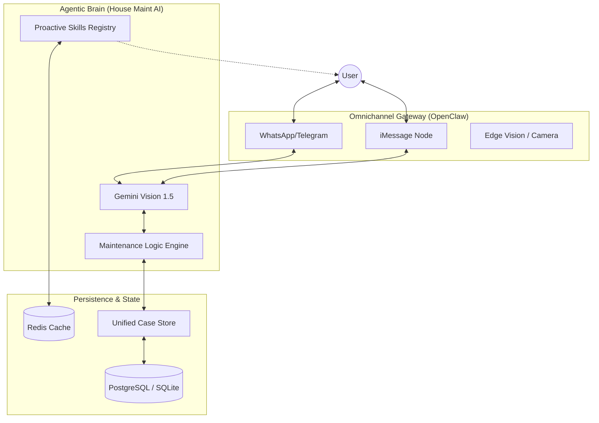

# 🏗️ House Maint AI — Fusion Architecture

This document outlines the architectural fusion between **House Maint AI** and the **OpenClaw** framework, transforming the system from a web-based tool into an ambient agentic assistant.

## 1. High-Level Concept

The architecture moves from a traditional Client-Server model to a **Gateway-Agent-Hub** model.

## 2. Key Components

### 2.1 Omnichannel Gateway
Drawing on OpenClaw's messaging gateway, interactions are decoupled from the React UI. A message received on Telegram is parsed by the same Gemini-powered brain that powers the `DiagnosisWizard`.

### 2.2 Edge Vision Integration
Unlike traditional web-based file uploads, the Gateway protocol allows for **direct device-to-AI streams**. 
- **iOS Node:** Utilizes the camera API for high-resolution maintenance photos.
- **Context Awareness:** The AI knows the device location and timestamp, adding metadata to reported maintenance issues automatically.

### 2.3 Proactive Skills Registry
Located in `src/skills`, this registry contains background tasks that execute on cron schedules (utilizing OpenClaw's wakeup system).
- **Audit Skill:** Periodically checks `localStorage`/DB for recurring maintenance (filters, inspections).
- **Notification Skill:** Pushes urgent alerts to the user's phone via the Gateway.

### 2.4 Hybrid Control Plane
- **Global:** Express API, PostgreSQL, and OpenClaw Cloud Gateway for remote orchestration.
- **Local:** A `Gateway` daemon running on the user's home network for low-latency device interaction and private data processing.

## 3. Data Flow: An Example

1. **Trigger:** A user texts "Sink is leaking" on WhatsApp.
2. **Analysis:** The Gateway routes the text to an AI Agent.
3. **Reasoning:** The Agent calls `Gemini` to ask for a photo.
4. **Input:** User snaps and sends a photo.
5. **Diagnosis:** `Gemini Vision` identifies a faulty P-TRAP.
6. **Execution:** An entry is added to `SharedCaseStore`.
7. **Confirmation:** User receives a repair guide link and a matching worker recommendation—all within the WhatsApp thread.

---

## 4. Security & Privacy
Following the OpenClaw security model:
- **Local First:** Sensitive device data stays local unless explicitly shared with the AI.
- **JWT Bounded:** All gateway-to-backend communication is authenticated via the same production-ready JWT system used by the React frontend.
