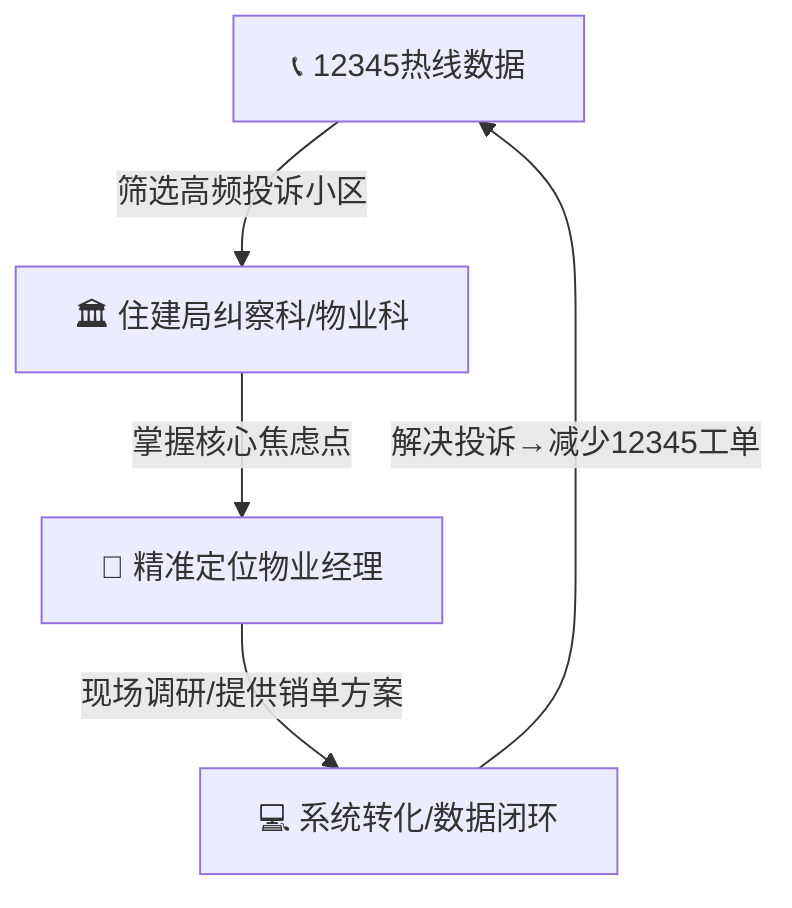

# 物业经理拜访方案 (Property Manager Interview Playbook)

> **目标**: 拜访3个小区物业经理，提取核心痛点，录入 `knowledge_entries`
> **耗时**: 每次拜访 40-60 分钟 | **预计3天完成** (每天1个)

---

## 〇、数据驱动精准获客 (Data-Driven Targeting)

> 🧠 **核心逻辑**: 不盲目扫楼，用政府数据锁定"最痛"的小区



### Step 1: 获取12345热线数据

| 渠道 | 方法 | 获取什么 |
|---|---|---|
| **12345市民热线** | 以"研究者/创业者"身份申请数据脱敏报告 | 各小区投诉频次排名 |
| **三亚住建局网站** | 查公开的物业考核/通报名单 | 被点名的物业公司 |
| **人民网领导留言板** | 搜索"三亚 物业 维修" | 具体小区+具体问题 |
| **小红书/抖音** | 搜"三亚 物业 投诉" | 业主真实吐槽 |

**你要找的关键指标:**
```
投诉关键词频率:
  "维修不及时"   → 调度问题 → AI派工切入
  "乱收费"       → 报价问题 → AI BOM切入
  "修不好/返工"  → 质量问题 → AI诊断切入
  "找不到人/不回复" → 沟通问题 → AI客服切入
```

### Step 2: 住建局关系建立

**拜访住建局物业科/纠察科的话术:**
```
"您好，我是本地创业者，正在做一个帮物业公司
提升维修响应效率的AI工具。想了解一下咱们三亚
物业维修投诉的主要集中在哪些方面？哪些小区
投诉比较集中？我们想先帮这些小区试点解决问题。"
```

**你从住建局得到的核心情报:**
- 📋 投诉量TOP小区清单 → **你的第一批客户名单**
- 😰 物业经理最怕什么 → **你的销售切入点**
- 📜 物业考核标准 → **你的产品要解决的KPI**

### Step 3: 精准定位物业经理

现在你不是"冷拜访"，你是带着**解决方案**去的：

```
"X经理您好，我了解到咱们小区去年12345维修类投诉
有XX起，住建局那边也关注了。我们有个工具能帮您
把维修响应时间从X小时缩短到30分钟，直接减少
12345的投诉量。免费试用一个月，不好用随时停。"
```

**为什么这招有效:**
- 物业经理最怕的就是12345投诉 → 影响考核 → 影响收入
- 你不是在"推销产品"，你是在"帮他消灾"
- 有住建局的信息背书，可信度直接拉满

### Step 4: 数据闭环

```
解决维修投诉 → 12345工单减少 → 住建局认可 → 更多物业公司找你
     ↑                                              ↓
     └──────── Hasiki系统积累数据，服务越来越好 ←───┘
```

---

## 一、拜访前准备 (Before You Go)

### 选择3个不同类型的小区 (从12345数据中筛选)

| # | 小区类型 | 选择原因 | 痛点差异 |
|---|---|---|---|
| 🏢 A | **老旧小区** (15-25年) | 维修频率最高，AI价值最大 | 管道老化、电路过载 |
| 🏙️ B | **中高档公寓** (5-10年) | 业主付费能力强，客单价高 | 智能家居、中央空调 |
| 🏖️ C | **民宿/度假物业** | 三亚特色市场，季节性强 | 短租交接、台风损坏 |

### 你的身份定位

**不要说** "我是做APP的" ← 物业经理会立刻防备
**要说** → "我在研究本地物业维修的效率提升方案，想听听您在一线的经验"

### 随身携带

```
□ 手机（录音 + 拍照）
□ 一盒好茶/水果（¥50-80，不要太贵也不要太便宜）
□ 名片（如果有）
□ 这份问题清单（打印或手机备忘录）
```

---

## 二、问题清单 (40分钟结构化访谈)

### 第一阶段：暖场 (5分钟) — 不要直接问问题

```
"X经理，这个小区管了多少户？您管了几年了？"
"每天最忙的是哪个时间段？"
```

🎯 **目的**: 建立信任 + 判断小区规模
📊 **数据**: → `knowledge_entries.category = 'market_intelligence'`

---

### 第二阶段：痛点挖掘 (15分钟) — 核心问题

#### 2.1 报修流程痛点

| 问题 | 你在听什么 | 数据流向 |
|---|---|---|
| "业主报修一般通过什么方式？电话？微信群？物业APP？" | 数字化真空度 | → `digital_vacuum` |
| "从报修到师傅上门，一般要多久？" | 响应时间基线 | → `failure_patterns` |
| "一个月大概有多少报修单？" | 需求量/频率 | → `knowledge_entries` |
| "最让您头疼的报修类型是什么？" | **核心痛点** | → `pain_points` |
| "有没有那种反复维修、修不好的情况？" | 返工率/质量 | → `failure_patterns` |

#### 2.2 师傅管理痛点

| 问题 | 你在听什么 | 数据流向 |
|---|---|---|
| "您现在用的维修师傅是固定的还是临时找的？" | 供给模式 | → `knowledge_entries` |
| "找师傅最困难的是什么？" | 调度痛点 | → `pain_points` |
| "师傅报价准不准？有没有乱报价的情况？" | 价格信任度 | → `materialPriceObservations` |
| "业主投诉最多的是什么？" | **终端用户痛点** | → `pain_points` |
| "旺季（冬季）师傅够用吗？" | 供需失衡 | → `knowledge_entries` |

#### 2.3 成本与效率

| 问题 | 你在听什么 | 数据流向 |
|---|---|---|
| "您平时花多少时间在协调维修这件事上？" | **手工工时** | → `digital_vacuum` |
| "修一次空调/水管一般多少钱？" | 真实价格基线 | → `materialPriceObservations` |
| "有没有用过58同城、万师傅这类平台？感觉怎么样？" | 竞品认知 | → `knowledge_entries` |
| "如果有个工具能帮您自动派单、追踪进度，您愿意试吗？" | 购买意愿 | → `go_no_go` |

---

### 第三阶段：深入追问 (10分钟) — 根据回答追问

#### 如果他说"师傅不来/不靠谱"：
```
追问：
- "不来的时候您怎么处理的？"
- "有没有因为师傅不来导致业主投诉的？"
- "如果有个系统能保证30分钟内有师傅响应，您觉得值多少钱/月？"
```
🎯 → 验证假设：调度自动化是10X切入点

#### 如果他说"报价不透明"：
```
追问：
- "业主一般怎么判断价格是否合理？"
- "您有没有被师傅坑过？怎么坑的？"
- "如果每次维修前就能看到材料明细和价格，有用吗？"
```
🎯 → 验证假设：BOM透明定价打破信息不对称

#### 如果他说"维修质量差/返工多"：
```
追问：
- "返工一般是什么原因？诊断错了还是技术不行？"
- "有没有让业主先拍个照片，远程判断一下问题的？"
- "如果AI能通过照片预判问题类型和需要的材料，有用吗？"
```
🎯 → 验证假设：AI诊断降低返工率

---

### 第四阶段：收尾+埋钩子 (10分钟)

```
"非常感谢X经理的时间。我正好在做一个维修效率的小工具，
下周能让您试一下吗？完全免费，就是帮您记录维修单、自动派师傅。
如果好用，您继续用；不好用，一分钱不花。"
```

**关键动作：**
- 📱 加微信（必须）
- 📋 问能否拍几张公共区域需要维修的照片（喂给AI学习）
- 🤝 约下周再来一次（带着产品Demo）

---

## 三、拜访后录入 (15分钟/每次)

### 回来后立刻做:

```
1. 听录音，提取关键词和数字
2. 按下面模板发给我（微信/直接贴在这里）
3. 我帮你录入系统
```

### 录入模板

```
=== 拜访记录 #X ===
日期: 2026-03-__
小区名: ________
小区类型: 老旧/中高档/民宿
楼龄: __年
户数: __户
物业经理: __ (姓或称呼)

== 数字 ==
月报修量: __单
平均响应时间: __小时
维修费均价: ¥__
手工协调时间: __小时/天
返工率(估): __%

== 痛点排名 (经理自己说的，按严重程度) ==
1. _______________
2. _______________
3. _______________

== 师傅情况 ==
固定师傅数: __人
临时找人频率: 经常/偶尔/几乎不
报价满意度: 满意/一般/不满意

== 竞品认知 ==
用过什么平台: ___________
对平台评价: ___________

== 购买意愿 ==
愿意试用免费工具: 是/否
愿意付费(如果好用): 是/否/看价格
可接受月费: ¥__

== 黄金语录 (原话记下来) ==
"____________________________"
"____________________________"

== 可拍照的维修需求 ==
□ 是，拍了__张 (什么问题)
□ 没机会拍
```

---

## 四、3次拜访后的分析框架

完成3次拜访后，我会帮你做交叉分析：

```
                    老旧小区    中高档      民宿
痛点#1              ________    ________    ________
痛点#2              ________    ________    ________
月报修量            ________    ________    ________
响应时间            ________    ________    ________
付费意愿            ________    ________    ________
AI切入点            ________    ________    ________
```

这个矩阵直接告诉你：**先打哪个市场，用什么功能切入。**

---

## 五、风险与应对

| 风险 | 应对 |
|---|---|
| 物业经理不愿意见你 | 说"只占您10分钟"，带茶/水果 |
| 他说"我们有合作的维修公司了" | "那您觉得他们哪里可以更好？" (转化为竞品情报) |
| 他对AI/技术完全不感兴趣 | 不提AI，只说"帮您省时间的小工具" |
| 他要求立刻看产品 | 给他看Dashboard截图，说"下周带完整版来" |
| 录音不方便 | 用笔记速记关键词+数字，拜访后立刻补录 |
