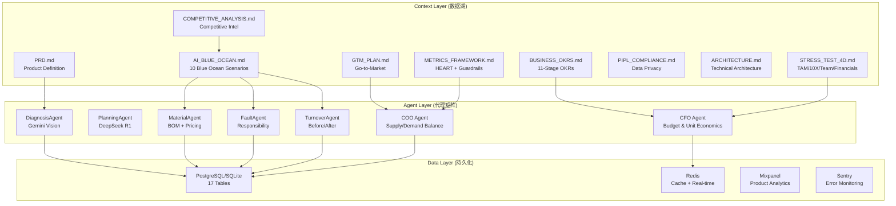

# House Maint AI — Master Strategy (企业数字孪生总控)

**Date:** 2026-03-08  
**Status:** Stage 1-2 (Testing Hypothesis → Proving Value)  
**Paradigm:** Enterprise Digital Twin — 可编程的生命体

---

## 🧬 The Digital Twin Architecture



---

## 📊 Strategy Document Map

### Dimension 1: TAM (天花板 / Ceiling)
| Document | Purpose | Key Metric |
|---|---|---|
| [PRD.md](file:///c:/Users/高杰/house-maint-ai/PRD.md) | Product definition, market sizing | TAM: ¥600B-1.5T |
| [AI_BLUE_OCEAN.md](file:///c:/Users/高杰/house-maint-ai/AI_BLUE_OCEAN.md) | 10 AI-unpopularized scenarios | AI-expanded TAM: ¥913B |
| [USER_PERSONAS.md](file:///c:/Users/高杰/house-maint-ai/USER_PERSONAS.md) | 3 core personas | Tenant / PM / 师傅 |
| [COMPETITIVE_ANALYSIS.md](file:///c:/Users/高杰/house-maint-ai/COMPETITIVE_ANALYSIS.md) | Quaala, Servwizee, Thumbtack, Angi, Property Meld | 18-month moat window |

### Dimension 2: 10X (斜率 / Slope)
| Document | Purpose | Key Metric |
|---|---|---|
| [STRESS_TEST_4D.md](file:///c:/Users/高杰/house-maint-ai/STRESS_TEST_4D.md) | 4D stress test (TAM/10X/Team/Financials) | Score: 7.3/10 |
| [ARCHITECTURE.md](file:///c:/Users/高杰/house-maint-ai/ARCHITECTURE.md) | Gateway-Agent-Hub architecture | Omnichannel ready |
| [PM_AUDIT.md](file:///c:/Users/高杰/house-maint-ai/PM_AUDIT.md) | Product management audit | Implementation gaps |

### Dimension 3: Team (地基 / Foundation)
| Document | Purpose | Key Metric |
|---|---|---|
| [PROJECT_RATING.md](file:///c:/Users/高杰/house-maint-ai/PROJECT_RATING.md) | Silicon Valley VC Audit v5 | Score: 8.5/10 |
| [VC_STRESS_TEST.md](file:///c:/Users/高杰/house-maint-ai/VC_STRESS_TEST.md) | Brutal investability audit | Score: 2.0 → 7.3 (post-pivot) |
| [STRATEGIC_OKR.md](file:///c:/Users/高杰/house-maint-ai/STRATEGIC_OKR.md) | Strategic objectives | Team gaps identified |

### Dimension 4: Financials (血条 / Health Bar)
| Document | Purpose | Key Metric |
|---|---|---|
| [GTM_PLAN.md](file:///c:/Users/高杰/house-maint-ai/GTM_PLAN.md) | Pricing, channels, messaging | ¥10/door/month SaaS |
| [METRICS_FRAMEWORK.md](file:///c:/Users/高杰/house-maint-ai/METRICS_FRAMEWORK.md) | HEART + North Star + Guardrails | TDR ≥ 20% |
| [PIPL_COMPLIANCE.md](file:///c:/Users/高杰/house-maint-ai/PIPL_COMPLIANCE.md) | Data privacy compliance | Zero PIPL breaches |
| [ROLLBACK_PLAN.md](file:///c:/Users/高杰/house-maint-ai/ROLLBACK_PLAN.md) | Disaster recovery | Recovery procedures |

---

## 🤖 Agent Registry (代理矩阵)

### Production Agents (Deployed)
| Agent | Model | Role | Cost/Call |
|---|---|---|---|
| `DiagnosisAgent` | Gemini 1.5 Flash | Photo → structured diagnosis (8-step MECE) | ¥0.02 |
| `PlanningAgent` | DeepSeek R1 | Diagnosis → repair plan + priority protocol | ¥0.05 |
| `LearningService` | Background | Extract patterns from completed repairs | ¥0.01 |
| `MatchingService` | Algorithmic | Worker matching (skill×rating×geo×speed) | ¥0 |

### New Agents (Building Now)
| Agent | Model | Role | Est. Cost/Call |
|---|---|---|---|
| `MaterialAgent` | Gemini Flash | Diagnosis → BOM + Taobao pricing | ¥0.08 |
| `FaultAgent` | Gemini Vision | Photos → landlord/tenant fault attribution | ¥0.10 |
| `TurnoverAgent` | Gemini Vision | Before/after photo comparison | ¥0.15 |
| `CFO Agent` | Algorithmic + Gemini | Budget monitoring, unit economics alerts | ¥0.01 |
| `COO Agent` | Algorithmic | Supply/demand rebalancing alerts | ¥0 |

---

## 🎯 Current Sprint: 90-Day Must-Win Battles

| # | Battle | KR Source | Deadline | Status |
|---|---|---|---|---|
| 1 | Recruit 30 beta tenants via QR stickers | KR1.1 | Apr 30 | ⬜ Not started |
| 2 | Reach 85% AI diagnostic accuracy | KR2.2 | May 30 | 🟡 Building |
| 3 | Achieve 20% ticket deflection rate | KR2.1 | May 30 | ⬜ Not started |
| 4 | Close 2 paying PM contracts | KR4.2 | Jun 14 | ⬜ Not started |
| 5 | Zero WeChat Pay settlement failures / 50 txns | KR5.3 | Jun 14 | ⬜ Not started |
| 6 | **Build S1 MaterialAgent** (10X play) | Blue Ocean | Mar 31 | 🔴 In progress |
| 7 | **Build S2 FaultAgent** (10X play) | Blue Ocean | Apr 7 | ⬜ Next |
| 8 | **Build S3 TurnoverAgent** (10X play) | Blue Ocean | Apr 15 | ⬜ Planned |

---

## ⚙️ Executable Business Rules (CORE_STRATEGY)

> [!CAUTION]
> **Human-in-the-Loop Gates:** All financial operations and major strategy pivots require manual `Approve Execution` before proceeding. Agents recommend; humans decide.

### Rule 1: Budget Auto-Stop
```
WHEN daily_ai_spend >= daily_budget * 0.8
  → CFO Agent triggers Sentry warning  
WHEN daily_ai_spend >= daily_budget
  → CFO Agent freezes non-essential AI endpoints
  → REQUIRES: Human approval to unfreeze
```
*Implementation: `aiUsageService.checkBudget()` — already built*

### Rule 2: Supply-Demand Rebalance
```
WHEN active_tickets / available_workers > 5:1 FOR 3 consecutive days
  → COO Agent alerts: "Worker shortage in [district]"
  → Auto-generate WeChat recruitment post for that district
  → REQUIRES: Human approval before posting
```
*Implementation: `getDashboardStats()` in analytics service*

### Rule 3: Accuracy Circuit Breaker
```
WHEN diagnosis_error_rate > 15% (misdiagnosis confirmed by worker)
  → Pause AI auto-triage
  → Revert to human-in-the-loop review for all diagnoses
  → Auto-create Sentry incident
```
*Implementation: `METRICS_FRAMEWORK.md` guardrail #1*

### Rule 4: Unit Economics Health Check
```
EVERY month_end:
  → CFO Agent calculates: (SaaS MRR + Commission) vs (Token cost + Server + Ops)
  → IF gross_margin < 50%: ALERT "Unit economics degrading"
  → IF gross_margin < 0%: EMERGENCY — freeze non-essential features
```

### Rule 5: CAC Watchdog
```
WHEN cac > ¥150 AND conversion_rate declining for 3 consecutive days
  → Auto-trigger churn-recovery campaign agent
  → Generate personalized WeChat template messages for at-risk PMs
  → REQUIRES: Human approval before sending
```

---

## 📈 10X Financial Transform: Fixed Costs → Variable Costs

| Traditional Team | Monthly Cost | AI-Native Equivalent | Monthly Cost | Savings |
|---|---|---|---|---|
| 3 Customer Service Reps | ¥36,000 | AI Diagnosis + DIY Deflection | ¥500 (tokens) | **98.6%** |
| 2 Dispatchers | ¥20,000 | MatchingService (algorithmic) | ¥0 | **100%** |
| 1 Price Analyst | ¥15,000 | MaterialAgent (BOM + pricing) | ¥200 (tokens) | **98.7%** |
| 1 Legal/Disputes | ¥15,000 | FaultAgent (attribution) | ¥300 (tokens) | **98.0%** |
| 1 Property Inspector | ¥12,000 | TurnoverAgent (photo diff) | ¥400 (tokens) | **96.7%** |
| **TOTAL** | **¥98,000/month** | **Agent Matrix** | **¥1,400/month** | **98.6%** |

> [!IMPORTANT]
> **The 10X Moat:** Competitors need ¥98K/month in staff to match our service level. We spend ¥1.4K in tokens. This means we can serve 70x more customers before hiring our first employee, OR undercut competitors by 90% on price. This is the "降维打击" — paradigm-level cost advantage.
