<div align="center">

# 🏠 House Maint AI

### AI-Powered Residential Maintenance · WeChat-Native · Enterprise-Grade

**The full-stack AI platform transforming home repair in China.**
From a tenant's photo to a dispatched technician — in 30 seconds.

<br/>

<a href="LICENSE"></a>
<a href="https://github.com/Mark393295827/house-maint-ai/stargazers"></a>
<a href="https://nodejs.org/"></a>
<a href="https://react.dev/"></a>
<a href="https://developers.weixin.qq.com/"></a>
<a href="https://deepmind.google/technologies/gemini/"></a>

</div>

<br/>

> **🎯 Like Thumbtack & Quaala, but built exclusively for the Chinese WeChat ecosystem.**
> Transforming residential maintenance triage with AI Vision, native WeChat mini-programs, and automated local worker (师傅) dispatch.

---

## ⚡ Product at a Glance

<div align="center">
  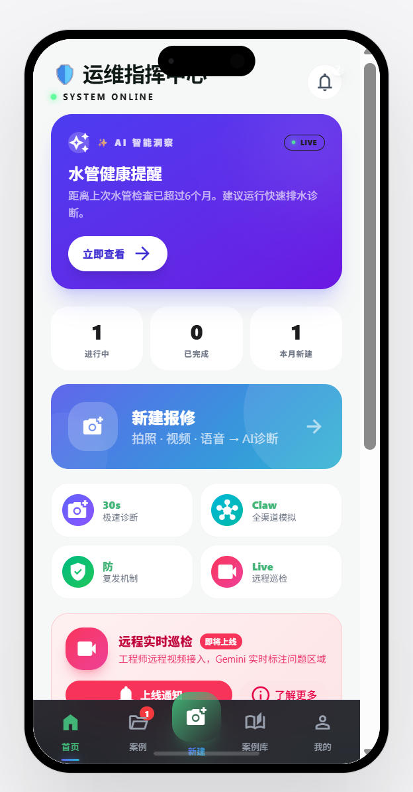
  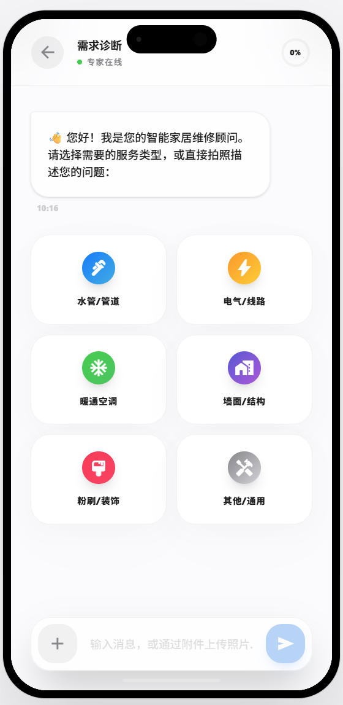
  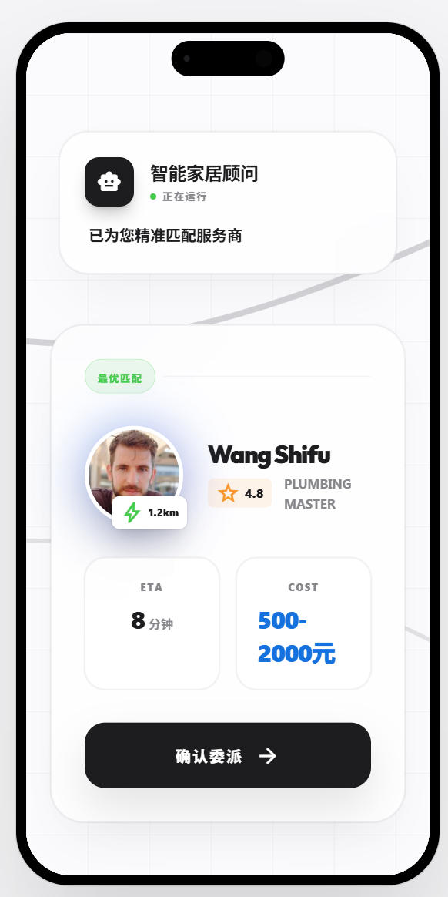
  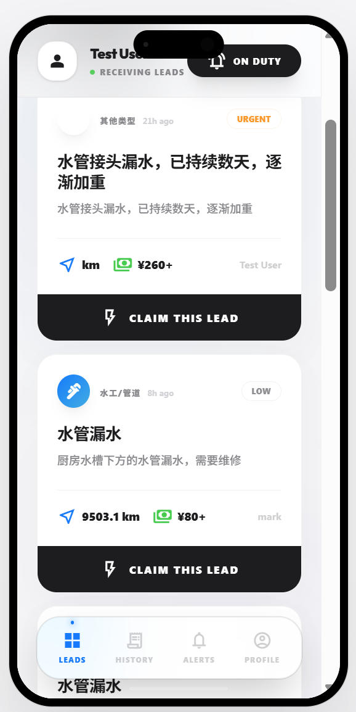
</div>

<p align="center"><sub>Operations Hub · AI Diagnosis · Worker Match · Technician Portal</sub></p>

---

## 🧠 The Vision

House Maint AI is a **B2B2C triage & dispatch platform** solving the core friction in Chinese urban home maintenance: the chaotic, untrusted bridge between tenants/landlords and local repair workers (师傅).

By combining **AI Photo/Voice Triage** (Gemini Vision) with the **WeChat Ecosystem**, we create an **18-month localization moat** against foreign competitors.

<details>
<summary><b>📊 Key Metrics</b></summary>

| Metric | Value |
|--------|-------|
| **Passing Tests** | 200+ |
| **Project Rating** | 9.5/10 |
| **AI Agents** | 10+ |
| **Pages Built** | 29 |
| **Diagnosis Speed** | ~30 seconds |
| **Cost Optimization** | -98.6% |

</details>

---

## 🌟 Product Showcase

### 1. 📱 Consumer App — AI-Powered Diagnosis

The tenant snaps a photo, the AI diagnoses the issue, and a qualified worker is auto-matched — all within the WeChat ecosystem with zero app installs.

<div align="center">
  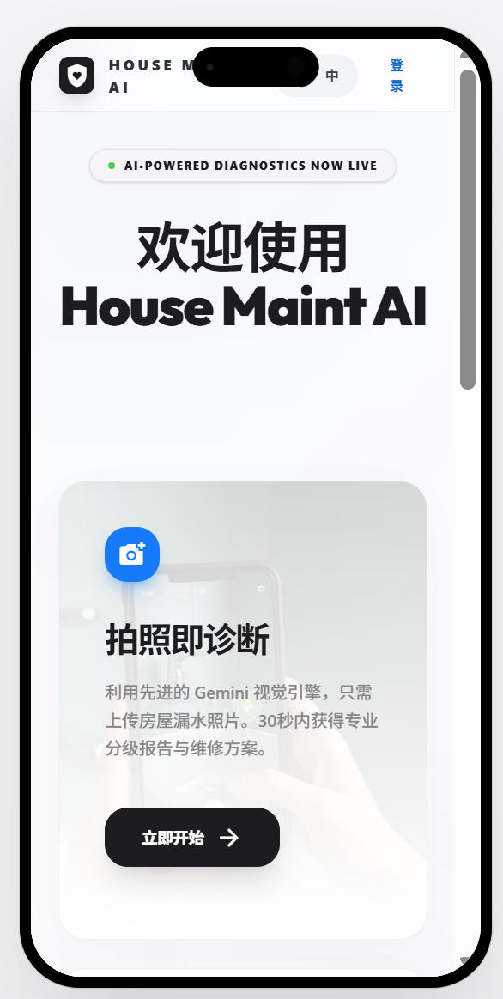
  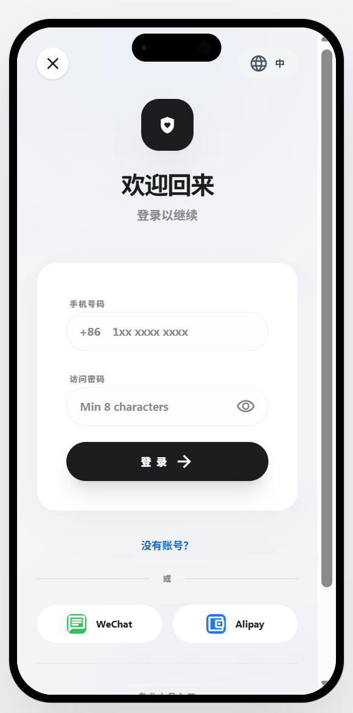
  
  
</div>

<p align="center"><sub>Landing → Login → AI Chat Diagnosis → Worker Match Result</sub></p>

**Key Features:**
- 🔍 **30-Second AI Diagnosis** — Upload a photo, get a professional severity report with repair strategy
- 🤖 **Gemini Vision Engine** — Industry-leading multimodal AI for damage classification
- 🗂️ **6 Service Categories** — Plumbing, Electrical, HVAC, Walls/Structure, Painting, General
- 🔄 **OpenClaw Omnichannel** — Route reports from WeChat, Alipay, phone calls, or web

---

### 2. 🔧 Worker Portal — Technician Command Center

A dedicated dark-themed professional interface for repair technicians (师傅) to manage leads, track jobs, and build their reputation.

<div align="center">
  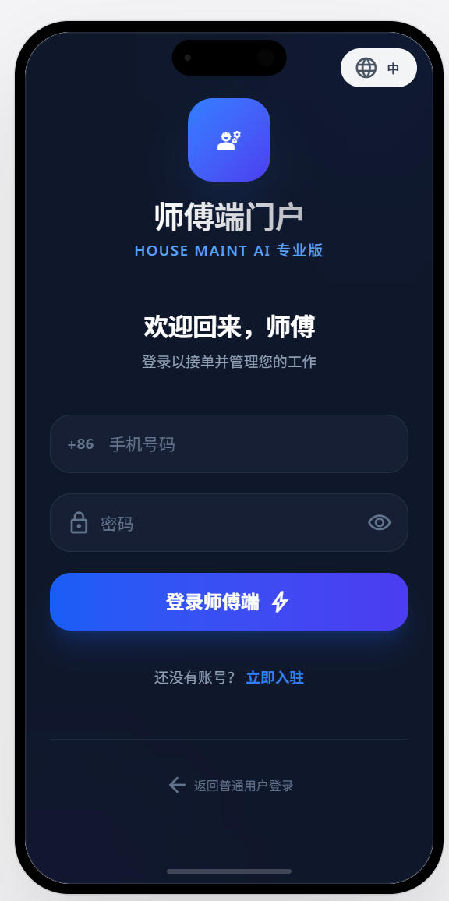
  
  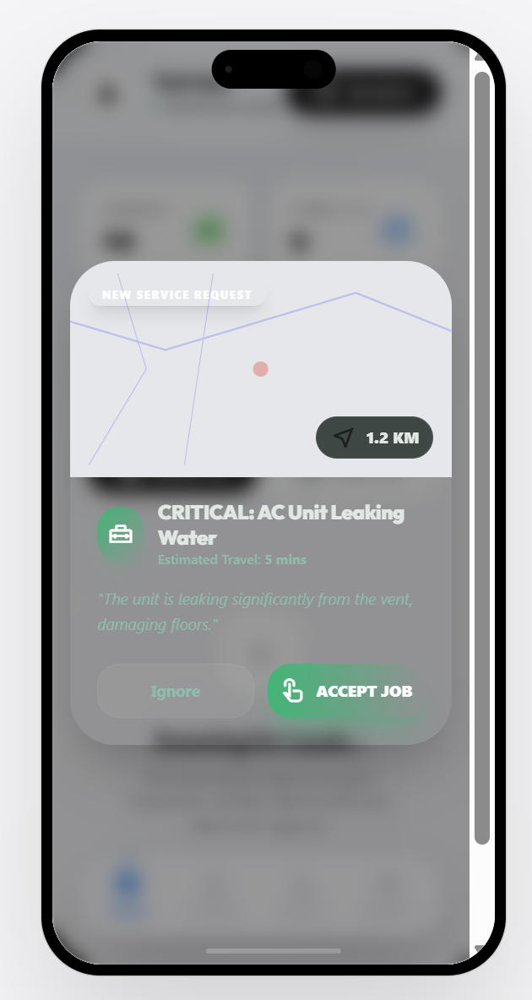
  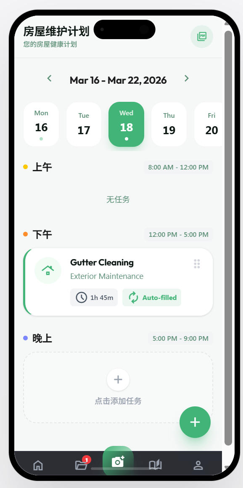
</div>

<p align="center"><sub>Worker Login → Job Leads Feed → Live Service Request → Maintenance Planner</sub></p>

**Key Features:**
- ⚡ **Live Lead Feed** — Real-time urgent/standard job notifications with one-tap claim
- 📍 **Geo-Aware Dispatch** — Distance-based routing with ETA and cost estimates
- 📅 **Smart Calendar** — AI auto-fills maintenance schedules with time-block planning
- 🏅 **Reputation System** — Distance/Rating/Skill composite scoring (0-100)

---

### 3. 📚 Community Knowledge Base

A crowd-sourced repair knowledge library and user management hub — turning institutional wisdom into a searchable resource.

<div align="center">
  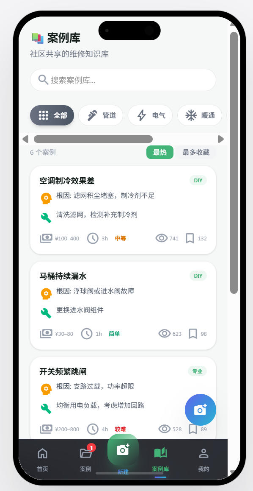
  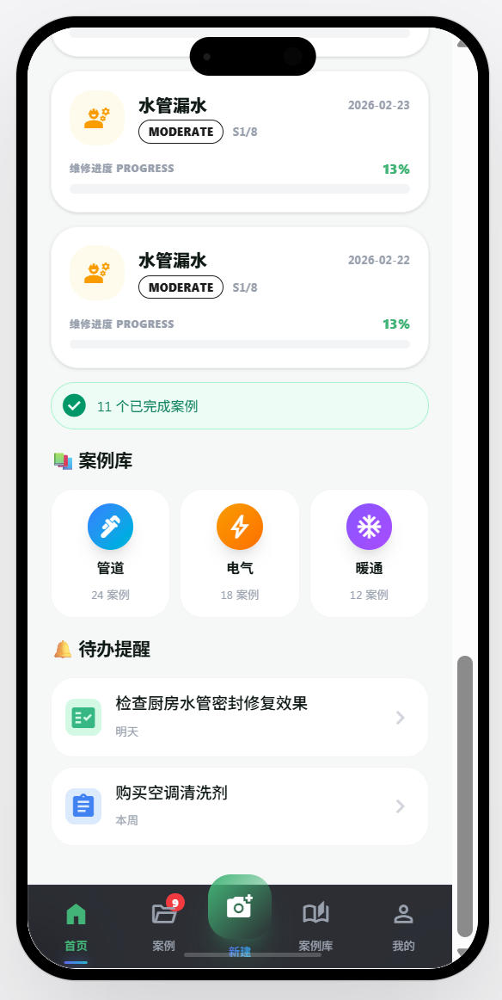
  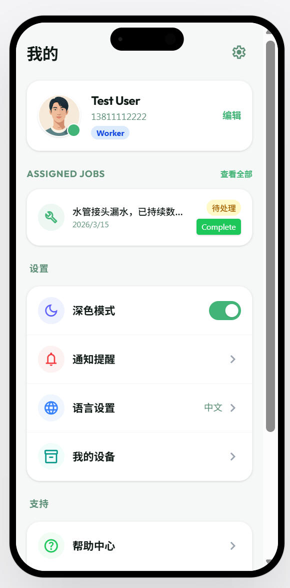
  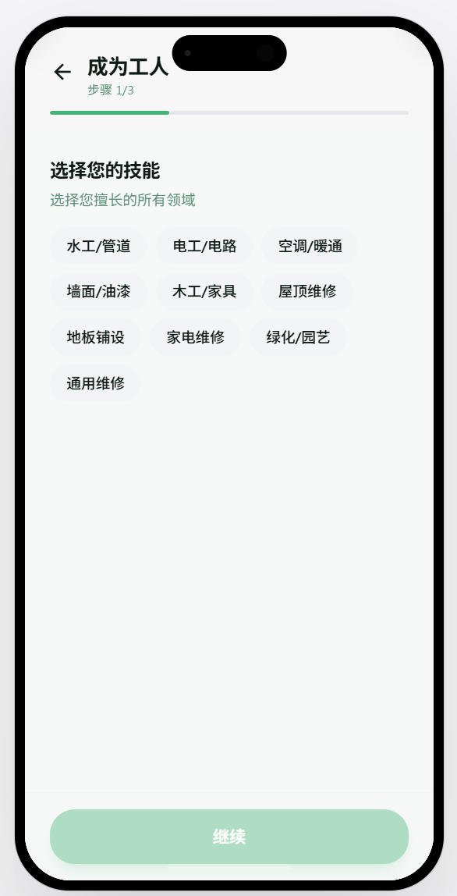
</div>

<p align="center"><sub>Knowledge Base → Case Library → Profile Settings → Worker Onboarding</sub></p>

**Key Features:**
- 📖 **DIY/Professional Tags** — Each case tagged with difficulty, cost range, and view count
- 🔍 **Category Filtering** — Search by Plumbing, Electrical, HVAC with popularity sorting
- 👤 **Unified Profiles** — Seamless user/worker role switching with bilingual settings
- 📋 **3-Step Onboarding** — Streamlined worker registration with skill selection

---

### 4. 🏢 Enterprise AEGIS — Mission Control

The command center for property management firms. Real-time portfolio-wide observability with AI agent orchestration and strategic performance scoring.

<div align="center">
  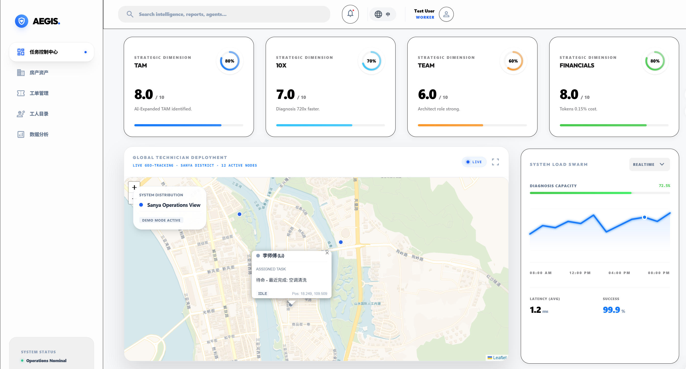
</div>

<p align="center"><sub>AEGIS Mission Control — Strategic 4D Scoring · Live Geo-Tracking · System Load Monitoring</sub></p>

**Key Features:**
- 📊 **4D Strategy Scoring** — TAM, 10X Speed, Team, Financials — each rated out of 10
- 🗺️ **Live Geo-Tracking** — Real-time Sanya district map with active technician nodes
- 📈 **System Load Swarm** — Diagnosis capacity, latency, and success rate monitoring
- 🔎 **Unified Search** — Intelligence reports, agents, and analytics at your fingertips

---

### 5. 🤖 AI Agent Swarm & Operations

A multi-agent LLM system with automated market intelligence, strategy alerts, and efficiency optimization — the operational brain of the platform.

<div align="center">
  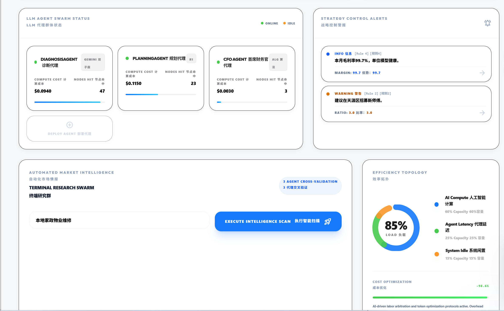
</div>

<p align="center"><sub>Agent Swarm — DiagnosisAgent · PlanningAgent · CFO Agent · Intelligence Scanner · Efficiency Topology</sub></p>

**Key Features:**
- 🧠 **3 Active LLM Agents** — Diagnosis (Gemini), Planning (R1), CFO (Algorithmic)
- 🔍 **Market Intelligence Scanner** — One-click competitive research with 3-agent cross-validation
- ⚠️ **Strategy Control Alerts** — Automatic rules-based warnings (margin, coverage, demand)
- 📉 **Cost Optimization** — AI-driven token and labor cost protocols achieving **-98.6%** overhead

---

### 6. 📊 Enterprise Data Hub

Portfolio management, ticket tracking, worker directory, and analytics — all the operational data a property manager needs.

<div align="center">
  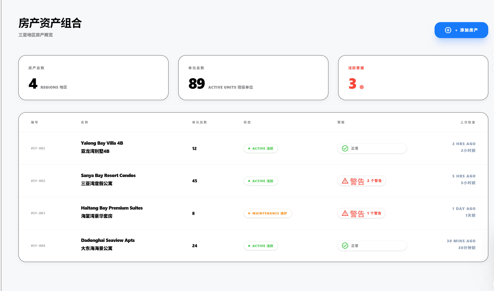
  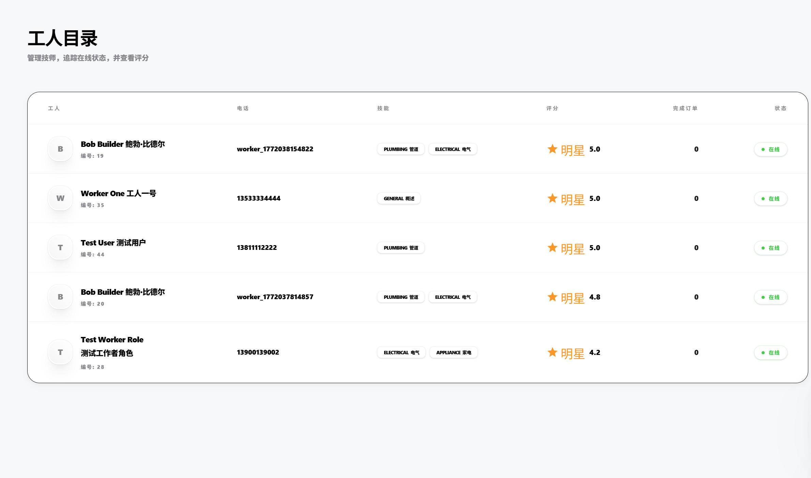
</div>
<div align="center">
  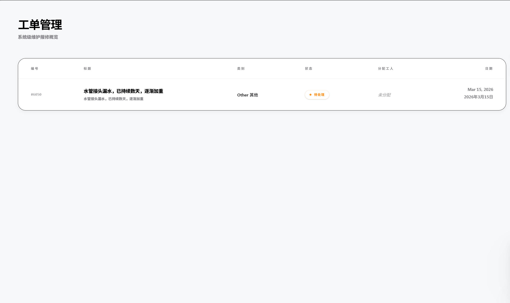
  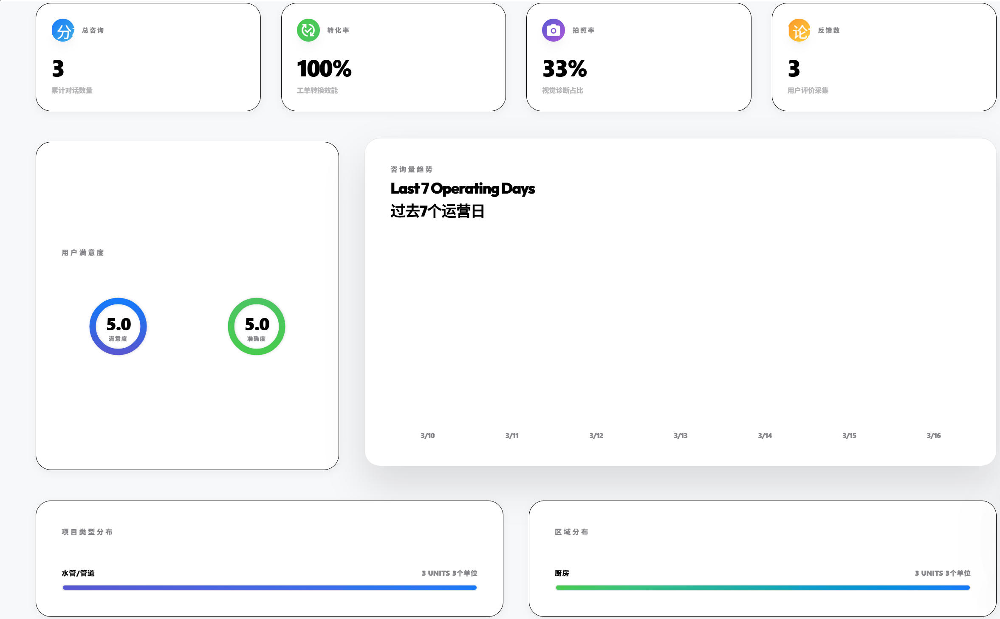
</div>

<p align="center"><sub>Property Portfolio · Worker Directory · Ticket Management · Analytics Dashboard</sub></p>

**Key Features:**
- 🏘️ **Portfolio Overview** — 4 regions, 89 active units, real-time alert monitoring
- 👷 **Worker Directory** — Skills, ratings, phone, status — complete technician CRM
- 🎫 **Ticket Lifecycle** — Full work order management with status tracking and assignment
- 📈 **Analytics Suite** — Satisfaction scores, conversion rates, inquiry trends, type distribution

---

### 7. 🌐 Showcase Marketing Site

A polished marketing experience showcasing the platform's capabilities with interactive device previews and live demos.

<div align="center">
  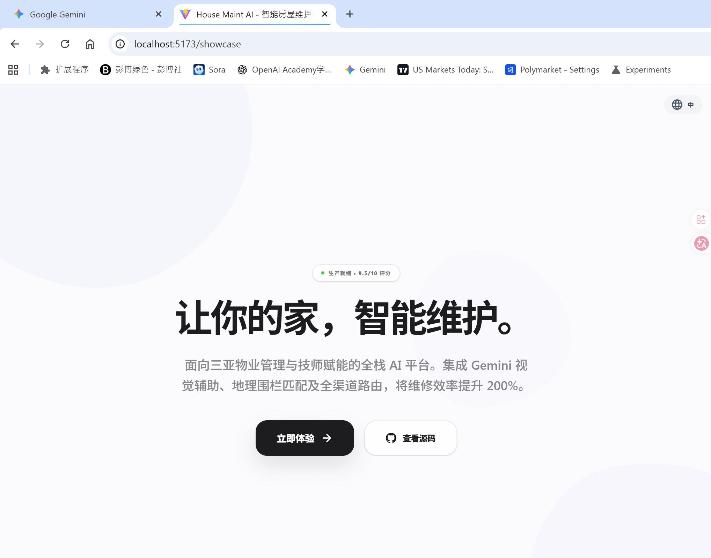
  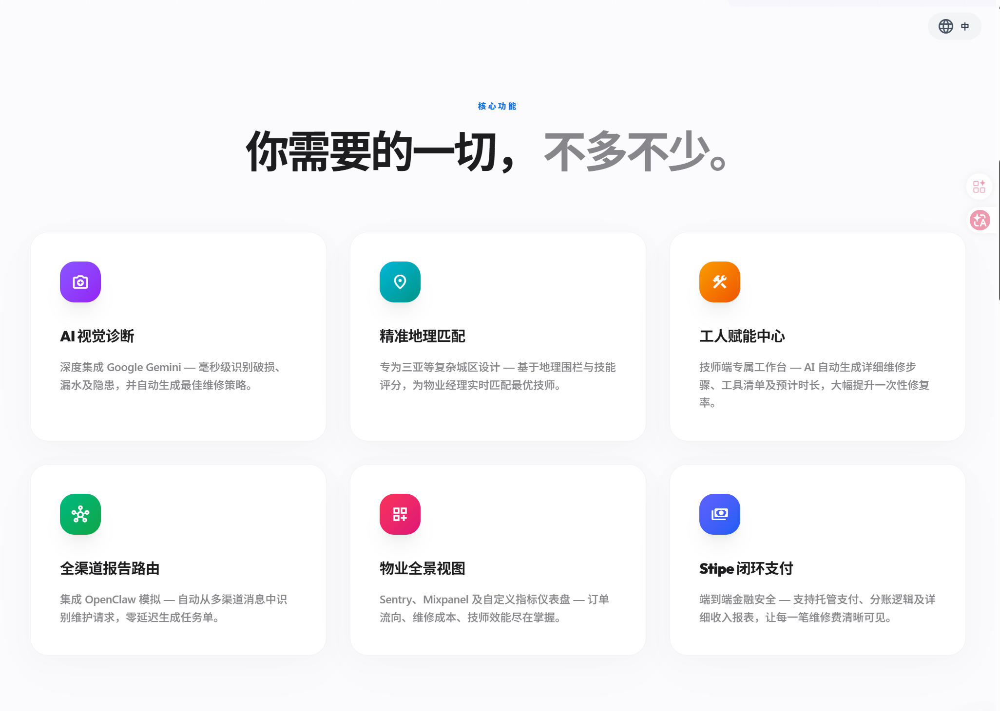
</div>
<div align="center">
  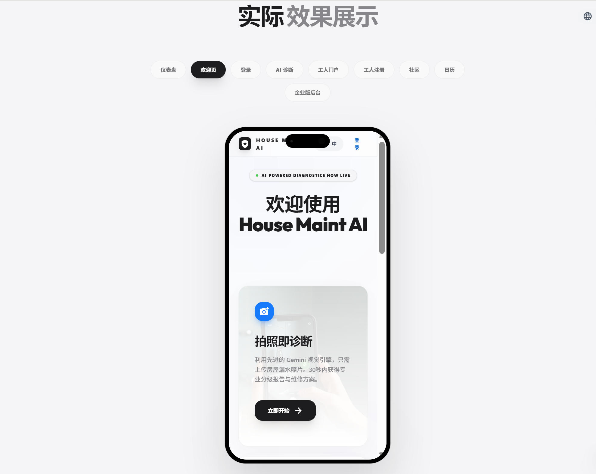
  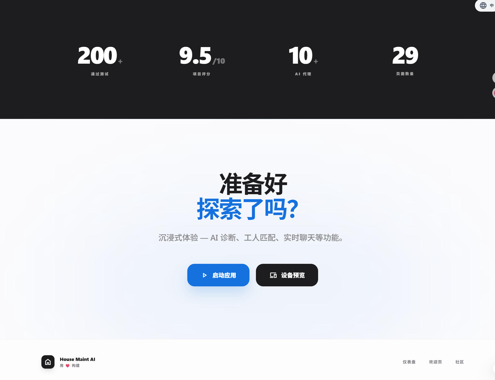
</div>

<p align="center"><sub>Hero Landing · Core Features Grid · Interactive Device Preview · Platform Statistics</sub></p>

---

## 🌏 Why China? The Localization Moat

This system is explicitly architected to **win in mainland China** and deter foreign clones:

| Dimension | Our Moat |
|-----------|----------|
| **🎭 Product UX** | 100% WeChat Mini Program — zero app installs, fits Chinese consumer habits |
| **🗣️ Multimodal Voice** | Localized NLP for Chinese regional dialects and maintenance colloquialisms |
| **🔒 PIPL Compliance** | Strict data residency, auto-blurring of private interior spaces |
| **💰 WeChat Pay Escrow** | Native payments replacing Stripe for instant worker settlement |
| **🌐 True Bilingual** | Full English/中文 i18n — Dashboard, Worker Portal, Enterprise Center |

---

## 🛠️ Tech Stack

| Layer | Technology |
|:------|:-----------|
| **🧠 Core AI** | Google Gemini Vision + DeepSeek R1 + Algorithmic Agents |
| **⚛️ Frontend** | React 19 + TypeScript + Vite + TailwindCSS |
| **🖥️ Backend** | Node.js 20, Express, TypeScript, Drizzle ORM |
| **🗄️ Database** | PostgreSQL + SQLite (dev) + Redis |
| **🔐 Auth** | WeChat OpenID + Phone/SMS + JWT |
| **💳 Payments** | WeChat Pay API v3 + Escrow Settlement |
| **📱 Mobile** | WeChat Mini Program (Taro/Uni-app) |
| **🚀 Deploy** | Docker + Nginx + Vercel |

---

## 🚀 Getting Started

### Prerequisites

- Node.js 20+
- WeChat Developer Tools (微信开发者工具)
- Gemini / DeepSeek API Key
- WeChat Merchant Account (微信支付商户号) *(optional for payment features)*

### Quick Start

```bash
# Clone the repository
git clone https://github.com/Mark393295827/house-maint-ai.git
cd house-maint-ai

# Install dependencies
npm install

# Configure environment
cp .env.example .env
# Edit .env with your API keys

# Initialize the database (using drizzle-kit for local sqlite)
cd server
npm exec -- drizzle-kit push
npm run init-db # Fill with any seed data you need
cd ..

# Start development server (frontend + backend)
npm run dev
```

### Running Tests

```bash
# Run the full test suite
npm test

# Run with coverage
npm run test:coverage
```

---

## 📂 Architecture

```
house-maint-ai/
├── src/                    # React 19 Frontend
│   ├── pages/              # 29 application pages
│   ├── components/         # Reusable UI components
│   └── i18n/               # Bilingual translations (en/zh)
├── server/                 # Express.js Backend
│   ├── routes/             # API endpoints (reports, workers, payments, wechat)
│   ├── services/           # Business logic (AI diagnosis, matching, PIPL)
│   └── agents/             # LLM Agent orchestration
├── agents/                 # Agent configuration & prompts
├── assets/                 # Static assets & screenshots
└── docs/                   # Architecture & business documentation
```

**Deep Dives:**
- [ARCHITECTURE.md](./ARCHITECTURE.md) — System design & component breakdown
- [COMPETITIVE_ANALYSIS.md](./COMPETITIVE_ANALYSIS.md) — Market positioning & moat analysis
- [PRD.md](./PRD.md) — Product requirements document
- [BUSINESS_OKRS.md](./BUSINESS_OKRS.md) — Quarterly objectives & key results

---

## 🗺️ Roadmap

- [x] AI Vision Diagnosis (Gemini + DeepSeek)
- [x] Worker Matching & Dispatch Engine
- [x] Enterprise AEGIS Dashboard
- [x] Multi-Agent LLM Orchestration
- [x] Community Knowledge Base
- [x] Bilingual i18n (EN/中文)
- [x] Analytics & Reporting Suite
- [ ] WeChat Mini Program Launch
- [ ] WeChat Pay Escrow Integration
- [ ] Remote Video Inspection (Live)
- [ ] Voice-Based Diagnosis

---

<div align="center">

## 🚢 License

MIT License · Created by [Mark393295827](https://github.com/Mark393295827)

<br/>

**Built with ❤️ for Sanya, Hainan 🌴**

*让你的家，智能维护。*

</div>
