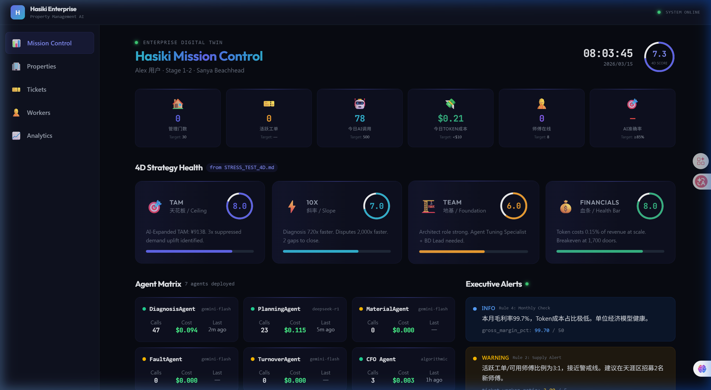
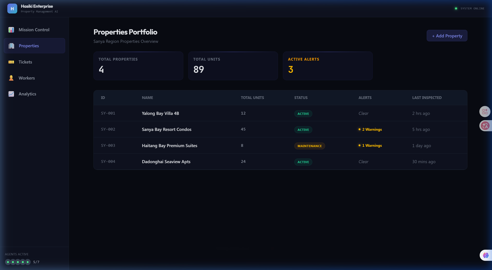
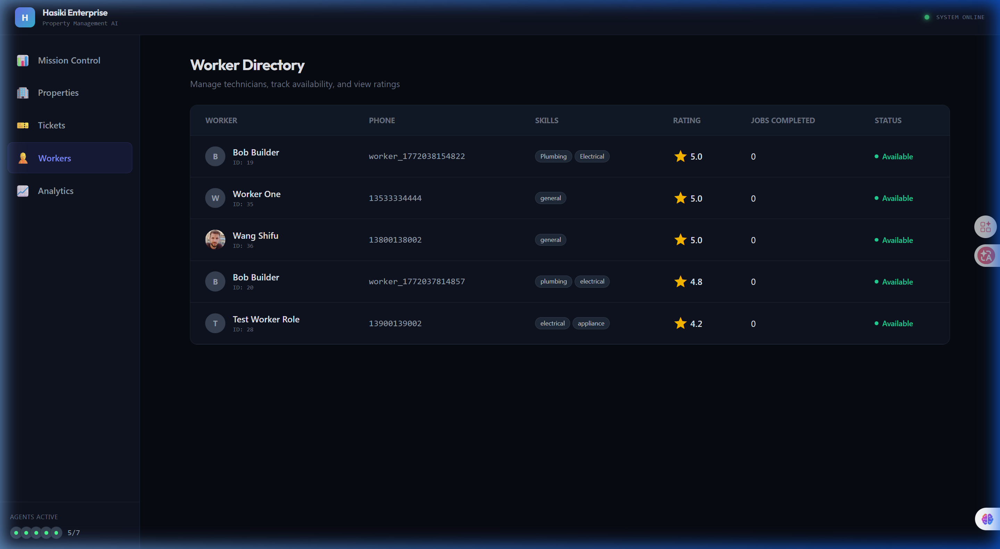
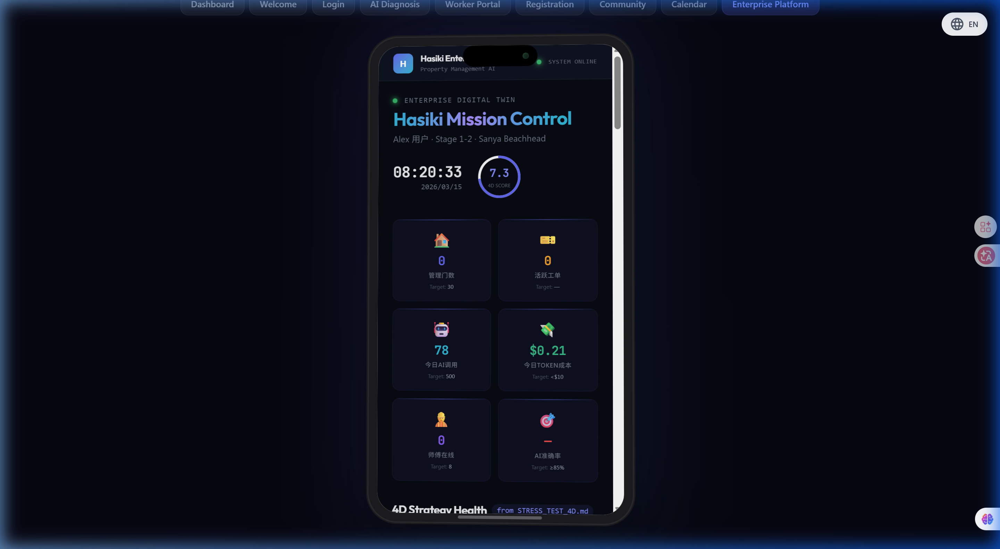

# House Maint AI — AI-Powered Home Maintenance for China (WeChat Native & Enterprise)

> **"Like Quaala & Servwizee, but built exclusively for the Chinese WeChat ecosystem."**
> Transforming residential maintenance triage with AI Vision, native WeChat mini-programs, and automated local worker (师傅) dispatch.

[](LICENSE)
[](https://deepseek.com/)
[](https://developers.weixin.qq.com/)

---

## 🌌 The Vision (The 18-Month Local Moat)

House Maint AI is a highly localized B2B2C triage and dispatch platform. We solve the core friction in Chinese urban home maintenance: **the chaotic, untrusted bridge between tenants/landlords and local repair workers.**

By combining **AI Photo/Voice Triage** with a native **WeChat Ecosystem**, we create an impenetrable 18-month legal and operational moat against foreign competitors.

## 📸 Product Innovations (The B2B2C Engine)

House Maint AI isn't just an app—it's a **fully-integrated operational ecosystem**. We've digitized the entire lifecycle of local maintenance: from a tenant's panicked WeChat photo, to an AI-generated repair mandate, straight to the local technician's phone. 

### 🌟 1. The Enterprise "War Room" (Mission Control)
_For Large Property Management Firms & Institutional Landlords_

Stop managing chaos in spreadsheets. Our **Mission Control** gives operations managers real-time, portfolio-wide observability. Track active tickets, monitor AI token costs, assess technician utilization across districts, and monitor **4D Strategy Health** all from a single pane of glass.



### 📊 2. Portfolio & Asset Management
_Data-Driven Property Insights_

Effortlessly scale from 10 to 10,000 units. The **Asset Management** hub provides a high-level overview of property health, active alerts, and recent inspections across Sanya's coastal lines, enabling proactive rather than reactive maintenance.



### ⚡ 3. The Virtual Quoting Marketplace (Worker Portal)
_For Local Freelance Technicians (师傅)_

No more "free estimate truck rolls." When a job is routed, technicians receive structured, pre-diagnosed leads via WeChat push notifications. The **Worker Portal** provides a dedicated, localized interface for technicians to accept jobs, access AI-generated checklists, and secure their 10-15% commission via WeChat Pay escrow.



### 📱 4. The Seamless Showcase Experience
_A Frictionless Consumer Touchpoint_

Our meticulously crafted UI/UX ensures tenant adoption. With a native, responsive design tailored for the WeChat ecosystem, the entire diagnostic and dispatch process feels premium and effortless.



---

## 🌏 Seamless Internationalization (i18n)

Built for global operators working in localized markets. House Maint AI offers **True Bilingual Support (English & Simplified Chinese)** out of the box. 

Whether it's an expat tenant reporting an issue or a local property manager reviewing tickets, the **User Dashboard, Worker Portal, and Enterprise Control Center** switch languages seamlessly without losing context or functionality.

---

---

## 🛡️ The Chinese Localization Moat

This system is explicitly architected to win in mainland China and deter foreign clones:
1.  **Product UX:** 100% WeChat Mini Program. Zero app installs. Fits Chinese consumer habits.
2.  **Multimodal Voice:** Integrates localized NLP to understand Chinese regional dialects and maintenance colloquialisms.
3.  **PIPL Compliance:** Strict data residency. Auto-blurring of private interior spaces in mainland cloud storages to comply with the Personal Information Protection Law.
4.  **WeChat Pay Escrow:** Native payments replacing Stripe for instant worker settlement and trust building.

---

## 🛠️ Tech Stack (China-Optimized)

| Layer | Technology |
|-------|-----------|
| **Core AI** | Localized LLMs (DeepSeek Vision / Baidu ERNIE) |
| **Frontend** | WeChat Mini Program (Taro / Uni-app) + React 19 Web Dashboard |
| **Backend** | Node.js 20, Express, TypeScript, Drizzle ORM |
| **Database** | PostgreSQL + Redis (Hosted in Mainland China) |
| **Auth & Pay** | WeChat OpenID Integration + WeChat Pay API v3 |

---

## 🚀 Getting Started (Development)

### 1. Requirements
- Node.js 20+
- WeChat Developer Tools (微信开发者工具)
- DeepSeek/Baidu API Key
- WeChat Merchant Account (微信支付商户号)

### 2. Local Setup
```bash
# Clone the repository
git clone https://github.com/Mark393295827/house-maint-ai.git
cd house-maint-ai

# Install backend dependencies
cd server && npm install

# Start the local daemon (with SQLite fallback)
npm run dev
```

---

## 📂 Architecture

- `server/routes/wechat.ts`: Mini-program login and Official Account webhook handlers.
- `server/routes/payments.ts`: WeChat Pay callback integration.
- `server/routes/reports.ts`: System-wide ticket management for Enterprise users.
- `src/pages/EnterprisePlaceholders.tsx`: The functional hub for Properties, Workers, and Analytics.
- `server/services/pipl.ts`: Data anonymization and retention policies.

*Refer to [ARCHITECTURE.md](./ARCHITECTURE.md) and [COMPETITIVE_ANALYSIS.md](./COMPETITIVE_ANALYSIS.md) for deep dives into the business model.*

---

## 🚢 License
MIT License. Created by [Mark393295827](https://github.com/Mark393295827).
