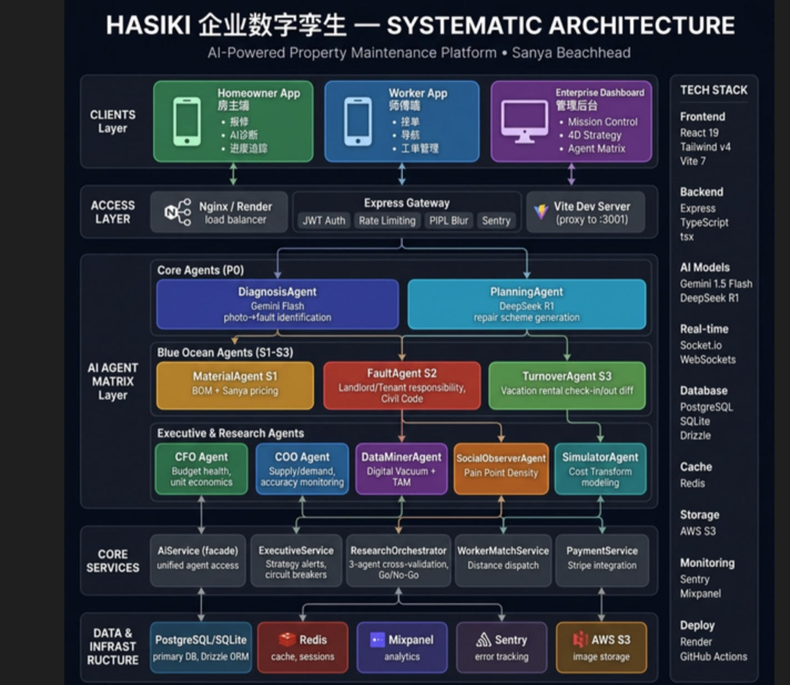

<div align="center">

# 🏠 House Maint AI

### Agent-Native Residential Maintenance Platform · WeChat-Native · Modular Monolith Architecture

**The full-stack AI platform transforming home repair in China.**
From a tenant's photo to a dispatched technician — in 30 seconds.

<br/>

<a href="LICENSE"></a>
<a href="https://github.com/Mark393295827/house-maint-ai/stargazers"></a>
<a href="https://nodejs.org/"></a>
<a href="https://react.dev/"></a>
<a href="https://developers.weixin.qq.com/"></a>
<a href="https://deepmind.google/technologies/gemini/"></a>

</div>

<br/>

> **🎯 Built exclusively for the Chinese WeChat ecosystem.**
> Transforming residential maintenance triage with a **Domain-First Control Plane**, vendor-neutral **Agent Runtime Kernel**, native WeChat mini-programs, and automated local technician (师傅) dispatch.

---

## 🧭 Systematic Architecture

<div align="center">
  
</div>

<p align="center"><sub>HASIKI Enterprise Digital Twin — Agent Runtime Kernel · Maintenance Control Plane · Modular Monolith Workspaces</sub></p>

---

## ⚡ Product at a Glance

<div align="center">
  
  
  
  
</div>

<p align="center"><sub>Operations Hub · AI Diagnosis · Worker Match · Technician Portal</sub></p>

---

## 🧠 The Vision & Architecture

House Maint AI is an **agent-native B2B2C triage & dispatch platform** solving core friction in urban property maintenance.

The system enforces two strict operational authorities:
1. **Maintenance Domain Control Plane**: Canonical `maintenance_cases` + append-only `case_events` ledger managing identity, organization hierarchy, resource scope ancestry, approvals, payments, and state reductions.
2. **Agent Runtime Kernel**: Vendor-neutral execution runtime managing scoped sessions, runs, task leases, capability routing, immutable artifacts, shared wall-time/token budgets, and independent evaluation.

<details>
<summary><b>📊 Key Platform Metrics</b></summary>

| Metric | Value |
|--------|-------|
| **Automated Tests** | 340+ tests across Node backend & UI suites |
| **Monorepo Packages** | 9 core packages (`@house-maint/*`) + 4 apps |
| **Diagnosis Speed** | ~30 seconds |
| **Cost Optimization** | -98.6% AI overhead via bounded task envelopes |
| **Multi-Tenancy** | Organization & Scope Ancestry preflight isolation |

</details>

---

## 🏗️ Workspace Directory Layout

The codebase is structured as an **npm workspaces modular monorepo**:

```text
house-maint-ai/
├── apps/
│   ├── web/                    # React 19 + Vite UI (Resident, Worker, Enterprise surfaces)
│   ├── api/                    # Express HTTP gateway, auth ingress, case commands
│   ├── worker/                 # Durable background task execution & outbox worker
│   └── miniprogram/            # WeChat Mini Program client interface
├── packages/
│   ├── contracts/              # Zod schemas & versioned API/event/artifact contracts (@house-maint/contracts)
│   ├── domain/                 # Maintenance control plane, CaseCommandService, case reducer & ancestry logic
│   ├── agent-core/             # Vendor-neutral agent kernel, task leases, budgets, memory store
│   ├── agent-adapters/         # Capability adapters (Diagnosis, Plan, BOM, Fault, Match)
│   ├── policy/                 # Scope authorization, risk tiers, tool grants, approval gates
│   ├── persistence/            # Postgres & SQLite repositories, migrations, transactional outbox
│   ├── observability/          # Security audits, usage ledgers, telemetry, PIPL redaction
│   ├── plugin-chassis/         # Surface plugin framework & signed ingress client
│   └── testkit/                # Fake harnesses, deterministic clocks, adversarial test fixtures
├── plugins/
│   ├── web/                    # Web surface plugin
│   ├── wechat/                 # WeChat channel integration plugin
│   ├── notifications/          # Multi-channel notification delivery plugin
│   └── internal-ops/           # Operations command plugin
├── server/                     # Express backend API & DB migrations
├── docs/                       # Architecture blueprints & graph contracts
└── tests/                      # Contract, integration, e2e, and eval test suites
```

---

## 🌟 Product Showcase

### 1. 📱 Consumer App — AI-Powered Diagnosis

The tenant uploads photos or describes an issue; the agent kernel generates a typed diagnosis and repair strategy, and auto-matches qualified technicians.

<div align="center">
  
  
  
  
</div>

<p align="center"><sub>Landing → Login → AI Chat Diagnosis → Worker Match Result</sub></p>

- 🔍 **30-Second AI Triage**: Multimodal damage classification with structured repair planning.
- 🔒 **PIPL Privacy Safeguards**: Automated blurring of private residential spaces in photos.
- 🗂️ **6 Service Categories**: Plumbing, Electrical, HVAC, Walls/Structure, Painting, General.

---

### 2. 🔧 Worker Portal — Technician Command Center

A dedicated interface for technicians (师傅) to view job leads, manage schedules, and complete repairs.

<div align="center">
  
  
  
  
</div>

<p align="center"><sub>Worker Login → Job Leads Feed → Live Service Request → Maintenance Planner</sub></p>

- ⚡ **Real-Time Job Claiming**: Distance-aware dispatch with transparent ETA and labor estimates.
- 📅 **Smart Maintenance Calendar**: AI-assisted schedule optimization.

---

### 3. 🏢 Enterprise Mission Control

Command center for property managers featuring portfolio-wide observability and AI agent runtime monitoring.

<div align="center">
  
</div>

<p align="center"><sub>Enterprise Mission Control — 4D Metrics · Live Geo-Tracking · System Load Swarm</sub></p>

---

## 🌏 China Localization Moat

| Dimension | Implementation |
|-----------|----------------|
| **🎭 UX Native** | 100% WeChat Ecosystem integration with zero forced app downloads |
| **🔒 Data Governance** | PIPL compliance, data residency, automatic image anonymization |
| **💰 Payment Escrow** | Native WeChat Pay v3 escrow settlement |
| **🌐 Full i18n** | Seamless Bilingual English/中文 support across all apps |

---

## 🛠️ Tech Stack

| Layer | Technology |
|:------|:-----------|
| **🧠 AI Core** | Gemini Vision + DeepSeek R1 + Vendor-Neutral Agent Kernel |
| **⚛️ Frontend** | React 19 + TypeScript + Vite + TailwindCSS |
| **🖥️ Backend** | Node.js 20, Express, TypeScript, npm workspaces |
| **🗄️ Database** | PostgreSQL + Drizzle ORM + SQLite (unit testkit) |
| **🔐 Auth** | Scoped JWT + WeChat OpenID + Resource Ancestry |
| **💳 Payments** | WeChat Pay API v3 + Idempotent Outbox Settlement |
| **🚀 Deploy** | Docker + Nginx + Vercel |

---

## 🚀 Getting Started

### Prerequisites

- Node.js 20+
- npm 10+ (Workspaces enabled)

### Quick Start

```bash
# Clone the repository
git clone https://github.com/Mark393295827/house-maint-ai.git
cd house-maint-ai

# Install workspace dependencies
npm install

# Configure environment
cp .env.example .env

# Start all local services (Frontend + API + Worker)
npm run dev:all
```

### Running Test Suites

```bash
# Run full unit & contract test suite
npm test

# Run focused contract and integration tests
npx vitest run --config vitest.config.ts tests/contract/cases tests/integration/cases tests/contract/agent-runtime tests/integration/agent-runtime
```

---

## 🚢 License

MIT License · Created by [Mark393295827](https://github.com/Mark393295827)
