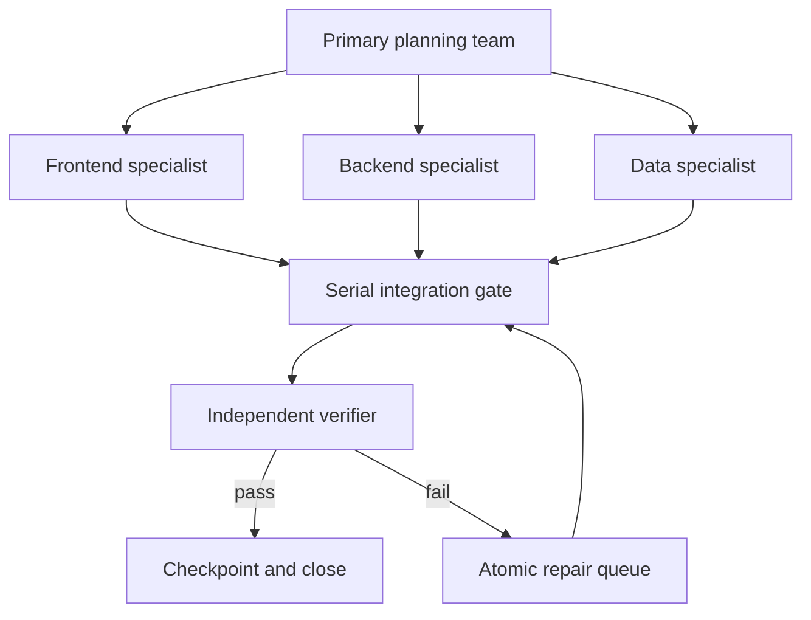

# Multi-Agent Audit Framework

This directory is the tracked control plane for a bounded frontend, backend, and data audit. Runtime logs and current state are written under the git-ignored `output/agent-audit/` directory.

The current function map, accepted repairs, and residual queue are in `audit-report-2026-07-20.md`.

## Team Model



The primary team owns shared contracts, prioritization, and integration. Specialists receive mutually exclusive territories. The verifier does not implement the change it evaluates.

## Commands

```powershell
# Validate the contract and show the quick gate plan without writing state
npm run audit:loop:plan

# Run artifact checks, both builds, and all unit suites
npm run audit:loop

# Add lint and desktop/mobile Playwright flows
npm run audit:loop:full
```

Advanced options can be passed directly to Node when npm on Windows consumes similarly named flags:

```powershell
node scripts/audit-loop.mjs --profile=full --only=lint,e2e --reset --json
```

## Continuous Task Cycle

1. Observe the current state and fresh repository evidence.
2. Reconcile specialist handoffs into the MECE task board.
3. Admit only findings with a reproducer or deterministic contract proof.
4. Assign one owner and one verifier to each atomic repair.
5. Run the smallest focused verifier after a repair.
6. Run the quick loop after each integration batch.
7. Run the full loop before closure or review handoff.
8. Stop on success, repeated failure twice, three iterations, permission boundary, or review-budget exhaustion.

## Receipts

The current state is `output/agent-audit/state.json`. Each iteration writes a summary and per-gate stdout/stderr logs below `output/agent-audit/runs/<run-id>/iteration-<n>/`.

Exit codes are stable:

| Code | Meaning |
|---|---|
| `0` | All selected gates passed |
| `1` | A verification gate failed |
| `2` | Contract, input, permission, or iteration budget prevents execution |

Use `--reset` only after changing the diagnosis, scope, or strategy. It starts a new run; it does not remove previous receipts.

## Permission Boundary

The runner may inspect and test the local repository and disposable local data. It does not commit, push, deploy, call paid models, alter credentials, migrate shared databases, or send external messages.
