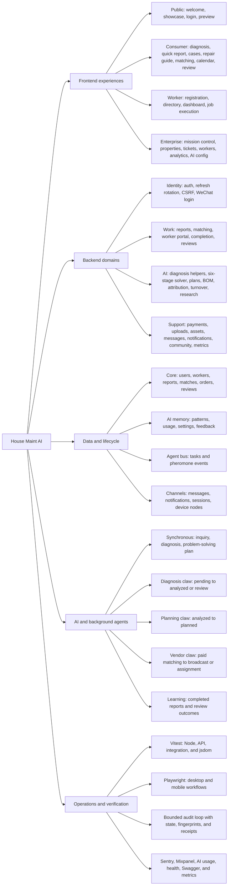

# Application Audit Report - 2026-07-20

## Scope and method

The primary planning team decomposed the repository into frontend, backend, data, and verification territories. Read-only specialists produced typed findings; disjoint workers repaired payment, authentication, migrations, and background-agent concurrency. The commander owns cross-layer contracts, integration, and final evidence.

The audit is bounded by the contract in `loop-contract.md`: three iterations, a 30-minute loop budget, two repeated failure signatures, local/disposable data only, and no deploys or shared-database migrations.

## Function mind map

## Six-stage ownership matrix

| Stage | User surface | Persisted evidence | Current executor | Completion gate |
|---|---|---|---|---|
| Intake | Inquiry chat, quick report, media capture | `reports.pending`, diagnosis task input | API plus inquiry agent | Structured report and evidence receipt |
| Diagnosis | Demand summary and liability/risk output | Diagnosis fields, confidence, urgency, `analyzed` or review state | Problem-solving agent and diagnosis claw | Confidence or human-review gate |
| Deflection | Safety gate and self-serve guidance | Plan output only; no dedicated report state | UI guidance only | Tenant confirms success or escalates |
| Dispatch | Provider matching, payment, worker job views | Order, match, worker assignment, report state | Payment webhook and vendor claw | Paid gate plus successful CAS transition |
| Verification | Completion details, feedback, review | Resolution details, review, AI feedback | Worker completion plus user feedback | Repair evidence and tenant confirmation |
| Reporting | Cases, report detail, enterprise analytics | Completed report, metrics, learning pattern | Analytics and learning services | Owner-ready summary and archived evidence |

`src/constants/operatingModel.ts` is the narrative source of truth. `reports` and its backend state machine remain the executable aggregate. The two contracts now share a complete status-to-stage projection, but deflection, automated tenant verification, and scheduled owner reporting still need dedicated persisted commands and executors.

## Accepted repairs

| ID | Severity | Repair | Regression evidence |
|---|---|---|---|
| F-01 | P1 | Removed stale 8-step framing and projected landing, diagnosis, AI config, and case progress onto the shared six-stage model. | Welcome, showcase, diagnosis, enterprise config, and operating-model tests |
| F-02 | P1 | Diagnosis uses AI severity consistently and cannot misreport a successful report creation when local metrics are malformed. | `DiagnosisPage.test.ts` |
| F-03 | P1 | Client auth retry stops after one refresh instead of recursively retrying protected 401 responses. | `src/services/api.test.ts` |
| F-04 | P1 | Repair-plan access is limited to owner, admin, or assigned worker; generic owner updates cannot bypass payment or assign a worker. | `tests/ai_planning.test.ts` |
| F-05 | P1 | Refresh rotation uses compare-and-set revocation; only one concurrent request can mint a successor. | Auth race and integration refresh tests |
| F-06 | P1 | Production rejects known payment defaults and disabled webhook verification; paid webhook retries reconcile reports and transition failures return 500. | 7 payment config and webhook tests |
| F-07 | P1 | Worker bootstrap starts diagnosis, planning, and vendor services and stops all three on shutdown. | `worker-bootstrap.test.ts` |
| F-08 | P1 | SQLite UPDATE RETURNING emulation returns no row when a guarded update changes nothing. | `database-adapter.test.ts` |
| F-09 | P1 | SQLite and PostgreSQL schema contracts cover runtime fields; journaled SQLite migrations converge to all runtime tables. | Schema parity and migration convergence tests |
| F-10 | P2 | Verification feedback is sent to the backend while analytics and malformed local storage remain non-blocking. | `DiagnosisPage.test.ts` |
| F-11 | P1 | Every report lifecycle state maps to the correct six-stage case progress. | `operatingModel.test.ts` |
| F-12 | P1 | Background diagnosis, planning, and vendor writes use eligible-state compare-and-set guards; vendor sourcing requires the paid `matching` gate. | 9 red-to-green race regressions plus 13 focused claw tests |

## Residual queue

These items are evidence-backed but exceed the current review budget or require a product contract. They are inputs to the next loop, not implicit claims of completion.

| ID | Severity | Residual issue | Required decision or verifier |
|---|---|---|---|
| R-01 | P1 | Dispatch ownership remains split between mock `StepDispatch`, calendar selection, payment, and vendor sourcing. The insecure generic assignment path is blocked, so the UI needs one canonical paid assignment command. | Choose automatic ranking vs customer-selected worker, then add a paid end-to-end flow |
| R-02 | P1 | Deflection has guidance but no persisted attempt, tenant success command, or escalation event. | Add deflection state/evidence and success/failure API tests |
| R-03 | P1 | Verification has completion/review touchpoints but no automated tenant confirmation, quiet-user follow-up, or relapse reopen worker. | Define verification SLA and executable worker contract |
| R-04 | P2 | Owner reporting is an AI summary and analytics view, not a persisted/scheduled report artifact. | Define report cadence, recipients, and archive format |
| R-05 | P1 | Checkout deduplication is query-then-insert; the database does not enforce one pending payable order per user/report. | Data cleanup policy plus partial unique index/concurrency test |
| R-06 | P2 | Enterprise AI configuration is browser-local and does not authoritatively control server runtime settings. | Define admin control-plane API, encryption, audit log, and RBAC |
| R-07 | P2 | The background worker has code/tests but no dedicated package script, container service, or deployment owner. | Add process topology and health/readiness checks |
| R-08 | P1 | Migration 0003 adds a unique review-per-report index; an upgraded database with historical duplicates needs an explicit cleanup policy. | Run a preflight duplicate query before production migration |
| R-09 | P2 | Telegram, WhatsApp intake, Mini Program surfaces, and ontology writes contain stubs or simulated behavior. | Admit each integration only with a real sandbox contract and end-to-end fixture |
| R-10 | P2 | The server lockfile reports seven moderate transitive advisories in Sentry/OpenTelemetry and `js-yaml`; the root production graph reports none. | Review the non-breaking Sentry 10.66/OpenTelemetry 2.9 lock refresh, then rerun build, telemetry smoke tests, and `npm audit` |
| R-11 | P1 | Payment webhook verification is a local HMAC contract, not WeChat Pay v3 platform-certificate verification, and it does not validate merchant/app identity or paid amount. | Implement the official certificate-rotation verifier and encrypted notification amount/merchant checks against a provider sandbox fixture |
| R-12 | P1 | High-urgency vendor sourcing marks a report `broadcasted` before all match rows and notifications succeed; a mid-loop database error can leave partial broadcast evidence with no automatic retry. | Add a transactional outbox or durable broadcast batch with retry/idempotency keys |

## Verification receipts

Focused red/green tests and schema checks are recorded in worker handoffs and `output/agent-audit/runs/`.

- Final post-fix quick receipt: `2026-07-20T01-32-08-049Z`, four gates passed, 190 Node tests and 140 UI tests.
- Full receipt: `2026-07-20T01-07-59-851Z`, six gates passed with 329 unit tests, 0 lint errors/195 warnings, and 16 Playwright tests before the final webhook guard.
- Security scan: no tracked high-confidence secret patterns; root production dependencies report zero advisories; server dependencies report seven moderate transitive advisories.
- Independent reviewer status: unavailable after three bounded orchestration attempts. No independent code-reading pass is claimed; commander review found and repaired the production webhook-disable defect after the full receipt.

Runtime logs remain ignored while durable contracts and this report remain tracked.

## Next trigger

Start the next bounded loop when the dispatch ownership decision is made, a production migration is scheduled, or a required gate fails. Reset state only when scope or diagnosis changes; otherwise resume the recorded failure fingerprint.
