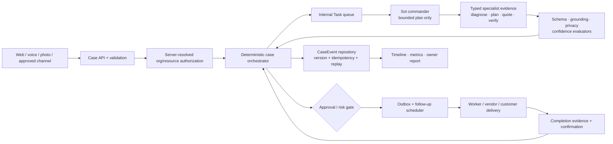

# Backend Practicality Iteration Blueprint

Status: review required — this blueprint updates the next execution wave; no new source execution is authorized by this document alone.

Date: 2026-08-01

## 1. Outcome to optimize

One customer maintenance issue should move through one backend-owned case:

```text
report → understand → decide → coordinate → verify → resolved
```

The backend is practical when it:

- gives the customer one clear next action;
- gives the operator one authoritative case state;
- lets AI propose useful work without owning side effects;
- prevents duplicate assignments, messages, payments, and closures;
- minimizes the number of concepts, endpoints, queries, and human handoffs required to resolve the issue.

The primary metric is **cost per verified resolution**, supported by first-response time, human touches, AI calls per case, reopen rate, and duplicate-effect rate.

## 2. Current implementation checkpoint

The previous foundation work is present on the current branch:

- additive organization/property/unit/grant/maintenance-case/event schema;
- SQLite transaction helper and transaction tests;
- pure authorization contracts, policy, principal and compatibility modules;
- broad AI agent routes for material, fault, turnover, WebIntel, and executive checks.

The following are not yet accepted as production capability:

- the case-event repository/reducer is missing;
- authorization middleware is not mounted into the operational routes;
- the latest security review reproduced seven unsafe authorization outcomes, so the repair needs a fresh independent acceptance receipt;
- local media remains a public static surface and Socket.IO remains globally scoped;
- PostgreSQL runtime migration/transaction parity has no executable harness;
- the current branch includes a broad agent/property-tools batch that still needs scope and regression review before becoming part of the concise backend contract.

The prior baseline was green before the latest foundation commit, and the schema unit was independently accepted. A fresh full post-commit regression run is required before the next promotion.

## 3. First-principles simplification

Reduce the public backend vocabulary to five domain objects:

| Object | Meaning | May change state? |
|---|---|---:|
| `Case` | One customer maintenance issue and its current projection | Orchestrator only |
| `Evidence` | Photo, voice transcript, text, diagnosis, plan, quote, or completion proof | Typed artifact writer |
| `Task` | Bounded work assigned to a model, worker, or operator | Scheduler/orchestrator |
| `Action` | A proposed or approved consequential effect | Policy/approval boundary |
| `CaseEvent` | Immutable fact used for replay, audit, and metrics | Append-only repository |

AI agents are capability adapters, not public domain objects. Material, fault, turnover, diagnosis, planning, and summary agents should return typed `Evidence` or `Action` proposals through one internal task interface.

## 4. Concise target API

Keep the existing `/reports` URLs as compatibility adapters. Introduce one case-oriented surface incrementally:

| Endpoint | Purpose | Response contract |
|---|---|---|
| `POST /api/v1/cases` | Create an issue from text/photo/voice metadata | `201 { data: case }` |
| `GET /api/v1/cases` | Scoped case list with status/property filters | `200 { data, meta }` |
| `GET /api/v1/cases/:id` | Case projection plus safe next action | `200 { data: case }` or non-enumerating `404` |
| `GET /api/v1/cases/:id/timeline` | Replay-backed case history | `200 { data: events }` |
| `POST /api/v1/cases/:id/commands` | `diagnose`, `plan`, `dispatch`, `verify`, `reopen`, or `cancel` | `202` for queued work, `409` for stale version, `422` for invalid command |
| `POST /api/v1/cases/:id/evidence` | Attach validated evidence reference | `201 { data: evidence }` |

Command envelope:

```json
{
  "command": "diagnose",
  "expected_version": 2,
  "idempotency_key": "client-generated-unique-key",
  "input": { "evidence_ids": [31, 32] }
}
```

Rules:

- validate with Zod at the edge;
- return consistent `{ data, meta }` or `{ error: { code, message, details } }` envelopes;
- use `409` for version/idempotency conflicts and never silently retry a different command;
- use cursor pagination for operational lists;
- expose no provider names, raw JSON, hidden reasoning, credentials, or direct model routes to customers;
- preserve `/reports` response shapes until parity tests pass, then mark them compatibility-only.

The existing `/api/v1/agents/*` routes become internal capability adapters behind the command/task service. New public features must not add another agent-specific route.

## 5. Practical execution architecture



Authority is deliberately asymmetric:

- Sol chooses a bounded plan and joins specialist results.
- Lower-cost specialists produce typed evidence only.
- The orchestrator owns case transitions and approved non-financial effects.
- Payment settlement remains a verified provider boundary.
- A human or versioned policy approves spend, dispatch, high-risk messages, and closure.

## 6. Iteration waves

### Wave 0 — Reconcile the previous run

Deliverables:

- fresh full Node/UI/build/lint regression after the foundation commit;
- diff/ownership review for the broad agent/property-tools batch;
- state ledger corrected from the interrupted run;
- explicit list of accepted, rejected, and unverified artifacts.

Stop if the branch cannot explain the architecture delta or if unrelated behavior changed without a preservation test.

### Wave 1 — Finish authorization before exposing it

Repair and independently recheck the seven previously reproduced outcomes:

- strict UTC instant parsing and malformed-date rejection;
- impossible resource ancestry rejection;
- no upward/sibling grant inheritance;
- principal-bound, case-specific query scopes;
- revoked legacy membership rejection;
- actor/user/membership binding;
- bounded correlation/action audit values.

Then add the smallest durable repository adapter that loads organization, membership, resource ancestry, grants, and liveness in one organization-scoped operation. Mount the middleware only on case list/detail/create behind a feature flag.

Exit gate: cross-organization, same-organization-unrelated, revoked, expired, forged-ancestry, and worker/admin denial fixtures pass at repository and HTTP boundaries.

### Wave 2 — Build the missing case-event service

Implement one `case-events` service with:

- canonical JSON and projection-patch envelope;
- reducer v1 and known event types;
- optimistic version check;
- same-key/same-payload replay;
- same-key/different-payload conflict;
- transaction rollback;
- replay from events without reading mutable projection fields.

Connect only `POST /cases` and the compatibility `POST /reports` create path first. Do not migrate every route in one batch.

Exit gate: one report creates one mapped case and one opening event; replay equals projection; legacy response remains unchanged.

### Wave 3 — Replace agent sprawl with one command/task path

Introduce `CaseCommandService` and an internal `Task` adapter. Existing diagnosis, planning, material, fault, turnover, and executive agents become typed workers behind it.

Defer or hide public agent routes that do not contribute to the maintenance resolution loop. Preserve them only behind internal/operator permissions or compatibility flags.

Exit gate: a single diagnose→plan command produces typed evidence, one case event per transition, bounded model calls, and no direct database/socket/payment imports in agents.

### Wave 4 — Make coordination durable

Add outbox delivery receipts, follow-up jobs, vendor offers, appointment state, retry/stop rules, and operator takeover. Replace global Socket.IO broadcasts with case/organization-scoped delivery.

Exit gate: restart, duplicate webhook, delayed reply, no reply, declined offer, and duplicate assignment fixtures pass.

### Wave 5 — Verify closure and measure cost

Add completion evidence, resident confirmation, reopen/relapse, owner reports, and metric lineage. Promote only low-risk automation with a rollback drill.

Exit gate: no unverified closure, no duplicate external effect, and cost per verified resolution is measurable.

## 7. Specialist assignment plan

This is a manager-workers program with serial integration. The runtime previously reached its thread/usage limit, so these are logical specialist roles scheduled in staggered waves; they are not a promise of ten simultaneous model processes.

| Role | Skill basis | Exclusive output | Verifier |
|---|---|---|---|
| Commander/integrator | agent-teams-command | contracts, joins, integration ledger | independent checker + human gate |
| Loop controller | loop-engineering | bounded state, retry, stop and recovery receipts | strict validator |
| Branch reconciler | coding-standards/backend-patterns | Wave 0 diff and compatibility ledger | commander |
| Authorization repairer | backend-patterns/security boundary | Wave 1 policy/repository repair | red team |
| Authorization red team | agent-teams-command maker-checker | adversarial denial fixtures | commander |
| Case-event builder | backend-patterns/database transaction pattern | reducer/repository service | event checker |
| Migration checker | database-migrations | SQLite/PG structural and rollback receipt | commander |
| Case API builder | api-design | case routes/commands/envelopes | API contract checker |
| Agent adapter builder | backend-patterns/service layer | internal task/agent adapter | policy/eval checker |
| Outbox/follow-up builder | loop-engineering/background jobs | durable delivery and retry loop | failure-injection checker |
| Realtime/media builder | backend-patterns/auth middleware | scoped media and case events | security red team |
| Regression/mission checker | agent-teams-command | full test/build/lint/preservation receipt | commander |

Ownership rule: no two roles edit the same file in one wave. Shared schema and command contracts remain commander-owned until published.

## 8. Loop contract for the next wave

```text
Objective: Make one maintenance case safe and executable end-to-end through a concise API.
Mode: Goal
Trigger: Explicit continuation after blueprint review.
Scope: Waves 0–2 only; current case foundation, authorization, case-events, and compatibility create path.
Non-goals: channels, PMS, payment automation, public media, global sockets, leasing, broad UI.
Owner: /root commander; maker-checker worker topology.
Success metric: one idempotent case creation and diagnose command replays deterministically with zero authorization bypasses.
Verifier: focused fixtures, full Node/UI/build/lint regression, independent red team, migration checker.
Max iterations: 3
Time limit: 120 minutes
Budget: 140 tool calls
Review budget: 750 human-authored lines and 10 files per integration unit.
Stop: success, verifier failure, repeated signature twice, budget cap, ownership overlap, or missing dependency.
Permission boundary: local branch only; no production, external provider, credentials, deploy, push, or irreversible migration.
Recovery: reject one unit, preserve compatibility routes, and roll back only the rejected unit using a forward migration if already applied.
```

## 9. Review decisions before execution

1. Approve the concise `Case`/`Evidence`/`Task`/`Action`/`CaseEvent` vocabulary.
2. Approve hiding or internalizing agent-specific public routes.
3. Approve the Wave 0–2 order and the case-create/diagnose pilot scope.
4. Approve no second organization until HTTP, media, and realtime authorization are integrated.
5. Confirm whether legacy `/reports` remains the compatibility facade for the first release.

After approval, the next command packet is contracts plus Wave 0 evidence. No new worker should touch source before the authorization repair and case-event boundaries are published.
