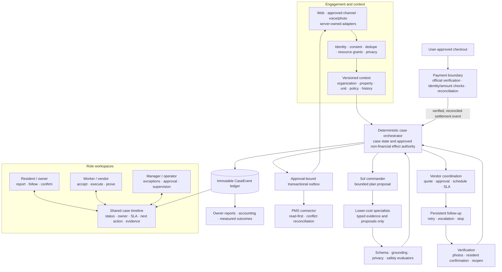
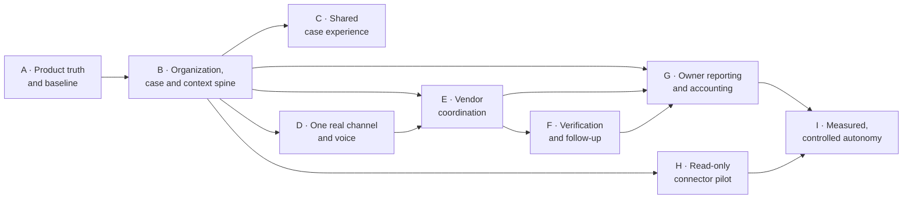

# CentralComs-Inspired Systematic Upgrade Blueprint

**Status:** review required — no implementation authorized  
**Prepared:** 2026-07-29  
**Scope:** House Maint AI maintenance operations; no leasing expansion in this plan  
**Primary reference:** [CentralComs landing page](https://centralcoms.com/landing)  
**Independent company description:** [CentralComs on Y Combinator](https://www.ycombinator.com/companies/centralcoms)  
**Existing project benchmark:** [`centralcoms-benchmark.md`](./centralcoms-benchmark.md)  
**Existing operating vocabulary:** [`product-operating-model.md`](./product-operating-model.md)  
**Runtime safety foundation:** [`maintenance-policy-agent-architecture.md`](./maintenance-policy-agent-architecture.md)  
**Voice and agent extension:** [`voice-first-sol-multi-agent-blueprint.md`](./voice-first-sol-multi-agent-blueprint.md)  
**UI and analytics foundations:** [`ui-clean-redesign-blueprint.md`](./ui-clean-redesign-blueprint.md), [`enterprise-analytics-blueprint.md`](./enterprise-analytics-blueprint.md)

## 1. Decision summary

House Maint AI should adopt CentralComs' strongest operating principle without copying its product:

> Move from isolated AI answers and screens to a closed-loop maintenance coordination system that keeps working until the issue is safely verified or explicitly escalated.

The repository already has a buyer-facing six-stage story, multimodal intake, diagnosis/planning agents, worker matching, payments, messages, analytics, and proposed policy-runtime blueprints. The largest gap is that several promises shown in the UI are still simulations, direct endpoint calls, prompts, or planned architecture rather than one durable operational runtime.

The recommended transformation is:

1. Make `Case + CaseEvent` the source of truth.
2. Give resident, worker, and manager surfaces role-specific views of the same timeline.
3. Add one real server-owned communication channel before claiming omnichannel support.
4. Add deterministic vendor coordination, SLA, approval, follow-up, and verification state machines.
5. Keep Sol and lower-cost AI specialists proposal-only; policy code owns state and effects.
6. Derive owner reporting and product claims from recorded outcomes.
7. Add a connector framework, then one read-first property-management integration.

This plan deliberately excludes source-code execution. Approval of this blueprint would authorize only the next planning step: frozen contracts, a dependency graph, named owners, and estimates. Implementation would require a second explicit approval.

## 2. What the reference actually demonstrates

CentralComs presents six connected operating capabilities:

- contextual 24/7 tenant and owner support;
- maintenance and vendor coordination;
- leasing automation;
- a shared knowledge/audit history;
- repair verification through persistent follow-up;
- accounting and owner reporting.

Its Y Combinator profile describes the maintenance path more concretely: cross-channel intake, triage, dispatch, persistent follow-up, repair verification, invoice checks, and stakeholder updates inside existing property-management systems.

### Evidence boundary

| Reference claim | How this plan uses it |
|---|---|
| Context-aware responses use lease, ticket history, and policies. | Adopt a versioned property/unit/occupancy/policy context model. |
| Vendor status is chased until work returns to schedule. | Add durable follow-up jobs, attempts, deadlines, escalation, and stop rules. |
| Calls, messages, and decisions form a shared visible history. | Add one immutable, case-scoped event ledger. |
| Closure follows resident confirmation and follow-up. | Separate worker completion from verified closure and relapse monitoring. |
| The agent works inside existing PMS and communication tools. | Use server-owned channel and connector adapters with idempotency and reconciliation. |
| Landing-page percentages and savings figures. | Treat as vendor marketing claims, not House Maint AI targets or independent benchmarks. |
| Automated quote approval or closure shown in examples. | Do not copy by default; retain explicit policy, spend, safety, and human gates. |

CentralComs' published privacy and SMS pages document phone-number collection, SMS purpose, and STOP-based opt-out. They do not provide enough evidence to design broad media, voice, AI-processor, tenant, retention, or cross-border governance for this project. House Maint AI therefore retains its stricter PIPL-aware privacy, consent, tenancy, deletion, and provider controls.

## 3. First-principles product model

| Principle | Architectural consequence | User-visible consequence |
|---|---|---|
| The problem is unfinished coordination, not lack of chat. | The primary object is a durable case, not a conversation. | Every screen shows case state, owner, deadline, and next action. |
| A status without evidence is not an outcome. | Worker completion and verified closure are separate transitions. | Residents can confirm, dispute, or report relapse. |
| Automation is only valuable when it reduces manual touches safely. | Follow-up, delivery, retry, and escalation are deterministic jobs. | Users receive timely updates without losing manual support. |
| Different roles need different actions, not different truths. | Resident, worker, manager, and owner views share one event ledger. | Everyone sees compatible status and history. |
| Models can advise but should not own money, state, or external effects. | Sol plans; specialists propose; policy code commits and sends. | Consequential actions remain explainable and confirmable. |
| Marketing claims must come from outcomes. | Metrics derive from immutable events and reconciled financial data. | Dashboards label data as measured, estimated, or unavailable. |
| Integrations fail and duplicate events. | Every connector uses identity mapping, idempotency, replay, and reconciliation. | Sync health and conflicts are visible to operators. |

## 4. Current-state assessment

### 4.1 Reusable foundation

| Capability | Current repository anchor | Assessment |
|---|---|---|
| Multimodal resident intake | `InquiryChat`, `DiagnosisWizard`, `QuickReportPage`, uploads | Strong web foundation; voice exists as capture/upload but not a complete speech workflow. |
| Diagnosis and clarification | diagnosis agent, inquiry, MECE/hypothesis/checklist/five-why endpoints | Reusable advisory capabilities; provider output must remain behind policy/evaluation. |
| Planning and enrichment | planning, material, fault, turnover, problem-solving agents | Broad capability set; schemas and authority boundaries need unification. |
| Worker supply and matching | worker routes, worker portal, `matching.ts`, `vendor_claw.ts` | Useful ranking/acceptance base; not yet full outreach/scheduling/follow-up. |
| Payment boundary | mocked checkout, local HMAC notification verification, orders | Useful development scaffold, not production WeChat Pay readiness; keep settlement separate from agent authority and add official certificate, merchant/app, amount, idempotency, and reconciliation gates. |
| Messages and notifications | message/notification routes and socket support | Reusable delivery surfaces; not yet a decision-bound, reconciled outbox. |
| Six-stage operating language | `src/constants/operatingModel.ts` | Good shared vocabulary for UI and metrics. |
| Enterprise analytics | company analytics, metrics, telemetry, existing blueprint | Good read-model direction; several outcome sources are not yet durable. |
| Safety and policy design | maintenance policy architecture and implementation graph | Correct target boundary; requires staged implementation before autonomy. |
| Voice/Sol plan | voice-first Sol blueprint and graph | Correct command/worker separation; should plug into the case spine rather than become a parallel product. |

### 4.2 Gaps between the story and the runtime

| Reference capability | Current reality | Missing operational system |
|---|---|---|
| Omnichannel intake | Web works; `/omnichannel-sim` is explicitly simulated and client-side gateway support is incomplete. | Server webhooks, channel consent, contact identity, deduplication, delivery receipts, retry, thread-to-case continuity. |
| Property context | Reports, users, assets, and cases exist. | Organization, property, unit, occupancy/lease snapshot, owner, policy snapshot, permissioned retrieval. |
| Persistent vendor coordination | Diagnosis, planning, matching, and worker acceptance exist. | Vendor offer, quote, appointment, SLA clock, response chasing, escalation, alternative vendor, operator takeover. |
| Shared knowledge/audit hub | Tasks, messages, telemetry, and usage logs persist separately. | Immutable case event ledger joining actors, artifacts, decisions, approvals, delivery, sync, and versions. |
| Repair verification | Worker may mark complete and users may review. | Structured completion evidence, resident confirmation, no-response cadence, dispute, relapse, reopen, verified closeout packet. |
| Accounting and owner reports | Orders and analytics exist. | Quote/invoice/scope linkage, owner/property allocation, reconciliation, period reporting, export, evidence trace. |
| PMS integration | No production AppFolio/Buildium/Yardi/RentManager or localized equivalent connector was found. | Connector SDK, mapping, read sync, outbox, webhook reconciliation, conflict state, health console. |
| Outcome proof | Several dashboards and hard-coded product targets exist. | Event-derived baselines for touch reduction, response, dispatch, verification, reopen, cost, and customer effort. |
| Always-on runtime | Background claws exist, but normal root development does not start `server/worker.ts`. | Explicit worker deployment unit, health/readiness, leases, drain, retry/dead-letter, kill switches. |

The most important conclusion is:

> The project does not need another CentralComs-like landing page. It needs to make the existing six-stage promise operational and measurable.

### P0 prerequisite: organizational tenancy

The current schema has users and roles but no authoritative organization membership, property, unit, occupancy/lease, or organization-scoped authorization aggregate. Manager/admin report access is therefore not yet a safe foundation for a multi-property audit hub or external communication channel.

Before any real channel, owner portal, shared knowledge hub, or PMS connector:

- every case, message, media object, worker/vendor record, artifact, job, approval, delivery, metric, and external mapping must carry an organization boundary;
- organization membership must be combined with explicit role, property, and case-participant grants;
- every HTTP query, socket subscription, outbox recipient, private-media request, report export, and connector operation must enforce those resource grants;
- cross-organization fixtures must prove denial;
- same-organization fixtures must prove that an unrelated user still cannot access a property, case, contact identity, media object, or owner report without the required grant;
- retention and erasure must operate within that boundary;
- one pilot organization must be backfilled and reconciled before a wider cohort.

## 5. Target operating model

Use one maintenance lifecycle across every channel and role:

1. **Intake** — receive text, voice, photo, video, or channel message.
2. **Context and triage** — resolve actor/property/unit, apply privacy and emergency rules, diagnose, and request only missing evidence.
3. **Resolution** — offer safe self-help or create an approved repair plan.
4. **Coordination** — select eligible vendors, obtain approval, schedule, and track acceptance.
5. **Execution** — maintain ETA, status, messages, scope, quote, and evidence.
6. **Verification** — inspect closeout evidence, ask the resident, follow up, dispute, reopen, or verify.
7. **Reporting** — reconcile cost, SLA, quality, audit, owner visibility, and learning candidates.

Each stage must publish:

- current status and owner;
- timestamp and SLA deadline;
- user-facing next action;
- immutable evidence references;
- allowed transitions;
- reason codes and approval requirement;
- fallback and escalation path.

## 6. Target information architecture

### Resident and owner workspace

Five stable destinations:

1. **Home** — active cases, urgent safety information, and one next action.
2. **Cases** — active and historical timelines.
3. **Report** — one voice/text/photo/video composer with review before submission.
4. **Messages** — case-linked conversations.
5. **Profile** — assets, calendar, orders, notifications, library, community, and settings.

The main screen should answer:

- What is happening?
- What did the system understand?
- What happens next?
- Who owns it and by when?
- Where is the supporting evidence?

### Worker and vendor workspace

Four destinations:

1. **Today** — active job and next required action.
2. **Offers** — eligible leads with scope, skills, location, timing, and approval state.
3. **Messages** — case-linked communication.
4. **Profile** — availability, credentials, service area, history, and earnings.

One persistent action changes with the job:

`Accept → Start → Request clarification → Submit evidence → Await verification`

### Manager and operator workspace

Five destinations:

1. **Operations inbox** — exceptions, breached SLAs, approvals, conflicts, and failed automation.
2. **Cases** — searchable queues and complete timelines.
3. **Portfolio** — properties, units, contacts, policies, and vendors.
4. **Reports** — SLA, cost, quality, verification, reopen, and owner outputs.
5. **Settings** — channels, integrations, AI routes, policy limits, retention, and feature flags.

The default is an exception inbox, not a dashboard containing every metric.

## 7. Target system blueprint

### Review-only architecture visual

This is a proposed target, not a representation of the current production runtime and not implementation authorization.

### Experience plane

- unified voice/text/photo/video intake;
- bilingual safe answers and optional voice playback;
- one case timeline component across roles;
- role-specific primary actions;
- manual takeover and emergency paths always visible.

### Operations spine

Minimum durable objects:

| Object | Purpose |
|---|---|
| `Organization` / `Membership` | tenant and role boundary |
| `Property` / `Unit` | physical context |
| `OccupancySnapshot` / `PolicySnapshot` | time-versioned contextual truth |
| `ContactIdentity` / `ChannelThread` | link web/WeChat/SMS/email identities to authorized actors |
| `Case` / `CaseEvent` | current state plus immutable shared history |
| `EvidenceArtifact` | tenant-scoped photo, transcript, document, diagnosis, plan, or receipt reference |
| `WorkOrder` / `VendorOffer` / `Assignment` | scope, outreach, quote, scheduling, acceptance |
| `SlaClock` / `FollowUpJob` | deadline, cadence, attempt, quiet hours, escalation, cancellation |
| `Verification` / `CloseoutPacket` | completion proof, resident response, dispute, relapse, reopen |
| `Quote` / `Invoice` / `FinancialLink` | approved scope and reconciled payment/accounting references |
| `Approval` / `PolicyDecision` | payload-bound consequential authorization |
| `OutboxEvent` / `DeliveryReceipt` | idempotent, reconciled external communication/effect |
| `IntegrationAccount` / `SyncRecord` | connector mapping, cursor, conflict, replay, and health |
| `OutcomeMetricEvent` | measured operational result without message/media content |

### Intelligence plane

- Sol commander proposes a bounded plan after confirmed intake and deterministic safety checks.
- Lower-cost specialists handle voice transcription, normalization, diagnosis, clarification, planning, materials, estimate, fault advisory, retrieval, matching criteria, bilingual rendering, criticism, and completion analysis.
- Every model output is a typed immutable proposal.
- Models do not directly write case state, select payment amounts, assign vendors, send messages, approve quotes, or close cases.

### Deterministic control plane

- authentication, tenancy, consent, privacy, emergency rules;
- case compare-and-swap transitions;
- accepted-plan validation and agent-run leases;
- spend and action authority;
- matching eligibility and scheduling constraints;
- follow-up timing and quiet hours;
- approval, outbox, delivery, retry, compensation, and reconciliation;
- kill switches and manual takeover.

### Integration plane

- channel adapters: web first, then one approved production channel;
- vendor communication adapters;
- payment provider boundary;
- one read-first PMS/property system connector;
- later outbound synchronization only after idempotency and conflict tests pass.

## 8. Iterative upgrade plan

No calendar estimate should be approved until team size, channel choice, target geography, and first integration are confirmed. The sequence below is dependency-based.

| Wave | Scope | Principal deliverable | Depends on | Review gate |
|---|---|---|---|---|
| A. Product truth and baseline | inventory routes, states, claims, channels, metrics, permissions, dirty worktree, and predecessor plans | preservation ledger, metric definitions, scope decision, baseline evidence | blueprint approval | All preserved functions have an owner; marketing targets are labelled target/estimated/unavailable. |
| B. Case and context spine | organization/property/unit/context contracts; `CaseEvent`; policy-owned lifecycle; legacy adapter | one authoritative case timeline and no dual writers | A | SQLite/Postgres parity, tenant isolation, replay, reconciliation, rollback. |
| C. Shared case experience | role shells, case header, timeline, next-action module, compatibility routes | one understandable case across resident, worker, and manager | B contracts | Existing camera, text, worker, payment, route, locale, and manual paths retain parity. |
| D. Real intake and voice | one server-owned channel, contact linking, consent/dedupe/delivery; unified voice/text/photo flow | channel message or confirmed voice input becomes one idempotent case | B; privacy and channel approvals | No simulated channel is presented as production; failure preserves drafts and manual intake. |
| E. Vendor coordination | offers, quotes, approval, scheduling, SLA, acceptance, status and escalation | a deterministic dispatch-and-chase loop | B, D | No AI-owned assignment/spend; duplicates, timeout, no-response, and operator takeover pass. |
| F. Verification and follow-up | closeout requirements, evidence, resident confirmation, cadence, dispute, relapse/reopen | worker completion can reach verified closure only through evidence policy | E | Quiet hours, consent, retry limits, stop rules, no-response escalation, and reopen pass. |
| G. Owner reporting and accounting | scope/quote/invoice links, owner/property read model, audit export, measured KPI definitions | owner-ready report backed by case and financial evidence | B, E, F | Every number has source, formula, freshness, and measured/estimated/unavailable label. |
| H. Connector pilot | connector SDK, identity mapping, import cursor, conflict queue, reconciliation, health | one read-only pilot integration | B and product-owner selection | Replay and conflict tests pass before any outbound write is enabled. |
| I. Optimization and controlled autonomy | outcome calibration, policy tuning, selective low-risk automation, cost/latency routing | measured reductions in effort without safety regression | six weeks or an approved sample window of stable G/H evidence | Named approval, rollback drill, statistically defensible evidence, no copied vendor claim. |

Leasing automation remains out of scope through Wave I. It should be considered only after the maintenance loop is stable, measured, and strategically approved as a separate product.

## 9. Workstream ownership

| Workstream | Owns | Must not own |
|---|---|---|
| Product operations | lifecycle semantics, SLAs, exception policy, rollout decisions | source implementation or self-verification |
| Experience architecture | role shells, case timeline, intake grammar, accessibility | backend state semantics |
| Data and tenancy | durable objects, migrations, retention, deletion, reconciliation | provider prompts |
| Policy runtime | sole state/effect authority, leases, joins, approvals, outbox | UI rendering or financial settlement |
| AI capability adapters | typed model proposals and evidence | direct DB/effect imports |
| Channel platform | webhook security, consent, identity, dedupe, receipts | case decision authority |
| Vendor operations | offers, scheduling, quote workflow, SLA, escalation | payment settlement |
| Verification | evidence rules, follow-up jobs, reopen/dispute | unilateral closure |
| Reporting and integrations | read models, exports, connector SDK, sync health | fabricating unavailable metrics |
| Independent quality and security | contract, privacy, accessibility, recovery, adversarial, and rollback evidence | implementing the artifact it accepts |

These are ownership boundaries, not ten simultaneous permanent agents. Implementation concurrency is admitted only for disjoint writers after contracts are frozen.

## 10. Measurement framework

Baseline these before setting targets:

| Outcome | Definition |
|---|---|
| Acknowledgement time | intake accepted event − first inbound event |
| Time to actionable next step | first verified plan/clarification/manual route − intake accepted |
| Manual touches per case | authenticated operator actions excluding passive views |
| Clarification rounds | user-response cycles before accepted diagnosis or manual escalation |
| Dispatch acceptance time | vendor offer opened − assignment accepted |
| SLA breach rate | cases crossing a versioned stage deadline / eligible cases |
| Follow-up burden | human follow-up actions per eligible case |
| Verification completion rate | verified cases / jobs marked complete |
| Reopen or relapse rate | cases reopened within the declared observation window / verified cases |
| First-time-fix rate | verified cases without rework or reopen / eligible completed jobs |
| Safe automation rate | cases completing declared low-risk steps without operator action and without override/reopen/safety failure |
| Cost per verified resolution | reconciled operational + inference cost / verified cases |
| Customer effort | report, correction, and confirmation actions required per resolved case |
| Owner report completeness | required sourced fields present / required fields |
| Connector health | reconciled events / eligible sync events, plus conflict age |

Do not use page views, model-call counts, generated prose volume, or self-reported model confidence as primary product success measures.

## 11. Safety, privacy, and anti-copy guardrails

- Do not copy CentralComs' brand, language, screenshots, layout, interactions, metrics, calculator assumptions, or claimed autonomy.
- Do not present simulation, client-side gateway scaffolding, prompts, or future plans as production capability.
- Do not adopt automatic quote approval, dispatch, financial action, legal attribution, or closure without a versioned policy and named approval boundary.
- Do not send unconfirmed voice transcripts or unapproved media to Sol or any provider.
- Do not expose provider names, raw JSON, hidden reasoning, unrestricted media URLs, or credentials to clients.
- Keep text, photo, keyboard, manual-service, and emergency paths available when voice or AI fails.
- Apply tenant, consent, purpose, processor, region, retention, erasure, and quiet-hour controls before outbound communication.
- Treat the existing mocked checkout and local HMAC verifier as development scaffolding only.
- Before paid dispatch, settlement, accounting release, or production payment claims, require official WeChat Pay v3 certificate/signature verification, merchant/app identity and paid-amount validation, database-enforced idempotency, durable settlement reconciliation, and mismatch/duplicate tests.
- No performance or savings claim enters the public UI until its metric definition, source, sample, period, and uncertainty are approved.

## 12. Decisions requested from the product owner

Recommended defaults are provided for review, not assumed authorization.

| Decision | Recommended default | Why it matters |
|---|---|---|
| Product boundary | Maintenance coordination only | Avoids diluting the existing strength with premature leasing scope. |
| Initial geography/compliance | China-first/PIPL if Sanya remains the target | Determines channel, processor, retention, payment, and data-region architecture. |
| First real channel | Web plus one approved WeChat-compatible server integration | Matches current product direction while keeping the rollout bounded. |
| First connector | Read-only pilot against the customer's actual property system | Avoids guessing AppFolio/Yardi or a China-market PMS. |
| Spending authority | Visible human approval for every quote/payment initially | Creates evidence before any low-risk threshold policy is considered. |
| Closure authority | Resident confirmation or named manual reviewer; no default auto-close | Prevents a worker “complete” action from hiding unresolved work. |
| Raw voice retention | Discard after confirmed transcript unless explicitly required and consented | Minimizes privacy and operational risk. |
| Rollout cohort | Internal/synthetic → one pilot property → bounded cohort | Makes failures observable and reversible. |
| Public metrics | Measured values only; targets explicitly labelled | Prevents the existing hard-coded targets from becoming unsupported proof. |

Approval should explicitly accept, revise, or reject each row.

## 13. Review acceptance checklist

- [ ] The core promise is maintenance coordination rather than generic AI or leasing.
- [ ] One case and event ledger is accepted as the system source of truth.
- [ ] Resident, worker, and manager information architecture is approved.
- [ ] The first geography, channel, and connector are selected.
- [ ] Spend, dispatch, outbound message, and closure authority are approved.
- [ ] Voice/audio/media consent and retention defaults are approved.
- [ ] Wave order and release gates are accepted.
- [ ] Metric definitions are accepted before numerical targets.
- [ ] CentralComs is accepted only as an operating-pattern reference.
- [ ] No implementation begins until a second, explicit execution approval.

## 14. Evidence and claim ledger

### Source ledger

| ID | Source | Authority/directness | Used for | Limitation |
|---|---|---|---|---|
| S1 | [CentralComs landing](https://centralcoms.com/landing) | Official product positioning; direct | six workflow areas, context, audit, verification, reporting, integrations | metrics and examples are vendor claims |
| S2 | [CentralComs YC profile](https://www.ycombinator.com/companies/centralcoms) | Independent host of company-supplied profile; direct workflow detail | intake, triage, dispatch, follow-up, verification, invoice and stakeholder update sequence | not an independent product evaluation |
| S3 | [CentralComs about](https://centralcoms.com/about) | Official founder narrative | problem framing: signals still require action after centralization | narrative, not operational proof |
| S4 | [CentralComs privacy](https://centralcoms.com/privacy) and [SMS consent](https://centralcoms.com/sms-consent) | Official public policy | phone/SMS collection, purpose, opt-out | insufficient for broader AI/media governance |
| S5 | Current repository and tests | Primary implementation evidence | verified current capabilities and gaps | dirty worktree and planned documents are not release evidence |

### Claim ledger

| Claim | Sources | Status | Confidence |
|---|---|---|---|
| The reference product is organized around closed-loop workflows, not a standalone chatbot. | S1, S2 | supported | high |
| Shared context, persistent follow-up, audit history, repair verification, and reporting are the most transferable patterns. | S1, S2, repository fit analysis | supported inference | high |
| House Maint AI already has a coherent six-stage story and reusable point capabilities. | S5 | supported | high |
| Several omnichannel, follow-up, reporting, and autonomous-coordination promises are simulated, fragmented, or planned rather than durable runtime behavior. | S5 | supported | high |
| CentralComs marketing percentages should become House Maint AI targets. | S1 only | rejected/unsupported | high |
| Leasing should be added now. | S1, S2, repository scope analysis | rejected for this plan | medium-high |

## 15. Next action after approval

If the blueprint is approved, prepare—but do not yet execute:

1. a frozen product/lifecycle contract;
2. a route, function, state, data, permission, and compatibility ledger;
3. a static implementation DAG with exclusive writer territories;
4. one-page designs for the shared case timeline and three role shells;
5. a migration and rollback plan for the case spine;
6. a vendor-neutral channel and connector contract;
7. a resource-based estimate and staged release proposal.

That packet becomes the second review gate. Source implementation begins only after the product owner explicitly approves it.
