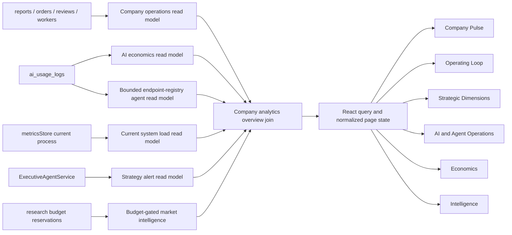

# Enterprise Operations Analytics Blueprint

Status: Blueprint only  
Target route: `/enterprise/analytics`  
Map: Explicitly excluded  
Reference images:

- `ScreenShot_2026-03-16_102256_453.jpg`
- `ScreenShot_2026-06-12_201756_768.jpg`

## 1. Product Decision

The page should become the company's operational intelligence surface, not an
AI token dashboard with unrelated modules appended below it.

The enterprise information architecture will have clear ownership:

| Surface | Primary question |
| --- | --- |
| Mission Control | What requires operational action right now? |
| Analytics | Is the company operating efficiently, profitably, and reliably? |
| Properties | Which assets and locations create demand or risk? |
| Tickets | Which work orders need intervention? |
| Workers | Is supply, quality, and coverage sufficient? |
| AI Config | How are models, agents, skills, and workflow gates configured? |

`/enterprise/analytics` remains one continuous page. A sticky section navigator
provides anchor-based movement between Overview, Operations, AI & Agents,
Economics, and Intelligence without creating disconnected sub-pages.

## 2. Reference Extraction

The images add six meaningful modules:

1. Strategic dimensions: TAM, 10X, Team, and Financials.
2. System Load Swarm: capacity, latency, success, and a time trend.
3. LLM Agent Swarm Status: status, model, calls or graph nodes, and compute cost.
4. Strategy Control Alerts: rule, measured value, threshold, severity, and action.
5. Automated Market Intelligence: explicit research execution and latest result.
6. Efficiency Topology: compute, execution latency, idle share, and cost optimization.

The map in the second image is not carried into Analytics. Operations location
tracking remains owned by Mission Control.

## 3. Current-State Gap

| Current analytics capability | Decision |
| --- | --- |
| Inquiry, conversion, photo, and feedback metrics | Replace browser-local scope with company-wide backend aggregates. |
| VC value, token cost, ROI, and IVR | Keep and promote into the Economics section. |
| Actual output share and total-to-output ratio | Keep with zero-denominator safeguards. |
| Token trend, model detail, endpoint detail | Keep as evidence and drill-down modules. |
| Service quality and inquiry structure | Keep, but source from shared data rather than `localStorage`. |
| Strategic dimensions | Missing; add with versioned formulas and confidence labels. |
| Six-stage operating-loop health | Missing from Analytics; add a compact funnel and exception summary. |
| Agent status and system load | Missing; add from durable telemetry rather than hard-coded cards. |
| Strategy alerts | Service logic exists but is not exposed or persisted; add an admin read model. |
| Research swarm | Execution exists but history is not durable; add latest-run and history support. |
| Efficiency topology | Existing visual is static; replace with measured utilization categories. |

Enterprise analytics must not present browser-local values as company metrics.
Every number is labeled `Measured`, `Estimated`, or `Unavailable`.

## 4. Target Page Blueprint

### Desktop, 12-column grid

```text
+--------------------------------------------------------------------------+
| Header: Company Operations Intelligence | scope filters | refresh/export |
+--------------------------------------------------------------------------+
| Sticky section nav: Overview | Operations | AI & Agents | Economics | Intel|
+--------------------------------------------------------------------------+
| COMPANY PULSE: Active work | SLA | Deflection | First fix | Value | Margin |
+--------------------------------------------------------------------------+
| OPERATING LOOP HEALTH (8 cols)                 | CONTROL ALERTS (4 cols)   |
| Intake > Diagnose > Deflect > Dispatch > Verify > Report | ranked actions |
+--------------------------------------------------------------------------+
| STRATEGIC OUTLOOK: TAM | 10X | TEAM | FINANCIALS                         |
+--------------------------------------------------------------------------+
| AGENT SWARM STATUS (8 cols)                    | SYSTEM LOAD (4 cols)      |
| status, model, calls, tokens, cost, latency    | load, success, p95 trend  |
+--------------------------------------------------------------------------+
| VC VALUE ECONOMICS (6 cols)                    | TOKEN EFFICIENCY (6 cols) |
+--------------------------------------------------------------------------+
| MARKET INTELLIGENCE (8 cols)                   | EFFICIENCY (4 cols)       |
| latest run, evidence, explicit scan action     | compute/wait/idle topology|
+--------------------------------------------------------------------------+
| EVIDENCE: trends, model table, endpoint value, stage and quality details  |
+--------------------------------------------------------------------------+
```

### Mobile

- One column, with Company Pulse rendered as a stable two-column metric grid.
- Filters move into a single filter sheet; active scope remains visible.
- Section navigation becomes a horizontally scrollable sticky tab row.
- Alert and agent detail opens in a full-height sheet.
- Data tables use contained horizontal scrolling and preserve the page width.
- The existing enterprise bottom navigation remains unchanged.

## 5. Section Contracts

### A. Company Pulse

Purpose: answer whether the company is healthy in less than ten seconds.

Metrics:

- Active work orders
- SLA attainment
- DIY deflection rate
- First-time-fix rate
- Estimated AI-created value
- Gross margin or AI-cost-to-revenue ratio

Rules:

- Show current value, period comparison, target, and freshness.
- Period comparison stays explicitly `Unavailable` until the read model exposes
  a prior-period observation; the UI must not synthesize one.
- A missing denominator displays `Unavailable`, never `0%`.
- Clicking a metric applies a cross-page filter or opens its evidence drawer.

### B. Operating Loop Health

The six stages come from `src/constants/operatingModel.ts`:

1. Intake
2. Diagnosis
3. Deflection
4. Dispatch
5. Verification
6. Reporting

Each stage displays entering volume, conversion to the next stage, median cycle
time, and exception count. Selecting a stage filters alerts, trends, and the
evidence table.

### C. Strategic Outlook

Each dimension contains a score, trend, confidence, formula version, and source:

| Dimension | Required inputs |
| --- | --- |
| TAM | Latest validated research run, current TAM, expanded TAM, evidence confidence |
| 10X | Diagnosis-time reduction, deflection improvement, automation coverage |
| Team | Ticket-to-worker ratio, SLA, first-time-fix rate, capacity coverage |
| Financials | Gross margin, AI cost share, ROI, IVR |

Scores are computed by versioned threshold rules. If the minimum sample or
source requirement is not met, the score is `N/A`; no reference-image value is
used as production data.

### D. Strategy Control Alerts

The existing `ExecutiveAgentService` becomes a read-only analytics source.
Every alert includes:

- Stable alert ID and generated time
- Severity and owner
- Rule and formula version
- Metric value, unit, threshold, and comparison direction
- Recommended action
- Evidence link
- Human-approval requirement
- Acknowledged/resolved state

Alerts sort by severity, then business impact, then age. Financial, dispatch,
recruitment, or external messaging actions remain advisory until explicitly
approved.

### E. Agent Swarm Status

Agent cards are operational records, not decorative identities:

- Agent ID and display name
- Online, idle, degraded, or offline status
- Assigned model and workflow stage
- Calls, input/output tokens, stored cost, average and p95 latency
- Success/error rate and last activity
- Graph nodes completed when that measurement is available

Phase 1 may derive identity from an endpoint-to-agent registry. The durable
target is an `agent_runs` ledger; `nodes hit` remains hidden until graph-node
receipts exist.

### F. System Load

Metrics:

- Request throughput
- Success rate
- Average and p95 response latency
- Active agent runs
- Utilization over the selected period

A current in-memory snapshot is insufficient for a trend. A bounded
`ops_metric_samples` ledger stores periodic aggregates for historical charts.

### G. VC Economics and Token Efficiency

Reuse the current measured economics contract:

- Estimated business value
- Actual stored token cost
- Return on inference
- Inference cost / business value
- Total token consumption
- Output share
- Total consumption / output ratio

The effective total is calculated per ledger row as
`max(total_tokens, input_tokens + output_tokens)` before aggregation.

### H. Automated Market Intelligence

The research control is explicit and user-triggered:

- Sector and focus inputs
- Cost estimate and budget state before execution
- Three-agent validation status
- Latest verdict, executive summary, evidence count, and run time
- Link to prior research runs

The button calls the existing research swarm only after CSRF, role, and budget
checks. Page load never starts an external model call.

### I. Efficiency Topology

Replace the static 60/25/15 composition with measured categories:

- AI compute: model execution time
- Agent coordination: verified orchestration or wait time
- System idle: available observation time not consumed

The three percentages must total 100% after rounding correction. Cost
optimization is compared with a declared baseline model and period.

## 6. Unified Read Model

The page should consume one bounded overview request plus lazy drill-downs:

```ts
interface CompanyAnalyticsOverview {
  meta: {
    range: '7d' | '30d' | '90d';
    generatedAt: string;
    freshness: 'live' | 'delayed' | 'partial';
  };
  pulse: CompanyPulseMetric[];
  operatingLoop: OperatingStageMetric[];
  strategicDimensions: StrategicDimensionMetric[];
  alerts: StrategyAlertView[];
  agentOperations: AgentOperationMetric[];
  systemLoad: SystemLoadMetric;
  economics: AiEconomicsMetrics;
  intelligence: LatestResearchSummary | null;
  accessIssues: DataAccessIssue[];
}
```

Implemented endpoints:

| Endpoint | Responsibility |
| --- | --- |
| `GET /api/v1/analytics/company-overview` | Company pulse, loop, dimensions, alerts, runtime summary |
| `GET /api/v1/metrics/ai-economics` | Measured token economics using the same `range` |
| `GET /api/v1/ai/research-market/preflight` | Authoritative research budget and reservation readiness |
| `POST /api/v1/ai/research-market` | Explicit research execution after atomic budget reservation |

The shared URL filter is `range`. Optional `stage` scopes the loop and alerts,
and optional `metric` opens the selected Company Pulse evidence detail.
`region` and `propertyType` are intentionally not published because reports do
not yet carry authoritative, queryable dimensions for them. Evidence history,
research-run history, and alert acknowledgement remain deferred until their
durable ledgers exist.

## 7. Source-of-Truth Plan



## 8. Interaction and Visual Rules

- Preserve the current enterprise shell and route.
- Use Google Cloud/Looker-style neutral surfaces, 1px borders, and an 8px
  maximum panel radius.
- Avoid gradients, decorative glow, oversized shadows, and nested cards.
- Blue means navigation or neutral action; green means verified healthy;
  amber means attention; red means breach; gray means unavailable.
- One refresh action updates a single `generatedAt` timestamp for the overview.
- Loading preserves panel dimensions; partial failures identify the failed
  source while retaining verified sections.
- Every chart has a table-equivalent or accessible text summary.
- All interactive state is represented in the URL or an explicit drawer.

## 9. Delivery Sequence

1. Build the company and agent read models with formula tests.
2. Add durable agent, load-sample, alert, and research-run storage where required.
3. Build isolated analytics modules against typed fixtures.
4. Add bilingual copy and accessibility labels.
5. Integrate the modules into `MetricsDashboard` and one shared filter state.
6. Run contract, unit, integration, accessibility, and responsive browser tests.
7. Perform an independent terminal review against this blueprint.

The strict implementation DAG is defined in
`docs/enterprise-analytics-implementation.graph-contract`.

## 10. Acceptance Criteria

- The map does not render or load on `/enterprise/analytics`.
- The first viewport communicates company health, operating-loop risk, and
  highest-priority alerts.
- All six reference-image modules are present with real, estimated, or
  unavailable labels.
- Company metrics never depend on browser-local storage.
- Agent, alert, system-load, and research records have typed backend contracts.
- Filters update every dependent section consistently.
- Zero denominators and insufficient samples never become false percentages.
- Desktop at 1440px and mobile at 390px have no page-level horizontal overflow.
- Keyboard navigation, focus order, landmarks, and contrast pass review.
- Frontend and server tests, TypeScript, production build, lint, and Playwright
  checks pass with fresh evidence.
