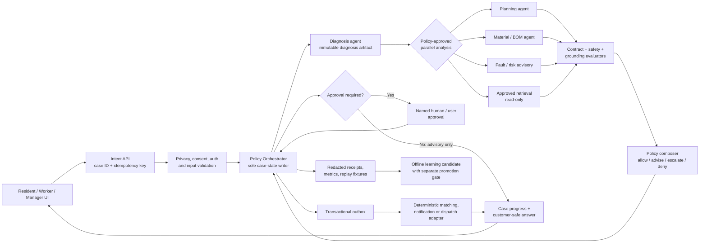

# Maintenance Policy-Agent Architecture

**Status:** target architecture for staged implementation  
**Baseline inspected:** 2026-07-29  
**Delivery command program:** [`ui-agentic-delivery-command-program.md`](./ui-agentic-delivery-command-program.md)  
**Static implementation DAG:** [`maintenance-policy-runtime-implementation.graph-contract`](./maintenance-policy-runtime-implementation.graph-contract)  
**Joint UI adoption DAG:** [`maintenance-case-progress-adoption.graph-contract`](./maintenance-case-progress-adoption.graph-contract)  
**Voice-first Sol extension:** [`voice-first-sol-multi-agent-blueprint.md`](./voice-first-sol-multi-agent-blueprint.md)

## 1. The architectural decision

House Maint AI should use multiple AI agents for independent analysis, not for uncontrolled workflow ownership.

The minimum useful product promise is:

> A resident can submit text, a photo, or both; the system quickly explains the likely issue and safest next step; then it carries the same verified case context through planning, dispatch, repair, and proof of completion.

The core rule is simple:

> **Agents create proposals and evidence. A deterministic Policy Orchestrator owns state transitions and external effects.**

This preserves the benefit of parallel AI work without allowing a model answer, vendor call, or partial failure to silently change a case, charge money, dispatch a worker, or close a safety-sensitive job.

## 2. First-principles constraints

| Constraint | Consequence |
|---|---|
| A user needs a reliable outcome, not an impressive chain of AI messages. | Show one customer-safe result, its confidence/uncertainty when relevant, and a clear next action. Keep internal agent choreography out of the UI. |
| A photo can be private, poor quality, or safety-critical. | Consent and privacy inspection precede model work; low-quality/blocked input has a retake/manual route; safety escalation can short-circuit normal automation. |
| Several analyses can use the same diagnosis without changing each other. | Planning, material/BOM, fault-risk enrichment, and approved retrieval run from an immutable diagnosis snapshot in parallel. |
| Dispatch, payment, worker acceptance, and closure are consequential. | They are deterministic case transitions with compare-and-swap versioning, approval gates, and idempotent outbox effects. |
| Providers fail, stall, or return malformed output. | All providers sit behind server adapters; outputs must pass schema/safety evaluation; retry, timeout, fallback, and kill-switch behavior are explicit. |
| The current app already has lifecycle behavior. | Introduce an adapter and preserve current report states until parity and migration evidence exist; do not replace lifecycle semantics under a UI change. |

## 3. Current-state observations and the migration problem

The repository already has valuable pieces, but they are not yet one authoritative policy runtime:

- `server/worker.ts` starts diagnosis, planning, and vendor background claws, while normal local development commands do not necessarily start that worker process.
- A submitted report creates a diagnosis task, but planning, vendor matching, and learning paths can operate through separate direct polling or data mutation paths.
- `server/routes/reports.ts` contains the report lifecycle; AI route handlers provide diagnosis, planning, material, fault, turnover, research, and other capabilities.
- The browser-side agentic gateway and skills (`src/agenticInit.ts`, `src/gateway/**`, `src/skills/**`) are useful interaction scaffolding but must not become trusted workflow authority.
- The PIPL/privacy gate must remain server-authoritative and fail closed in production. Browser-visible provider credentials are never acceptable.

The migration goal is **not** to rewrite all agents. It is to place a policy boundary around existing capabilities and move their durable writes behind that boundary in small, testable steps.

### Dual-runtime cutover contract

The new policy runtime and the legacy report/Blackboard/claw runtime must never mutate the same job concurrently. Before the first migrated case is admitted, define all of the following:

- an immutable, unique `legacy_report_id ↔ case_id` mapping (or explicitly retain `report.id` as the canonical case ID);
- `workflow_engine_version` on every case/report, with one authorized mutator for the active version;
- a cutover flag evaluated by every legacy claw so it skips policy-migrated cases;
- an atomic adapter transaction that changes the legacy-visible status only with the matching policy decision and outbox intent;
- a reconciliation job and migration test that detect duplicate ownership, status divergence, orphaned work, and any legacy write that bypassed the orchestrator.

New policy stages may be stored internally during migration, but they do not change the externally visible report state until a compatible mapping and acceptance test exist.

## 4. Target topology



The diagram intentionally has one state-owner. Individual agents may run concurrently only after the orchestrator publishes an immutable input artifact. They return proposals to a join; they do not call the next agent by mutating the case themselves.

Payment is intentionally outside the generic outbox path: checkout is user initiated; a signed provider webhook is the settlement authority; an immutable financial ledger and reconciliation workflow record the result; and AI never selects an amount, settles a charge, or triggers a payout/refund.

## 5. Agent roles and authority limits

| Role | Inputs | Output | May do | Must never do |
|---|---|---|---|---|
| Intake and privacy gate | user intent, authenticated identity, consent, media reference | validated intake artifact or block reason | redact/deny/route to manual path; create a case event | send unredacted data to an unapproved provider; infer consent |
| Diagnosis agent | validated media/text snapshot | `DiagnosisArtifact` with labels, evidence, confidence, uncertainty, safety flags | analyze a bounded input and request more evidence | write report status, dispatch, quote, pay, or message externally |
| Planning agent | accepted diagnosis artifact, locale, policy context | `MaintenancePlanProposal` | create concise bilingual repair steps, skills, tools, time/cost range and caveats | return raw JSON to a customer; declare a binding quote or safety clearance |
| Enrichment agents | same diagnosis snapshot | material/BOM, fault-risk, or grounded retrieval proposal | independently enrich a plan | read/write another agent's hidden state or cause an external effect |
| Policy Orchestrator | case version, validated artifacts, current policy | `PolicyDecision`, allowed transitions, approval requests | evaluate rules, compare-and-swap case state, queue an effect | call an LLM as the sole authority for a consequential decision |
| Matching service | approved dispatch intent, deterministic criteria | candidate matches / review requirement | rank and create a reversible proposal | bind a worker or publish a job without policy approval |
| Outbox executor | approved, idempotent effect | delivery receipt | send an approved notification or call a deterministic adapter | create its own action, retry forever, or duplicate effects |
| Verification and learning | completion evidence and outcomes | verification proposal / offline learning candidate | calculate evidence quality and metrics | promote learned policy or close a case without a gate |
| Research swarm | explicit admin research request and budget | read-only research brief | use bounded, audited parallel research | access case PII, masquerade simulations as facts, or alter policy/case state |

## 6. Durable objects and single-writer rules

The following records form the minimum audit trail. They may be implemented with the repository’s existing database technology, but their semantics must be stable before implementation begins.

| Object | Required fields | Writer | Purpose |
|---|---|---|---|
| `Case` | `case_id`, `legacy_report_id`, `workflow_engine_version`, `version`, `tenant_id`, `owner`, `current_stage`, `safety_tier`, `privacy_state`, `created_at`, `updated_at` | Policy Orchestrator only | Current workflow state and immutable legacy identity mapping. Version is used for compare-and-swap. |
| `AgentRun` | `run_id`, `case_id`, `stage`, `attempt`, `input_hash`, `policy_version`, `policy_epoch`, `status`, `lease_owner`, `lease_until`, `deadline_at`, `error_code` | Policy Orchestrator / queue control plane only | Durable execution, claim, heartbeat, timeout, retry and dead-letter record. |
| `RunReceipt` | `run_id`, `lease_token_hash`, `policy_epoch`, `artifact_hashes`, `finished_at`, `outcome_code` | Agent append path after lease validation | Immutable agent completion handoff; it cannot alter run state, lease, attempt, or timeout. |
| `Artifact` | `artifact_id`, `case_id`, `tenant_id`, `run_id`, `type`, `schema_version`, `content_hash`, `evidence_refs`, `confidence`, `provider_metadata`, `consent_ref`, `purpose`, `data_classification`, `retention_deadline`, `deletion_state` | Artifact ingestion service after policy/lease validation | Immutable typed proposal/evidence. Raw media stays in a separate encrypted store; no raw hidden reasoning. |
| `JoinPolicy` | `join_policy_id`, `case_id`, `case_version`, `diagnosis_hash`, `required_types`, `optional_types`, `quorum`, `max_artifact_age`, `policy_version`, `fallback` | Policy Orchestrator only | Versioned fan-in rule for one decision; prevents stale or optional artifacts from silently changing an outcome. |
| `PolicyDecision` | `decision_id`, `case_id`, `case_version`, `input_artifact_hashes`, `join_policy_id`, `policy_version`, `policy_epoch`, `risk_tier`, `action`, `reason_codes`, `approver_required` | Policy Orchestrator | Explainable allow/advise/escalate/deny decision. |
| `ActionProposal` | `action_id`, `case_id`, `tenant_id`, `case_version`, `kind`, `payload_hash`, `reversible`, `expires_at` | Producing service | Immutable, content-addressed candidate external or lifecycle action awaiting policy. |
| `Approval` | `approval_id`, `case_id`, `action_id`, `payload_hash`, `case_version`, `policy_version`, `approver_id`, `authenticated_role`, `decision`, `reason`, `issued_at`, `expires_at`, `revoked_at` | Named human or authenticated user through the approval service | Case- and payload-bound approval. It expires and is invalidated by material case/policy/role changes. |
| `OutboxEvent` | `event_id`, `case_id`, `tenant_id`, `transition_id`, `action_id`, `decision_id`, `approval_id`, `action_kind`, `payload_hash`, `case_version`, `policy_epoch`, `idempotency_key`, `destination`, `status`, `attempts`, `reconciliation_state` | Policy Orchestrator creates; executor delivers | At-least-once delivery intent cryptographically bound to its decision/approval/payload/version, with destination idempotency and reconciliation receipt. |

**State and transaction rule:** only the Policy Orchestrator may transition a `Case`, using a compare-and-swap update on `case.version`. It is also the sole owner of `AgentRun` lifecycle/leases, `JoinPolicy`, `PolicyDecision`, and `OutboxEvent` creation. Agents submit lease- and policy-epoch-checked `RunReceipt`/artifact candidates only. A case transition, matching decision, immutable action proposal, and any required outbox event commit in one database transaction with unique keys such as `(case_id, transition_id)` and `(case_id, action_kind, idempotency_key)`. Before delivery, the executor revalidates tenant/case/action/payload hash, decision ID, required approval ID and revocation/expiry, case/policy version, policy epoch, and current kill-switch; any mismatch is rejected and reconciled rather than delivered. The executor provides at-least-once delivery, passes the destination idempotency key, deduplicates inbound webhooks, and records reconciliation/compensation when a destination cannot guarantee exactly-once behavior.

**Privacy and tenancy rule:** every reference is tenant- and case-scoped; raw media is encrypted and separated from derived artifacts; agents receive only purpose-scoped sanitized references. Consent withdrawal, retention expiry, or erasure creates tombstones and propagates deletion/quarantine through artifacts, queues, receipts, caches, and permitted processors. Provider region/processor approval is recorded before inference, including for anonymization processors.

## 7. Compatible lifecycle migration

The existing report statuses remain visible during migration. The policy runtime maps them to internal events rather than silently replacing them.

| Existing lifecycle state | Policy event / target meaning | Required artifact or gate |
|---|---|---|
| `pending` | intake recorded; diagnosis queued/running | validated intake + privacy decision |
| `analyzed` | diagnosis accepted | valid diagnosis artifact; safety and confidence policy passed |
| `planned` | customer-safe plan accepted | valid plan artifact plus schema/safety/locale evaluation |
| `matching` | approved dispatch/matching requested | customer or human gate where required; idempotent matching intent |
| `in_progress` | worker accepted and active; completion evidence may be collected in an internal verification substage | deterministic worker acceptance and job state evidence; legacy report remains non-terminal while verification is pending |
| `completed` | verified completion and any required customer/human confirmation are complete | completion evidence, verification decision, and required confirmation are accepted before the legacy terminal state is written |

No route handler or background agent may set `planned` merely because an LLM returned text. The target transition requires a valid planning artifact, evaluator receipt, current case version, and a policy decision. Likewise, the current terminal `completed` state is not repurposed to mean “evidence received”: retain `in_progress` until verification/confirmation succeeds, or first introduce backward-compatible intermediate/reopen semantics and migrate consumers with tests.

## 8. The bounded policy episode

For each new intake, changed evidence, or requested action:

1. Accept an idempotent intent and return a `case_id` plus immediate truthful status. A network retry reuses the same logical intake/upload session and idempotency key.
2. Authenticate, check consent, apply tenant/media/mime/size limits, run privacy controls, and create an intake artifact containing permitted references only.
3. Run a conservative deterministic emergency classifier before any model fan-out. Gas, electrical, fire, structural, flood, mold, or similarly urgent signals immediately show fixed localized safety guidance and enter a priority manual/emergency route; degraded AI or review systems cannot suppress that path.
4. The orchestrator claims the episode with a lease, policy epoch, deadline, and compare-and-swap case version.
5. Run diagnosis. Reject malformed, unsafe, stale, cancelled, or policy-incompatible output before artifact commit or visibility.
6. If diagnosis is accepted, create a versioned `JoinPolicy` and fan out only independent work: plan, materials/BOM, fault-risk, and authorized retrieval.
7. Collect completed proposals until the `JoinPolicy` timeout or required quorum is reached. A missing optional enrichment does not block a safe advisory answer; a missing required safety artifact does.
8. Evaluate schema, grounding, safety, privacy, authority, lifecycle policy, current policy epoch, and artifact age/version. The policy composer then chooses `allow`, `advisory_only`, `needs_more_evidence`, `human_review`, or `deny`.
9. Render a customer-safe response and progress event. If a consequential action is permitted, create a payload-bound action proposal and obtain required approval.
10. In one transaction, commit the decision against the current `case.version`, the action proposal, legacy adapter update if applicable, and allowed outbox event(s).
11. Record a redacted receipt and schedule offline outcome evaluation. Expired leases are reclaimed deterministically; exhausted retries go to a named dead-letter review queue.

### Parallelism rule

Safe parallelism is a fan-out from an immutable diagnosis snapshot. The fan-in decision is always deterministic.

| Can run in parallel | Why it is safe | Join condition |
|---|---|---|
| planning, material/BOM, fault-risk, approved knowledge retrieval | read the same accepted diagnosis; emit independent proposals | a persisted `JoinPolicy` fixes required/optional types, quorum, case/artifact version, max age, and fallback before fan-out |
| bounded image anonymization variants | no case state ownership; fixed concurrency limit | approved sanitized media reference only |
| read-only research calls | separate admin budget and no case writes | clearly labelled research artifact only |
| post-decision notification rendering | outbox event already has a decision/idempotency key | delivery receipt; it cannot change decision |

The following are deliberately serialized or deterministic: report/case state, worker assignment and acceptance, payment, refunds, status closure, legal/landlord-tenant claims, knowledge/policy promotion, and anything that changes an external system.

### Queue, cancellation, and egress boundaries

- A queue-control process atomically claims a pending `AgentRun`, assigns one lease owner/token and deadline, renews a heartbeat, and reclaims only expired leases. The claim algorithm must have equivalent transactional semantics on supported SQLite and Postgres deployments.
- Worker pools are bounded per stage/tenant; safety cases receive priority without starving ordinary cases. Per-user/tenant cost quotas, image/mime/size limits, provider circuit breakers, abort timeouts, and classified retry limits are checked before a call.
- Every run carries a policy epoch and cancellation token. The current epoch is checked before artifact ingestion, JoinPolicy composition, PolicyDecision commit, outbox creation, dequeue, and immediately before an outbound call. At dequeue/effect time, the executor also revalidates the immutable ActionProposal payload hash, decision/approval bindings, case/tenant/version, and approval revocation/expiry. Late or cancelled results are quarantined, not consumed.
- Retrieval, OCR, user text, media, and provider output are untrusted data, not instructions. Retrieval uses tenant-scoped source allowlists, versioned/cited evidence, no arbitrary web/tool execution, and evaluator checks that separate source evidence from generated inference.
- Human-review queues have an owner, acknowledgement target, escalation SLA, and static emergency/manual fallback. Review unavailability is never silently treated as approval.

## 9. Risk tiers and human gates

| Tier | Examples | Default treatment |
|---|---|---|
| T0 — deterministic | schema validation, route/state rules, version checks, retries, data formatting | automatic after tests and policy checks |
| T1 — advisory | diagnosis explanation, bilingual repair plan, tool list, non-binding time/cost range | display only after evaluator pass; no durable consequential effect |
| T2 — reversible | provisional worker candidate, notification draft, appointment suggestion | compare-and-swap plus the explicitly versioned confirmation rule for that action; preserve a rollback path |
| T3 — consequential | emergency closure, binding dispatch, legal/liability statement, high-value external action; payment/refund/payout through its separate financial boundary | named human approval; record approver, exact payload/version, and expiration |
| T4 — prohibited / incident | privacy/residency violation, credential leakage, safety bypass, unapproved provider, unsafe DIY instruction | deny, contain, notify an authorized operator, and preserve a redacted incident receipt |

Human review is mandatory for electrical, gas, fire, structural, flood, mold, unclear emergency scenarios, low confidence, conflicting artifacts, failed evidence, quote/payment/refund, safety-critical dispatch, low-quality worker matching, and completion without required evidence or confirmation. Numeric thresholds must be policy-versioned configuration, not hidden prompt text.

An approval is valid only for its exact `action_id`, `payload_hash`, `case_version`, `policy_version`, approver role, and expiry. It is invalidated on material case or payload change, policy change, role revocation, or explicit revocation. The requester/proposer and approving actor are separated for T3 actions; step-up authentication is required where policy calls for it. Payment settlement, payout, refund, and charge authority remain a user-initiated, webhook-verified financial workflow with ledger reconciliation, never a generic AI or outbox action.

## 10. Evaluators and evidence before visibility

Every artifact is evaluated before it can alter the visible answer or policy decision.

| Evaluator | Checks | Failure behavior |
|---|---|---|
| Contract | typed schema, locale shape, no raw JSON/rendering failure, bounded length | discard/retry once or show clear unavailable/manual fallback |
| Safety | emergency taxonomy, prohibited unsafe instructions, required escalation | `human_review` or `deny`; never obscure urgent safety guidance |
| Privacy / residency | consent/purpose/version, media classification, redaction, tenant ACL, approved processor/data-region policy, retention/deletion state | block external inference; retain only permitted reference/receipt and propagate erasure/tombstone work |
| Authority | role, case ownership, spend/action authority, approved destination | deny/queue for named approver |
| Lifecycle | valid transition, idempotency, current version, duplicate-effect guard | reject stale/duplicate request and refresh case state |
| Grounding | evidence vs inference, calibrated confidence, source/provenance labels, mock/demo status | qualify answer, request more evidence, or hide unsupported conclusion; simulations are labelled `demo` and provider failures `unavailable` |
| Experience | Chinese/English completeness, actionable wording, no internal policy jargon | return structured retry/manual escalation copy |

The UI should display a concise conclusion, next step, safety note, evidence/photo request if needed, and a fallback. It should never expose a model’s private reasoning, raw provider payload, or internal policy trace.

## 11. Neutral UI progress contract

UI surfaces integrate through one server response/event model rather than provider-specific loading behavior:

```json
{
  "schema": "case-progress/v1",
  "case_id": "case_…",
  "version": 12,
  "stage": "planning",
  "status": "in_progress",
  "retryable": true,
  "next_action": "review_plan | provide_photo | wait | contact_support",
  "user_message": {
    "zh": "我们正在整理维修方案。",
    "en": "We are preparing the repair plan."
  },
  "result_ref": "opaque, short-lived, case-bound safe-render reference",
  "correlation_id": "…"
}
```

`result_ref`, `correlation_id`, and progress events are non-bearer values: they are opaque, short-lived, case/tenant/role-authorized, artifact-type constrained, and never expose a filesystem or object-store path. Socket subscriptions enforce the same authorization.

The camera flow creates one logical intake/upload session with an idempotency key, immediately shows its captured preview and case acknowledgement, then subscribes/polls by `case_id`. Network retries reuse that session rather than creating duplicate reports. When a safe diagnosis/plan passes policy, the UI renders the structured bilingual answer directly. If any guard fails, the same UI presents a retake, text description, manual service request, or support option — never a misleading “system unavailable” dead end.

## 12. Failure containment and operational smoothness

| Failure | User-facing behavior | Runtime behavior |
|---|---|---|
| blurry/insufficient image | explain what to retake; allow text/manual reporting | no diagnosis promotion; record an input-quality artifact |
| provider timeout or malformed output | preserve only permitted encrypted references and offer retry/manual help | bounded retry with different attempt ID; then an explicit unavailable outcome and dead-letter receipt |
| privacy/consent block | explain privacy-safe alternative without exposing policy internals | do not call external model; enforce retention policy |
| low confidence or conflicting agents | show uncertainty and escalation path | `needs_more_evidence` or `human_review`; do not auto-dispatch |
| process crash | show last confirmed stage and allow refresh | lease expiry/reclaim; idempotent rerun from immutable input |
| duplicate click/request | one visible case, no duplicate message/payment | idempotency key and CAS transition reject duplicate action |
| policy/provider incident | manual workflows and fixed emergency guidance remain available | server-authoritative kill switch invalidates in-flight AI actions at artifact, decision, outbox, dequeue, and effect boundaries |

The kill switch has server-owned modes: `enabled`, `advisory_only`, `review_only`, and `disabled`, plus a global emergency suspend. It scopes by environment, cohort, agent/stage, provider, and effect type; carries an actor, reason, expiry, and rollback test; and is checked before execution, artifact ingestion, policy composition, every case write, outbox creation, dequeue, and outbound effect. Best-effort provider abort is useful but not treated as a cancellation guarantee.

## 13. Evaluation fixtures, metrics, and promotion gates

### Required synthetic fixtures

Each immutable, synthetic or de-identified fixture pack records `fixture_id`, input hash, expected risk tier, expected policy outcome/reason codes, and safe-output properties — never an exact expected model prose string.

1. Clear low-risk plumbing issue with a useful bilingual plan.
2. Electrical/gas/fire/structural/flood/mold emergency or ambiguity, including degraded-provider static guidance.
3. Blurry, unrelated, malicious, or prompt-injection-bearing image/text.
4. Valid diagnosis with malformed planning output, timeout, and provider mock/error outcome.
5. Chinese/English plan length, semantic parity, and no raw-JSON/hidden-reasoning rendering.
6. Consent denied, PIPL-protected media, processor/residency rejection, retention expiry, and erasure propagation.
7. Role, budget, approval, payload-hash, or approver-separation mismatch.
8. Concurrent stale-version writes, stale policy epoch/kill-switch change, post-approval payload mutation, post-enqueue approval revocation, duplicate outbox delivery, and cross-case/tenant artifact or action substitution.
9. Legacy and new UI route/locale parity for the same case state, including a test that legacy workers cannot bypass the orchestrator for migrated cases.

### Minimum metrics

| Category | Metrics |
|---|---|
| Agent health | completion/error/timeout rate, retry rate, p50/p95 latency, cost/quota, schema failure rate |
| Safety and trust | policy denials, human-review rate, emergency escalation correctness, privacy blocks, kill-switch activations |
| Operations | time from intake to safe next action, dispatch latency, duplicate effects, lease recovery, verification pass/reopen rate |
| Product outcomes | photo-to-answer completion, manual fallback completion, time-on-task, abandonment, resident/worker satisfaction, outcome ledger with verified resolution/reopen/override labels |
| Delivery | route parity, test/a11y/visual/bundle results, rollout cohort regressions, rollback drill result |

Confidence is not treated as self-reported truth. Periodically collect blinded outcome labels, minimum sample sizes, calibration/Brier analysis, human override/error patterns, and reopen/relapse outcomes before reporting accuracy or product value. Do not promote a learned pattern, model/prompt/provider change, policy version, spending limit, data residency change, or high-risk workflow action based only on aggregate model metrics. Promotion requires replay evidence, policy review, a rollback point, and named approval.

## 14. Staged implementation and rollout

1. **Observe and normalize:** add redacted receipts, contract schemas, immutable report/case mapping, workflow-engine ownership flag, legacy-state adapter, and worker process startup/health verification. Keep output advisory-only.
2. **Expand durable storage safely:** add forward-only, immutable schema migrations for the policy records; keep schema and backfill work separate; prove SQLite/Postgres convergence, compatibility, and a forward compensating-migration path before a migrated case is admitted.
3. **Enforce the policy boundary:** guard every legacy report/AI/payment/matching/learning mutator by `workflow_engine_version`, then move diagnosis/planning/enrichment writes behind orchestrator-owned AgentRun/JoinPolicy/Decision records and immutable artifacts. Legacy claws and learning queries skip migrated cases; continue to use existing capabilities through adapters.
4. **Add safe parallelism:** fan out plan/BOM/fault/retrieval after diagnosis; enforce quotas, timeouts, evaluator gates, and a deterministic join.
5. **Make the runtime reachable:** launch the policy worker through standard local/container startup, mount the authorized progress API/socket in the real server entrypoint, and verify drain/recovery with fake providers.
6. **Integrate truthful progress:** only through the separately approved [joint UI adoption DAG](./maintenance-case-progress-adoption.graph-contract), use `case-progress/v1` in the resident camera flow and worker bilingual plan; preserve manual paths.
7. **Enable reversible actions:** only after replay and lifecycle tests, allow explicitly accepted matches/notifications through the outbox.
8. **Controlled rollout:** internal users, a small resident cohort, workers, then managers; compare completion, error, support, safety, and rollback signals at each cohort.

At every stage, preserve manual report creation, messaging, and dispatch. AI must be an accelerator, not a single point of operational failure.

## 15. Decisions requiring product-owner input before T3 exposure

- The definitive emergency/safety taxonomy and threshold values.
- Named human approver roles and service-level expectations.
- The maximum binding quote, spend, refund, and external-message authority.
- Consent language, retention periods, approved providers, and data-residency requirements.
- What customer-visible confidence, provenance, and liability language is acceptable.
- The production rollout cohorts and measurable rollback thresholds.

Until these choices are approved, the system remains at T0/T1 advisory capability with human review for higher-risk actions.
