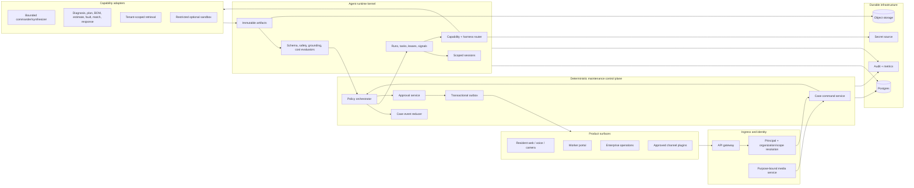
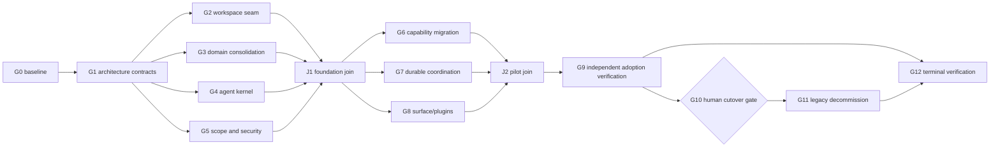

# House Maint AI Agent-Native Reconstruction Blueprint

**Status:** review required; no source migration or production action is authorized by this document  
**Prepared:** 2026-08-02  
**Current repository baseline:** `codex/update-diagnosis-flow` at `0841b2d`  
**Reference snapshot:** [`yc-software/qm` at `7f2c916`](https://github.com/yc-software/qm/tree/7f2c916360f1797a8ff2a77ce2ce40c5fabab087)  
**Execution DAG:** [`qm-agent-native-reconstruction.graph-contract`](./qm-agent-native-reconstruction.graph-contract)

## 1. Reconstruction decision

Reconstruct House Maint AI as a **domain-first modular monolith plus a durable agent worker**, using QM as an architectural reference rather than replacing the product with QM or copying its source tree.

The system will have two explicit authorities:

1. **Maintenance domain control plane** — owns identity, organization scope, cases, case events, approvals, payments, dispatch, messages, and closure.
2. **Agent runtime kernel** — owns sessions, runs, task leases, capability routing, model calls, immutable artifacts, budgets, evaluation, and cancellation. It may propose; it may not perform consequential domain mutations.

This distinction is mandatory. QM is designed around scoped internal organizational agents and durable computers. Its own threat model does not claim a hardened public multi-tenant service boundary. House Maint AI is a public B2B2C product with residents, workers, property organizations, private media, financial actions, and safety-sensitive maintenance cases. The useful QM ideas are its headless core, scope resolution, durable state, harness interfaces, plugin surfaces, command policy, and isolated execution—not its exact trust boundary or Slack-first product shape.

### Observable end state

A resident can submit confirmed text, voice transcript, or photos. One authoritative case is created. A bounded set of model capabilities produces typed evidence. A deterministic policy orchestrator decides the safe next transition. Every external effect is approved when required, idempotent, auditable, and recoverable. Residents, workers, and operators see the same case truth through different scoped surfaces.

### Non-goals

- No big-bang rewrite and no immediate framework replacement from Express to Fastify.
- No permanent fleet of ten-plus processes when a case needs only two or three capabilities.
- No agent-specific public API as the long-term product contract.
- No general shell, browser, payment, database, notification, or worker-assignment access for model adapters.
- No direct use of QM as the customer-facing authorization boundary.
- No production deployment, provider call, credential mutation, data deletion, or legacy removal during blueprint review.

## 2. First-principles rules

| Rule | Architectural consequence |
|---|---|
| Customers buy verified resolution, not agent choreography. | The UI shows one conclusion, uncertainty where material, one next action, and truthful progress. |
| One issue needs one source of truth. | `maintenance_cases` plus append-only `case_events` becomes canonical; legacy reports become adapters. |
| Models are probabilistic and untrusted. | Agents emit schema-validated artifacts and action proposals; deterministic services own state and effects. |
| Durable work must survive restart and duplicate delivery. | Sessions, runs, leases, artifacts, approvals, outbox entries, and receipts live in Postgres/object storage, not timers or in-memory maps. |
| Scope determines context and authority. | Principal and scope resolution happens before memory retrieval, model routing, tool grants, or delivery. |
| Stable transformations do not need an agent. | Validation, lifecycle reduction, matching filters, pricing rules, access control, idempotency, and delivery remain deterministic. |
| Every capability has a cost and risk budget. | Route by capability and policy, with finite attempts, latency, tokens, spend, data class, and residency. |
| Compatibility is a product feature. | Existing resident, worker, enterprise, report, payment, and review journeys stay live behind explicit adapters until parity passes. |

## 3. Current structure: what to preserve and what to reconstruct

The repository is already substantial rather than a generic React starter:

- Frontend: 210 files under `src`, including 48 page files and 111 component files.
- Backend: 171 files under `server`, including 20 route modules, 42 backend test files, 27 services, and 13 runtime-agent files.
- Product surfaces: resident diagnosis/cases, worker portal, enterprise dashboard, messaging, payments, reviews, community, assets, metrics, and showcase.
- Valuable foundation: organization/property/unit membership, resource grants, hardened authorization policy, `maintenance_cases`, append-only `case_events`, transaction helpers, compatibility case routes, telemetry, and a broad automated test base.

### Current structural fractures

| Current pattern | Problem | Reconstruction treatment |
|---|---|---|
| `reports`, `cases`, and `maintenance_cases` coexist. | Multiple lifecycle vocabularies create dual-writer and migration risk. | Make `maintenance_cases` canonical; keep `/reports` as a versioned compatibility facade; retire the old `cases` table after parity. |
| `server/agents/**` are singleton prompt/provider classes. | Provider names, prompts, retry behavior, parsing, and business behavior are coupled. | Wrap capabilities behind a harness and typed adapter contract; move prompts/configuration out of domain routes. |
| `diagnostics_claw`, `planning_claw`, and `vendor_claw` poll and mutate `reports`. | Timers, direct SQL, and competing writers cannot guarantee replay, leases, or restart safety. | Replace with durable run/task claims and one policy-orchestrator writer. |
| Root `dev:all` starts web/API but not the policy worker. | Local and production behavior diverge. | Add an explicit `apps/worker` process and one verified `dev` composition. |
| `/api/v1/agents/*` exposes capabilities as product endpoints. | Public contracts leak internal topology and encourage route-specific orchestration. | Internalize behind `/cases/:id/commands`; retain temporary operator-only compatibility endpoints. |
| `src/agenticInit.ts` registers channel objects and a startup timer in the browser. | Browser code cannot be trusted as workflow authority and loses state on reload. | Move channels and schedules to server plugins/triggers; keep the browser as a surface client only. |
| Top-level `agents/` and `skills/` mix engineering-agent assets with product concepts. | Humans and tools cannot reliably distinguish development automation from runtime capabilities. | Move engineering assets to `dev/agents` and `.codex/skills`; put product capability descriptors under `packages/agent-adapters` or the deployment layer. |
| SQLite and Postgres paths have different operational guarantees. | Production-only concurrency defects remain invisible locally. | Make Postgres the required agent-runtime store; keep SQLite only for isolated domain unit tests. |
| AI telemetry is mostly endpoint-oriented. | It cannot reconstruct a run, task, artifact lineage, retry, or effect. | Tie usage to `session_id`, `run_id`, `task_id`, capability route, artifact hashes, and case version. |
| Secrets are global environment values. | They cannot express organization, purpose, capability, or tool scope. | Introduce a server-side secret source and scoped grants; never include values in tasks, artifacts, logs, prompts, or sandboxes. |

## 4. QM patterns: adopt, adapt, and defer

| QM pattern | Decision for House Maint AI |
|---|---|
| Headless core with optional surfaces | **Adopt.** React, WeChat, worker, admin, and future channels become clients/plugins over stable domain/runtime APIs. |
| Principal plus scoped memory/files/policy | **Adapt.** Add maintenance scopes: `personal`, `case`, `property`, `organization`, `channel`, and `admin`. Case/property membership is resolved server-side. |
| Harness-neutral model runtime | **Adopt.** Durable contracts use capability IDs, never provider/model names. Deployment configuration maps capabilities to approved routes. |
| Durable sessions, runs, leases, signals, and deliveries | **Adopt.** Implement with Postgres and transactional outbox semantics. |
| Per-scope durable computer | **Defer for customer cases.** Most maintenance agents need typed model calls and retrieval, not shell access. Use an ephemeral restricted sandbox only for approved admin/research or engineering tasks. |
| Skills and tools delivered as a deployment layer | **Adapt.** Use signed, versioned capability/tool manifests. A skill cannot loosen organization policy or add its own secret. |
| Strict/Auto/Dangerous security postures | **Narrow.** Customer cases allow `strict` or policy-controlled `auto`; no dangerous posture. Admin sandboxes remain separately gated. |
| Slack/web plugins | **Adapt.** Prioritize web, worker, WeChat, and enterprise surfaces; Slack is optional for internal operations. |
| QM as a direct product dependency | **Do not adopt initially.** Evaluate it later as an isolated internal operator-agent service, not as the public case runtime. |

## 5. Target system topology



### Runtime separation

- `apps/api` acknowledges commands, validates identity/scope/version, appends case events, and enqueues work.
- `apps/worker` claims durable tasks, invokes approved harnesses, stores artifacts, runs evaluators, and returns receipts.
- `apps/web` renders domain state and run progress; it never runs trusted schedules or mutates lifecycle state locally.
- Plugins translate external surfaces into signed, normalized ingress and delivery requests. They do not bypass core authorization.

## 6. Target repository layout

Use npm workspaces first; changing package managers is unrelated to the reconstruction objective.

```text
apps/
  web/                    React/Vite resident, worker, and enterprise surfaces
  api/                    Express HTTP, auth ingress, case commands, webhooks
  worker/                 durable task claims, agent execution, outbox delivery
  miniprogram/            current mini-program surface
packages/
  contracts/              Zod schemas and versioned API/event/artifact contracts
  domain/                 case reducer, commands, policies, deterministic matching
  agent-core/             scopes, sessions, runs, tasks, leases, harness router
  agent-adapters/         diagnosis/plan/BOM/fault/etc. capability adapters
  policy/                 approvals, tool grants, risk tiers, egress/command rules
  persistence/            Postgres stores, migrations, object store, outbox
  observability/          audit, run lineage, usage, metrics, redaction
  plugin-chassis/         signed ingress, core client, shared plugin protocol
  testkit/                fake harnesses, clocks, stores, adversarial fixtures
plugins/
  web/
  wechat/
  notifications/
  internal-ops/           optional QM-backed internal operator surface
deploy/
  house-maint/
    deployment.jsonc      non-secret runtime contract and immutable pins
    tools/                versioned tool descriptors
    skills/               product runtime skill manifests
dev/
  agents/                 engineering-agent role files currently under agents/
  fixtures/
tests/
  contract/
  integration/
  e2e/
  evals/
```

During migration, the current `src/` and `server/` remain operational. Moves happen only after import-compatibility tests pass; there is no one-commit directory relocation.

## 7. Canonical contracts

### 7.1 Scope contract

Every request resolves:

```text
principal -> membership -> organization -> resource ancestry -> effective scope
          -> read/write grants -> data classes -> policy version -> allowed capabilities
```

No agent, provider adapter, browser, or plugin may construct its own organization or case scope from request-body identifiers.

### 7.2 Task envelope

```json
{
  "schema": "agent-task/v1",
  "run_id": "run_...",
  "task_id": "task_...",
  "scope_id": "case:123",
  "case": { "id": 123, "version": 7 },
  "capability": "vision.diagnose.structured.v1",
  "input_artifact_ids": ["artifact_..."],
  "budget": { "attempts": 2, "wall_ms": 15000, "tokens": 6000, "cost_micros": 300000 },
  "policy_version": "policy_...",
  "idempotency_key": "..."
}
```

Forbidden fields include provider keys, raw credentials, unrestricted SQL, direct URLs to private media, arbitrary shell commands, mutable case objects, and hidden reasoning.

### 7.3 Artifact envelope

Every agent result is immutable and content-addressed:

```text
artifact_id, schema_name/version, scope_id, case_id/version, producer_run/task,
input_hashes, payload_hash, policy_version, data_class, retention, created_at,
evaluation_state, supersedes_artifact_id
```

Only an evaluator-approved artifact may become customer-visible or feed a consequential policy decision.

### 7.4 Harness contract

The agent kernel exposes one vendor-neutral interface:

- `run(task, context, tools, signal) -> event stream + artifact candidate`
- `abort(run_id)` and bounded steering where supported
- capability profile: modality, structured output, context, latency, region, cost, tool transport
- model utilities: one-shot structured call, critic, summary, and safety screen

Deployment-owned routing maps capability IDs to providers/models. Business code never imports provider SDKs directly.

### 7.5 Domain authority contract

`CaseCommandService` is the only write entrance for migrated cases. It checks authorization, expected version, idempotency, policy, and required approval before appending a `CaseEvent`. Agents cannot import case repositories, payment providers, worker assignment, sockets, or notification delivery.

## 8. Agent topology

Logical roles are capabilities, not always-running processes. The dispatcher activates the smallest useful subgraph.

| Capability | Output | Typical activation | Forbidden authority |
|---|---|---|---|
| Commander/synthesizer | bounded `PlanProposal` and final synthesis | complex or ambiguous cases | no state/effect writes |
| Intent/clarification | canonical intent or one question | incomplete confirmed input | no case creation |
| Media-quality assessor | quality/retake proposal | photo/video intake | no privacy override |
| Diagnosis | grounded diagnosis artifact | visible/text evidence | no dispatch/quote |
| Hypothesis analyst | ranked causes and evidence gaps | uncertain diagnosis | no unsupported certainty |
| Repair planner | bilingual maintenance plan | accepted diagnosis | no binding price |
| BOM specialist | material/tool proposal | plan requires parts | no purchasing |
| Cost/SLA estimator | non-binding ranges | plan/BOM available | no payment/contract |
| Fault adviser | responsibility advisory | tenancy context requested | no legal decision |
| Match-criteria analyst | skills/location/SLA criteria | dispatch preparation | no worker assignment |
| Response composer | safe bilingual display/speech proposal | accepted artifacts | cannot weaken safety text |
| Independent critic | evaluator receipt or rework request | before visibility/closure | cannot verify its own route |

Research, WebIntel, executive summaries, turnover analysis, and offline learning remain isolated auxiliary workflows. They use separate budgets and cannot receive case PII unless an explicit purpose/scope contract permits it.

## 9. Persistence and data migration

| Current data | Target | Migration rule |
|---|---|---|
| `reports` | compatibility facade over `maintenance_cases` | dual-read comparison, then one-way write adapter; never two eligible writers |
| old `cases` table | retire | migrate referenced data or prove unused before forward-only removal |
| `maintenance_cases` | canonical case projection | state changes only through event reducer |
| `case_events` | canonical append-only history | retain hash, sequence, version, actor, correlation, and idempotency invariants |
| `tasks` | `agent_tasks` | durable lease, attempt, timeout, cancellation, input/output artifact references |
| `pheromone_events` | `run_events` | replace metaphorical events with typed operational receipts |
| `agent_sessions` | scoped sessions | add principal/scope/surface/category and append-only entries |
| `ai_usage_logs` | model-usage ledger | bind to run/task/capability/route; redact content |
| `patterns` | knowledge candidates | human/versioned promotion before retrieval eligibility |
| direct messages/sockets | transactional outbox + delivery receipts | revalidate scope, case version, approval, expiry, and kill switch at dequeue |

Postgres becomes mandatory for durable agent execution. Object storage holds encrypted media and large artifacts behind opaque, expiring, scope-checked references. SQLite remains useful for pure reducer and adapter tests but cannot certify concurrency or lease behavior.

## 10. Security and tool model

### Trust tiers

1. **Tier 0: structured model call** — no tools, no shell, artifact inputs only. Default for diagnosis, planning, BOM, estimates, translation, and critique.
2. **Tier 1: scoped read tools** — tenant-filtered retrieval and approved connector reads. No write tools.
3. **Tier 2: reversible domain proposals** — proposes messages, offers, or actions; deterministic policy and human gates decide effects.
4. **Tier 3: restricted sandbox** — ephemeral, isolated, egress-filtered, and approval-gated for internal research/engineering only. It is not part of the resident repair critical path.

### Mandatory controls

- Server-resolved principal and scope before context assembly.
- Least-privilege data-class and tool grants on every task.
- Strict command deny/approval rules even inside restricted sandboxes.
- No API keys in source, notes, prompts, tasks, receipts, browser bundles, or durable artifacts.
- Purpose, region, retention, consent, and erasure metadata for voice/photo processing.
- Human approval for dispatch, spend, binding quotes, external messages, policy changes, and closure where evidence is insufficient.
- Append-only audit for scope resolution, model route, tool call, artifact, evaluator, approval, case event, and delivery.
- Organization and global kill switches that stop new runs and outbox delivery without corrupting accepted evidence.

## 11. Surface and plugin reconstruction

- Preserve current routes and role-based journeys during migration.
- Replace page-specific AI calls with case commands and session/run streams.
- Use one `CaseProgress/v1` read contract for resident, worker, enterprise, and channel surfaces.
- Camera and voice remain deliberate user actions with preview/edit/confirm steps.
- Plugins receive normalized signed ingress and use a scoped core client; they do not import domain repositories.
- External channel identities must bind to an internal principal/membership before case access.
- Internal operations may later use QM as a separate plugin/service through a narrow signed API. It must not share raw customer credentials or bypass case policy.

## 12. Migration waves and exit gates

### Wave 0 — Freeze behavior and ownership

Deliver a route/service/data-writer inventory, fresh baseline tests, case lifecycle map, provider-call map, secret-flow map, and ownership ledger. Mark previous implementation graphs as source evidence; do not run them concurrently with this reconstruction graph.

**Exit:** every public route and every case/report mutator has one current owner, one target owner, and a preservation test or explicit retirement decision.

### Wave 1 — Workspace and contract seam

Enable npm workspaces and create empty `apps`/`packages` boundaries without moving behavior. Publish versioned Zod contracts for scope, command, event, task, artifact, approval, delivery, progress, and error envelopes.

**Exit:** current application builds through compatibility entrypoints; contract tests reject provider names, secret fields, mutable case payloads, and unknown schema versions.

### Wave 2 — Canonical domain core

Move the case reducer, authorization contracts, policy decisions, and compatibility adapters into `packages/domain` and `packages/contracts`. Reconcile `reports`, old `cases`, and `maintenance_cases` with shadow reads.

**Exit:** create/read/command/timeline replay identically in SQLite unit fixtures and Postgres integration fixtures; no cross-organization or dual-writer path succeeds.

### Wave 3 — Agent kernel

Implement scoped sessions, runs, task leases, cancellation signals, artifact storage, harness routing, fake harnesses, budgets, evaluator receipts, and run telemetry. Do not migrate external effects yet.

**Exit:** restart, duplicate claim, timeout, abort, stale case version, malformed artifact, exceeded budget, and provider-unavailable fixtures terminate deterministically.

### Wave 4 — Diagnosis-to-plan pilot

Convert diagnosis, clarification, hypothesis, planning, BOM, estimate, and critic logic into typed adapters. Internalize the corresponding public agent routes. Activate only one migrated command: `diagnose_and_plan`.

**Exit:** one confirmed case command produces replayable evaluated artifacts and a safe bilingual next action with bounded model calls and zero domain writes from adapters.

### Wave 5 — Durable coordination and effects

Replace polling claws with the durable worker, deterministic matching criteria, approvals, transactional outbox, scoped notifications, and delivery receipts.

**Exit:** restart, duplicate webhook, duplicate assignment, declined offer, no reply, approval revocation, stale decision, and delivery retry tests produce no duplicate effect.

### Wave 6 — Surface adoption

Rewire resident diagnosis, worker job, enterprise operations, voice/camera, and approved channel plugins to the same case/session/progress contracts. Keep compatibility fallbacks during cohort rollout.

**Exit:** all preserved journeys pass browser tests at mobile and desktop widths; text/manual/emergency fallbacks remain available; internal provider/agent names never appear.

### Wave 7 — Learning, operations, and optional sandbox

Add promoted knowledge, operator run inspection, budget controls, redacted metrics, rollback drills, and the separately gated internal sandbox/QM integration experiment.

**Exit:** learning cannot self-promote; admin reads are audited; tool/egress/secret fixtures fail closed; internal sandbox compromise cannot mutate a maintenance case directly.

### Wave 8 — Cutover and deletion

After a human gate, disable legacy mutators, retain read adapters for a bounded period, then remove browser timers, polling claws, duplicate agent routes, duplicate case storage, and misleading terminology.

**Exit:** production-like Postgres rehearsal, migration/rollback drill, independent security review, full regression, cost/latency comparison, and named product approval all pass.

## 13. Static execution graph



The companion JSON contract assigns one owner and write territory per node, uses typed joins, caps retries at two, forbids whole-graph replay, and ends at a local verification receipt. Production rollout is outside the graph and requires separate authorization.

## 14. Verification and adoption scorecard

### Hard gates

- Zero cross-organization access in repository, HTTP, artifact, session, delivery, and media fixtures.
- Zero case transitions outside `CaseCommandService` for migrated cases.
- Zero duplicate payments, assignments, messages, approvals, or closure events under replay.
- Every visible AI artifact passes schema, safety/privacy, grounding, and independent-route checks.
- Every run has finite attempts, wall time, token/cost budget, cancellation, lineage, and terminal receipt.
- Postgres restart/concurrency tests pass; SQLite results are never accepted as production concurrency evidence.
- No provider credential or raw private content appears in source, client bundles, receipts, logs, analytics, or graph state.
- Rollback disables new execution and delivery without deleting accepted case evidence.

### Product metrics

- Time to safe next action.
- Cost per verified resolution.
- Model calls and failed/retried calls per case.
- Human touches per resolved case.
- First-response, assignment, completion, confirmation, and reopen latency.
- Reopen/relapse rate and unverified-closure rate.
- Duplicate-effect and policy-denial rate.
- Percentage of cases resolved without activating the commander or optional specialists.

## 15. Decisions required before implementation

1. Approve the **QM-inspired kernel, domain-owned control plane** decision instead of a direct QM product fork.
2. Approve `maintenance_cases`/`case_events` as canonical and `/reports` as a temporary compatibility facade.
3. Approve npm workspaces and the proposed `apps`/`packages` layout.
4. Choose the production Postgres/object-storage deployment target and data region.
5. Approve initial capability routes, maximum per-case cost, and which data classes each route may receive.
6. Define photo/audio retention, processor region, erasure, and consent policy.
7. Define human approval thresholds for dispatch, quotes, spend, messaging, and closure.
8. Decide whether QM is evaluated later only for internal operations or excluded entirely from runtime dependencies.
9. Approve the Wave 0–4 pilot before any directory move or legacy decommission begins.

## 16. Recommended first implementation slice

After approval, execute only Waves 0–4 for one pilot:

```text
confirmed text/photo -> create canonical case -> diagnose_and_plan command
-> scoped durable run -> diagnosis + plan + independent critic artifacts
-> deterministic policy decision -> bilingual next action -> replayable timeline
```

Do not include payment, real dispatch, autonomous messages, general sandbox tools, research, learning promotion, or production enablement in the pilot. That slice is large enough to prove the architecture and small enough to roll back without losing current product functionality.
