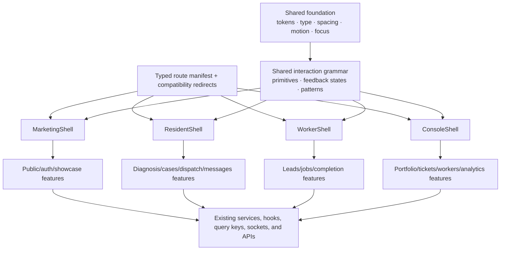
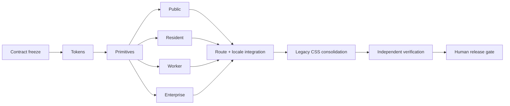

# House Maint AI UI Simplification Blueprint

**Status:** implementation-ready blueprint  
**Baseline date:** 2026-07-29  
**Scope:** public, resident, worker, enterprise, and shared web UI  
**Companion execution graph:** [`ui-clean-redesign-implementation.graph-contract`](./ui-clean-redesign-implementation.graph-contract)

## 1. Executive decision

House Maint AI should not be redesigned as one large collection of prettier pages. It should be replanned as:

> **One maintenance operating model, one interaction grammar, four role-specific shells, and a compatibility layer that protects every working behavior.**

The redesign should keep the platform's broad capability while replacing the presentation architecture that has accumulated around it.

The target is deliberately not “make every surface look identical.” A tenant taking a photo, a repair worker accepting a job, a property manager reviewing exceptions, and a visitor viewing the showcase need different density and navigation. They should still share the same semantic colors, type scale, spacing, controls, state feedback, accessibility behavior, and domain language.

The safe migration strategy is a strangler migration:

1. Freeze the current behavioral contract.
2. Build a shared foundation beside the existing UI.
3. Introduce four new shells.
4. Migrate one complete workflow slice at a time.
5. Keep old routes as compatibility redirects.
6. Retire legacy CSS only after replacement behavior has fresh evidence.

This is a product-architecture program with a UI result, not a cosmetic refactor.

## 2. What “cleaner without losing functionality” means

### 2.1 Clean means controlled complexity

A clean screen does four things:

1. Identifies the current case, job, or portfolio context.
2. Shows what matters now.
3. Offers one obvious primary next action.
4. Keeps evidence, history, and secondary controls available through progressive disclosure.

Clean does **not** mean:

- removing secondary capabilities;
- hiding status or safety information;
- flattening enterprise analytics into oversized mobile cards;
- replacing structured results with generic AI chat;
- changing domain behavior under visual work;
- preserving duplicate routes and known defects as if they were product requirements.

### 2.2 Functionality is a contract, not a pixel

A feature is preserved only when all applicable parts remain intact:

- route and deep-link behavior;
- role and permission behavior;
- API request and response shape;
- report and payment state transitions;
- query cache and invalidation behavior;
- storage and URL handoffs;
- socket subscriptions and optimistic updates;
- loading, success, empty, error, permission, and retry states;
- Chinese and English output;
- keyboard, screen-reader, mobile, and reduced-motion behavior;
- analytics and recovery actions.

The visual DOM can change completely while those contracts stay stable.

### 2.3 The primary product object is the maintenance case

The repository currently contains many page concepts, but the user's mental model is simpler:

```text
Issue → diagnosis → resolution choice → dispatch → repair → verification → record
```

The UI should organize resident, worker, and manager experiences around the same case and its six-stage operating loop:

| Stage | Resident question | Worker question | Manager question |
|---|---|---|---|
| Intake | Was my issue received? | Is this lead complete? | What arrived and where? |
| Diagnosis | Is it dangerous, and what is it? | What am I likely fixing? | How urgent and who is responsible? |
| Deflection | Can I safely solve it myself? | Is a visit still required? | Was a truck roll avoided? |
| Dispatch | Who is coming and when? | Should I accept this job? | Is the right worker responding? |
| Verification | Was it actually fixed? | What evidence must I submit? | Did it pass and relapse? |
| Reporting | What happened and what did it cost? | Was I paid and rated? | What is the SLA, cost, and quality trend? |

This model already exists in [`src/constants/operatingModel.ts`](../src/constants/operatingModel.ts). The redesign should make it the navigation and status vocabulary instead of inventing page-local stage names.

## 3. Repository-specific baseline

This blueprint is based on the actual repository rather than a generic React template.

| Baseline fact | Evidence | Design implication |
|---|---|---|
| 38 app route entries including the wildcard, plus 6 nested enterprise destinations | [`src/App.tsx`](../src/App.tsx), [`src/pages/EnterpriseDashboard.tsx`](../src/pages/EnterpriseDashboard.tsx) | Route parity must be machine-readable and complete. |
| 34 production page modules and 88 production component modules | `src/pages`, `src/components` | A page-by-page rewrite would be high risk. |
| About 23,100 lines across production page and component TSX | repository audit | Feature slices and shared primitives will produce more leverage than local cleanup. |
| 6 main source CSS files with about 9,100 lines and roughly 1,383 rule blocks | global, enterprise, analytics, showcase, and preview stylesheets | Styles need explicit layering and ownership. |
| 282 unique hex colors, 135 custom properties, 25 radius variants, and 37 shadow variants | static style audit | The app has multiple visual languages rather than one token system. |
| 22 pages directly recreate the centered mobile shell; 23 enforce a `max-w-md` layout in some form | page audit | Shell layout belongs in a shared component. |
| 16 pages use `BottomNav`, and those pages still implement their own headers | page audit | Navigation is shared only visually, not structurally. |
| `src/components/ui` contains only three infrastructure components while the app renders 266 buttons and 48 native form controls | component audit | The missing layer is a real primitive library. |
| 181 front-end tests in 35 files pass | `npm run test:unit:ui -- --reporter=dot` on 2026-07-29 | The migration starts from a healthy unit baseline. |
| Only 12 of 34 pages have direct page-level tests | test audit | Passing unit tests do not yet protect route and workflow parity. |
| Playwright defines 8 unique tests in 3 specs, executed for desktop Chrome and Pixel 5 | `npx playwright test --list` | E2E coverage must expand before legacy screens are retired. |
| Current build passes | `npm run build` on 2026-07-29 | The blueprint must keep the branch buildable at every integration checkpoint. |
| Current gzip output includes 245.32 kB entry JS, 120.02 kB vendor JS, 33.54 kB global CSS, and 136.43 kB for the metrics route | fresh Vite build | UI consolidation must also prevent bundle growth. |

### 3.1 Why the current UI feels busy

At least six visual systems coexist:

1. Resident Tailwind utility UI.
2. Apple/glass/Aegis public and authentication styling.
3. F1/neon/telemetry styling on the resident dashboard.
4. A split worker experience: a full-width dashboard plus resident-style detail pages.
5. Google/AEGIS/Tableau enterprise styling with a separate analytics subsystem.
6. An intentionally expressive showcase editorial system.

The problem is not that any single system is unusable. The problem is that operational screens inherit multiple systems at once.

Concrete examples:

- `primary` is blue in Tailwind v4 `@theme`, green in `tailwind.config.js`, and a third blue in the written UI standard.
- The v4 theme's `primary-dark` remains green while `primary` is blue.
- Several utility names used in components have no generated definition.
- [`src/enterprise.css`](../src/enterprise.css) is imported at the application root and changes global selectors used by non-enterprise pages.
- Worker job detail renders the resident bottom navigation, including a diagnosis destination a worker cannot use correctly.
- Cards, headers, form controls, status tones, shadows, and radii are repeatedly recreated at page level.

### 3.2 Why the current information architecture feels busy

Several route groups are aliases without a canonical redirect:

| Current duplicates | Recommended canonical destination | Compatibility policy |
|---|---|---|
| `/landing`, `/showcase` | `/showcase` | Redirect `/landing`, preserving query/hash. |
| `/match`, `/worker/match` | `/match` initially; later `/cases/:id/match` | Keep both until case-scoped routes are proven. |
| `/messages`, `/chat`, `/conversations` | `/messages` | Redirect list aliases; retain `/chat/:userId` compatibility. |
| `/enterprise/*`, `/enterpriseUI/*` | `/enterprise/*` | Redirect the legacy capitalized alias. |
| `/metrics`, `/enterprise/analytics` | `/enterprise/analytics` | Keep `/metrics` as a guarded redirect. |
| `/repair`, `/repair/:id`, case detail actions | `/cases/:id/repair` | Add case-scoped route before retiring legacy storage-based entry. |

Compatibility redirects should remain for at least two releases or 30 days of route telemetry, whichever is longer.

## 4. Behavior classification before redesign

“Do not lose functionality” must not accidentally mean “preserve every inconsistency.” Phase 0 assigns every current behavior one of five classifications:

| Class | Meaning | Examples |
|---|---|---|
| **P — Preserve** | Working product behavior with user value | authentication, photo diagnosis, case status, worker acceptance, messaging, localization |
| **C — Compatibility** | Old entry point retained as a redirect or adapter | route aliases, legacy session keys, callback URLs |
| **R — Repair** | Existing behavior is internally inconsistent or broken | ID mismatches, non-durable blob URLs, missing appointment persistence |
| **D — Demo-only** | Useful demonstration, not a measured production capability | selected enterprise mock panels, omnichannel simulation, device preview |
| **X — Deprecate** | Duplicate or unused implementation removable only after evidence | old page adapters and legacy CSS after cutover |

Known `R` items must receive their own defect IDs and regression tests. They must not be silently changed inside styling tasks:

- worker directory sends a worker ID to a route that reads it as a report ID;
- case cards navigate back to the list rather than the report detail;
- `/repair/:id` ignores the route parameter and depends on legacy session keys;
- diagnosis can place a non-durable browser `blob:` URL into report media;
- calendar selection does not persist the selected appointment;
- review route/report ID semantics do not match the submitted `booking_id` name;
- report-scoped chat can be opened without the required report ID;
- omnichannel simulation calls image analysis without an image;
- worker profile onboarding has two competing entry mechanisms.

These are contract repairs, not visual redesign work, even when repaired in the same release program.

## 5. Non-negotiable preservation ledger

| Capability | Invariant | Required evidence |
|---|---|---|
| Authentication | Preserve session bootstrap, cookie credentials, refresh deduplication, CSRF prewarm/retry, intended-route return, logout, and socket connect/disconnect. | Role/route integration tests for anonymous, user, tenant, worker, manager, and admin. |
| Authorization | Preserve the current access matrix until a separate product decision deliberately tightens it. | Direct-load and in-app navigation tests for every guarded route. |
| Camera and upload | Taking a photo must cleanly stop the camera stream and automatically produce an AI answer; denied camera permission must retain gallery/text fallback. | Unit failure matrix, Android Chrome smoke, iOS Safari smoke, and resident E2E. |
| Diagnosis | Preserve photo result, inquiry history, demand summary, six-stage plan, report creation, matching handoff, and clear error/retry states. | Deterministic provider fixtures plus photo-to-answer E2E. |
| Case lifecycle | Preserve report IDs, API state values, list/detail query keys, cache invalidation, status history, matching, repair, completion, review, and cancellation. | Contract tests for every state transition and route refresh. |
| Browser handoffs | Preserve `lastReportId`, `selectedWorker`, `lastProblemSolvingLoop`, and required legacy keys until a typed workflow store replaces them atomically. | Storage compatibility tests and refresh/back tests. |
| Matching | Preserve report-based matching, optional geolocation, scoring display, selection, and denial fallback. | Matching tests with and without location permission. |
| Worker operations | Preserve availability, leads, acceptance, job detail, AI-plan normalization, start/complete actions, notes, evidence, and profile refresh. | Full worker lifecycle E2E. |
| Client-facing plan | The maintenance plan remains concise, structured, and bilingual Chinese/English; raw provider JSON must not be presented as the client view. | Component contract and worker job page snapshots in both locales. |
| Messaging | Preserve report-scoped history, Socket.IO subscription, deduplication, optimistic send/rollback, read receipt, and reconnection behavior. | Socket integration tests plus offline/retry UI states. |
| Orders and payment | Preserve callback URLs, trusted server-side status refresh, order detail, cancellation, and retry. | Callback deep-link tests and deterministic payment fixtures. |
| Enterprise | Preserve properties, tickets, workers, analytics, AI configuration, market research, partial failures, and measured/demo/unavailable labels. | Manager/admin route and data-state matrix. |
| Supporting features | Preserve assets, community, library, calendar, notifications, orders, profile editing, theme, and device preview even when removed from primary navigation. | Route smoke and feature-state tests. |
| Localization | Preserve locale persistence and complete Chinese/English key parity. | Structural locale test and representative screenshots in both languages. |
| Showcase | Preserve the showcase content and navigation while keeping the firefly particle effect and click effect disabled. | Showcase unit test and motion preference test. |
| Credentials | AI provider keys remain server-side environment secrets and never enter client bundles, rendered configuration, snapshots, logs, or graph artifacts. Previously shared credentials should be rotated before release. | Secret scan and production-bundle inspection. |

## 6. Target product architecture



### 6.1 One foundation, four product shells

| Shell | Audience | Navigation | Density and behavior |
|---|---|---|---|
| `MarketingShell` | visitor, prospective manager, demo viewer | compact header, anchored sections, login/demo CTA | expressive typography and media; foundational focus, color, motion, and locale behavior still apply |
| `ResidentShell` | tenant, resident, owner | Home, Cases, Report, Messages, Profile | calm mobile-first flow, large touch targets, strong reassurance and status, one primary action |
| `WorkerShell` | repair worker | Jobs, Leads, Messages, Profile; availability in top context | action-oriented, denser job facts, persistent accept/start/complete action, no resident diagnosis tab |
| `ConsoleShell` | property manager, admin | Overview, Properties, Tickets, Workers, Analytics, AI Configuration | full-width sidebar/topbar, tables and charts, exception-first density, explicit data provenance |

`DevicePreview` remains a developer/demo utility shell and is excluded from customer navigation.

### 6.2 Proposed resident navigation

The current bottom navigation promotes the case library above messaging. The core lifecycle makes communication more important.

Recommended primary tabs:

1. **Home** — current cases, alerts, and next actions.
2. **Cases** — active and historical maintenance records.
3. **Report** — camera, upload, voice, video, and text intake.
4. **Messages** — report-scoped conversations.
5. **Profile** — assets, orders, calendar, notifications, community, library, settings.

No feature is removed. Lower-frequency capabilities move to contextual entry points:

- Calendar appears inside matching/case next steps and Profile.
- Orders and payment appear inside case detail and Profile.
- Library appears inside DIY resolution and Profile.
- Community appears inside Help/Profile.
- Assets appear inside report context and Profile.

### 6.3 Proposed worker navigation

1. **Jobs** — active and assigned jobs.
2. **Leads** — nearby available work.
3. **Messages** — report-scoped client/manager conversations.
4. **Profile** — availability, skills, service area, and settings.

The main job page always answers:

- What is wrong?
- Is it urgent?
- Where and when?
- What tools/materials should I bring?
- What is the next allowed status action?
- What evidence is required to finish?

### 6.4 Canonical case routes

Case-scoped URLs reduce storage coupling and make refresh/deep links reliable:

```text
/cases
/cases/:reportId
/cases/:reportId/repair
/cases/:reportId/match
/cases/:reportId/schedule
/cases/:reportId/messages/:userId
```

The existing `/reports/:id`, `/repair/:id`, `/match`, `/calendar`, and `/chat/:userId` entries remain compatibility paths until each case-scoped route has parity evidence.

## 7. Screen composition rules

Every operational page should use the same reading order:

1. **Page context:** title, back behavior, case/job/status context, optional secondary action.
2. **Current truth:** the smallest summary that explains what is happening.
3. **Primary next action:** one prominent action, disabled only with an explanation.
4. **Supporting facts:** evidence, worker, price, schedule, tools, materials, or metrics.
5. **History and advanced controls:** progressively disclosed.
6. **Persistent navigation:** supplied by the shell, not the page.

Additional rules:

- One visible `h1` per page.
- One primary button per task region.
- Status uses text/icon plus color, never color alone.
- AI output identifies confidence, source/state, and what the user should do next.
- Emergency/safety content precedes promotional or analytical content.
- Empty states explain both why the page is empty and the next useful action.
- Error states preserve input and offer a local retry.
- Fixed action bars reserve safe-area and content space; they may not cover content.
- Page components do not define their own global width, body background, or navigation.

## 8. Design foundation

Tailwind v4 `@theme` becomes the sole token source. `tailwind.config.js` remains only if a build requirement is proven and must not redefine the same semantics.

### 8.1 Semantic color contract

| Token | Light reference | Purpose |
|---|---:|---|
| `canvas` | `#f8f9fa` | page background |
| `surface` | `#ffffff` | primary surface |
| `surface-muted` | derived neutral | secondary groups |
| `text` | `#202124` | primary content |
| `text-muted` | `#5f6368` | supporting content |
| `border` | `#dadce0` | structure |
| `primary` | `#1a73e8` | main action and focus |
| `success` | `#34a853` | completed/healthy |
| `warning` | `#f9ab00` | attention/at risk |
| `danger` | `#ea4335` | emergency/destructive/error |

Dark values must be derived and contrast-tested as semantic pairs. Data-visualization palettes stay separate from interface status colors.

### 8.2 Scales

| System | Allowed scale |
|---|---|
| Spacing | `4, 8, 12, 16, 20, 24, 32, 48, 64` px |
| Radius | `8, 12, 16, 24, full`; 24 is reserved for major media/marketing surfaces |
| Elevation | `none, raised, floating, overlay` |
| Motion | `120, 180, 280` ms |
| Control height | 44 px minimum; 48 px for primary mobile actions |
| Typography | named caption, label, body, body-strong, title, page-title, display styles |

Rules:

- no arbitrary operational hex values outside reviewed data visualizations;
- no page-local shadow recipes;
- no `transition-all` in operational UI;
- continuous or decorative motion is off under `prefers-reduced-motion`;
- entrance animation cannot block interaction or communicate required state;
- Inter and Noto Sans SC remain the main Latin/Chinese families.

## 9. Component architecture

### 9.1 Layers

```text
src/
  app/
    router/          typed manifest, aliases, guards
    shells/          marketing, resident, worker, console
  styles/
    tokens.css
    foundations.css
    surfaces/
  components/
    ui/              behavior-free primitives
    patterns/        reusable interaction compositions
  features/
    public/
    resident/
    worker/
    enterprise/
  hooks/             existing server-state contracts
  services/          existing API/socket contracts
  types/             existing domain contracts
```

The migration creates feature adapters first. Existing hooks, services, types, and backend routes remain stable unless a separately tracked defect requires repair.

### 9.2 Required primitives

- `Button`, `IconButton`, `LinkButton`
- `TextField`, `Textarea`, `Select`, `Checkbox`, `Switch`, `SearchField`
- `Card`, `ListRow`, `Divider`, `Badge`, `StatusBadge`, `Avatar`
- `Tabs`, `SegmentedControl`, `BottomTabBar`, `Sidebar`, `Topbar`
- `Dialog`, `Sheet`, `Toast`, `Tooltip`
- `Spinner`, `Skeleton`, `EmptyState`, `ErrorBanner`, `InlineNotice`
- `Progress`, `Stepper`, `Timeline`

Every primitive owns:

- focus behavior;
- disabled and busy behavior;
- accessible naming;
- minimum target size;
- light/dark styling;
- locale-safe wrapping;
- tests.

### 9.3 Shared patterns

- `PageHeader`
- `PageSection`
- `StickyActionBar`
- `AsyncContent`
- `FormSection`
- `StatusSummary`
- `MediaCapture`
- `ChatComposer`
- `JobStepper`
- `MetricCard`
- `FilterBar`
- `DataTable`

### 9.4 Domain components

- `CaseSummary`
- `SeverityAndSafety`
- `DiagnosisResult`
- `MaintenancePlan`
- `WorkerMatchCard`
- `AppointmentSummary`
- `JobEvidence`
- `PaymentSummary`
- `ConversationThread`
- `OperatingLoopStatus`
- `PortfolioException`

The existing diagnosis, calendar, repair, profile, and enterprise analytics subcomponents are good decomposition starting points. They should be adapted rather than discarded.

## 10. State and integration architecture

### 10.1 Typed route manifest

Move route metadata out of JSX into a typed manifest containing:

- canonical path;
- compatibility paths;
- shell;
- allowed roles;
- page loader;
- breadcrumb/context label;
- primary navigation membership;
- analytics route name.

Generate route smoke cases from the same manifest. `APP_ROUTE_PATHS` should no longer be a second manually maintained list.

### 10.2 Separate navigation data from navigation visuals

`BottomTabBar` is a visual primitive. Resident and worker navigation arrays are separate role-specific models. Badge queries are supplied through typed item data rather than hard-coded inside the visual component.

### 10.3 Preserve server-state boundaries

- React Query remains authoritative for reports, assets, and community data.
- Existing query keys and invalidation are frozen in the functional contract.
- Socket.IO remains authoritative for live messages and read receipts.
- Component state is limited to view interaction.
- Storage handoffs are wrapped in a typed `workflowSession` adapter before replacement.
- API/provider secrets never enter browser state.

### 10.4 Model every async state

Each data-backed feature publishes fixtures for:

```text
loading | populated | empty | recoverable-error | permission-denied | stale/offline
```

Destructive or high-stakes mutations additionally publish:

```text
idle | confirming | submitting | succeeded | failed-with-preserved-input
```

## 11. Migration program

Effort bands are engineering estimates, not calendar promises. Parallel work is allowed only after contracts and writer territories are frozen.

| Phase | Effort | Outcome | Blocking exit gate |
|---|---:|---|---|
| 0. Contract freeze | 3–5 days | route/role manifest, behavior ledger, API/event/storage map, screenshots, baseline receipts | current build and 181 UI tests pass; all routes classified |
| 1. Foundation | 4–6 days | semantic tokens, type/spacing/motion/focus, core primitives, component preview | primitive unit/a11y tests and contrast checks pass |
| 2. Shells and routing | 4–6 days | four shells, role navigation, typed route manifest, compatibility redirects | every route loads under the correct role/locale/viewport |
| 3. Resident vertical slices | 8–12 days | diagnosis, cases, repair/match/schedule, messages/payment, supporting features | resident critical journey and state matrix pass |
| 4. Worker vertical slices | 5–8 days | worker shell, leads, jobs, bilingual plan, completion, messaging | worker accept-to-complete E2E passes |
| 5. Enterprise vertical slices | 6–9 days | console shell, tickets/workers/properties, analytics/config | manager/admin data and partial-failure matrix pass |
| 6. Integration and legacy consolidation | 4–6 days | locale merge, alias redirects, global CSS isolation, compatibility imports | no global style leakage; bundles within budget |
| 7. Hardening and controlled rollout | 5–7 days | cross-browser, a11y, visual, performance, telemetry, rollback evidence | independent verification and product approval |

Estimated total: **39–59 engineer-days**, reducible in calendar time through the four isolated surface branches in the companion graph.

### 11.1 Migration dependency graph



The full typed DAG, budgets, owners, writer territories, joins, recovery behavior, and stop conditions are in [`ui-clean-redesign-implementation.graph-contract`](./ui-clean-redesign-implementation.graph-contract). The delivery-agent command model and the durable product policy-agent model are deliberately separate and are defined in [`ui-agentic-delivery-command-program.md`](./ui-agentic-delivery-command-program.md), [`maintenance-policy-agent-architecture.md`](./maintenance-policy-agent-architecture.md), the separate runtime implementation DAG [`maintenance-policy-runtime-implementation.graph-contract`](./maintenance-policy-runtime-implementation.graph-contract), and the final client-adoption DAG [`maintenance-case-progress-adoption.graph-contract`](./maintenance-case-progress-adoption.graph-contract).

## 12. Atomic implementation backlog

| ID | Atomic output | Depends on | Definition of done |
|---|---|---|---|
| C-01 | route/alias/role manifest | — | all 38 app entries and 6 enterprise destinations represented |
| C-02 | functionality preservation ledger | — | every route capability classified P/C/R/D/X |
| C-03 | API, socket, storage, query contract map | — | every UI read/write and handoff has an owner |
| C-04 | representative zh/en state screenshots | — | primary routes captured at mobile/desktop states |
| F-01 | semantic token file | C-01–04 | one source for light/dark color, type, spacing, radius, elevation, motion |
| F-02 | control primitives | F-01 | typed APIs, keyboard behavior, busy/disabled states, tests |
| F-03 | feedback/overlay primitives | F-01 | named dialogs, focus trap/restore, Escape, live announcements |
| F-04 | page/navigation patterns | F-02–03 | headers, shells, tab bars, async states, sticky actions |
| S-01 | typed router and compatibility redirects | C-01, F-04 | query/hash/deep links and role guards preserved |
| S-02 | `MarketingShell` | F-04 | public/auth/showcase parity |
| S-03 | `ResidentShell` | F-04 | resident navigation and safe-area parity |
| S-04 | `WorkerShell` | F-04 | worker-only navigation and availability context |
| S-05 | `ConsoleShell` | F-04 | desktop/mobile enterprise navigation parity |
| R-01 | diagnosis photo-to-answer slice | S-03 | camera/upload/text, result, retry, stream cleanup pass |
| R-02 | case list/detail slice | R-01 | list, filtering, detail, status, refresh and deep link pass |
| R-03 | repair/match/schedule slice | R-02 | case-scoped handoff, geolocation fallback, booking pass |
| R-04 | messages/order/payment/review slice | R-02 | report scope and callback trust pass |
| R-05 | assets/library/community/profile slice | S-03 | all secondary routes and states pass |
| W-01 | worker lead/dashboard slice | S-04 | availability, refresh, accept and error paths pass |
| W-02 | worker job lifecycle slice | W-01 | bilingual plan, start, chat, completion and evidence pass |
| E-01 | enterprise overview/ticket/worker slice | S-05 | filters, drill-down, provenance and partial failures pass |
| E-02 | enterprise analytics/config slice | E-01 | measured/demo labels, config persistence, budgets pass |
| I-01 | locale and route integration | S-02–05, R-01–05, W-01–02, E-01–02 | locale trees match; all aliases and shells integrate |
| L-01 | global CSS isolation | I-01 | enterprise and showcase styles cannot leak globally |
| L-02 | token/utility retirement | L-01 | conflicting colors and orphan utilities removed |
| Q-01 | route/role/state automated suite | C-01, I-01 | complete route and async-state matrix passes |
| Q-02 | critical journey E2E suite | R-04, W-02, E-02 | resident, worker, manager/admin, and public journeys pass |
| Q-03 | a11y/responsive/visual suite | Q-01–02 | thresholds below pass |
| Q-04 | bundle and runtime suite | L-02 | budgets, console, network, and Web Vitals pass |
| G-01 | release/rollback receipt | Q-03–04 | product owner approves verified hashes and rollback |

Each row has one atomic output. The graph contract further enforces one writer per target and smallest-unit retry.

## 13. Verification gates

### 13.1 Functionality

- 100% automated coverage of all 38 app route entries and 6 nested enterprise destinations.
- 100% parity for role guards, aliases, deep links, query/hash state, refresh, and browser back.
- Zero API writes, socket subscriptions, analytics events, payment states, locale keys, or recovery actions removed without an explicit replacement.
- Every data-backed route tested in all applicable loading, populated, empty, error, permission, and retry states.
- No critical E2E failure; flaky retry rate below 1% over 20 CI runs.

Critical journeys:

```text
Resident:
login → capture/upload → AI answer → inquiry → report → match → schedule →
message → repair verification → payment/review

Worker:
login → availability → lead → accept → bilingual plan → start →
message → complete → evidence

Manager/Admin:
role gate → dashboard → filter → ticket/evidence drill-down →
worker/analytics → AI configuration

Public:
welcome/showcase → locale switch → correct authentication entry
```

### 13.2 Accessibility

- Zero critical or serious automated accessibility violations on every primary route/state in both locales.
- 100% of controls have programmatic names.
- Validation is associated through `aria-describedby`, and async failures are announced.
- Dialogs are named, focus-contained, Escape-closeable, and focus-restoring.
- All actions are keyboard operable with visible focus.
- Text contrast is at least 4.5:1; control and focus contrast at least 3:1.
- Interactive targets are at least 44×44 px.
- Reduced-motion preference removes nonessential continuous and entrance motion.

This directly addresses the audit baseline:

- no explicit `htmlFor` associations were found among current labels;
- seven overlays lack complete dialog semantics;
- clickable non-button cards exist;
- bottom navigation uses menubar semantics without a matching keyboard model;
- diagnosis progress/chat lack complete live-region semantics;
- 15 page modules have no `<main>` landmark.

### 13.3 Responsive behavior

Automated widths:

```text
320, 375, 768, 1024, 1440 CSS px
```

Required special checks:

- 200% zoom;
- portrait and short landscape;
- iOS/Android safe areas;
- soft keyboard in diagnosis and chat;
- fixed navigation/action overlap;
- long Chinese and English text;
- real-device Android Chrome and iOS Safari camera smoke.

No root horizontal overflow, clipped primary action, or unreachable content is allowed.

### 13.4 Performance

- Freeze a fresh-build baseline before each phase.
- No phase may regress initial compressed assets by more than 5%.
- Final initial JS: at most 300 kB gzip.
- Final initial CSS: at most 35 kB gzip.
- Enterprise analytics route: at most 150 kB gzip.
- No route chunk may grow by more than 10 kB gzip without an explicit budget receipt.
- P75 targets: LCP ≤ 2.5 s, INP ≤ 200 ms, CLS ≤ 0.1.
- No unexplained console errors, unhandled rejections, failed network calls, or duplicate request loops.

### 13.5 Testing

- UI coverage: at least 80% lines/functions and 70% branches.
- Critical workflow/state modules: at least 90% lines/functions and 85% branches.
- Playwright runs in CI for desktop/mobile Chromium and mobile WebKit.
- Traces, screenshots, and video are retained on failure.
- Representative route/state visual snapshots are reviewed in both locales.
- The current 35-file/181-test UI suite remains green throughout migration.

## 14. Agent collaboration operating model

The temporary engineering team is governed by the [delivery command program](./ui-agentic-delivery-command-program.md). The product's server-side, multi-agent maintenance workflow is governed separately by the [policy-agent architecture](./maintenance-policy-agent-architecture.md); product agents produce proposals and evidence, while a deterministic policy service controls case state and external effects.

### 14.1 Ownership

| Owner | Exclusive responsibility |
|---|---|
| Integration owner | blueprint, route contract, shell boundaries, joins, locale integration, final decisions |
| Workflow contract owner | behavior ledger, API/query/socket/storage invariants |
| Design-system owner | tokens, primitives, interaction grammar |
| Public owner | marketing, authentication, callback, and preview surface |
| Resident team | diagnosis, cases, dispatch, communication, resident secondary features |
| Worker owner | worker shell and job lifecycle |
| Enterprise owner | console, analytics, and configuration |
| Independent quality owner | route, E2E, a11y, responsive, visual, performance receipts |
| Product approval owner | human clarity and release/rollback decision |

### 14.2 Communication protocol

- Workers exchange typed artifacts, not prose-only “done” messages.
- Every artifact records source hash, output hash, verifier result, and known limitations.
- A surface branch may not edit another branch's pages, styles, locale files, or tests.
- Locale edits are merged only by the integration owner from branch copy manifests.
- A failed node retries only its writer territory after the diagnosis changes.
- Verified sibling work is never replayed to compensate for an unrelated failure.
- Any route, API, permission, or state-machine change exits the UI lane and becomes a separately reviewed domain change.

## 15. Rollout and rollback

### 15.1 Controlled cutover

1. Add a route-level `ui_v2` switch, scoped by role and environment.
2. Launch internal users first.
3. Launch a small resident cohort, then workers, then managers/admins.
4. Compare completion, error, abandonment, time-on-task, and support signals.
5. Increase exposure only when current and new contracts have parity.
6. Keep old page adapters and CSS checkpoints until the deprecation window closes.

### 15.2 Rollback

Rollback changes only route mapping and the failed surface bundle:

- no database rollback is required for visual-only work;
- compatibility redirects remain;
- old adapters remain importable during the window;
- state, API, and storage contracts are unchanged;
- failed verification artifacts are discarded without reverting verified sibling surfaces.

### 15.3 Legacy deletion rule

Legacy UI can be removed only when:

1. every old route resolves to a verified replacement;
2. no live import references the old module;
3. route telemetry shows the compatibility window has elapsed;
4. the replacement owns every async state and mutation;
5. visual, functional, accessibility, and bundle receipts are fresh;
6. rollback remains possible from a versioned checkpoint.

## 16. Success scorecard

### Product clarity

- ≥80% unassisted completion of photo → answer → worker dispatch.
- Median completion under 3 minutes, matching the existing PRD.
- SUS ≥68 in resident usability testing.
- One visible primary action in each task region.
- Worker can identify scope, tools, status, and next action without reading raw JSON.

### System coherence

- One semantic token source.
- Four product shells plus one development-only preview shell.
- One shared page header per shell profile.
- One navigation primitive with separate resident and worker models.
- At least 90% reduction in hard-coded operational hex values.
- No more than five intentional radius values.
- Zero root-level enterprise/showcase style leakage.
- All operational forms and overlays use shared primitives.

### Preservation

- 100% route/role/deep-link contract coverage.
- 100% Chinese/English structural key parity.
- Zero lost API mutation, socket behavior, payment state, or recovery action.
- Camera-to-answer, bilingual maintenance plan, and disabled showcase effects remain explicitly protected.

## 17. Decisions now fixed

1. Use first principles and the six-stage maintenance loop as the information model.
2. Use one shared foundation, not one identical visual treatment.
3. Use four role-specific product shells.
4. Make Tailwind v4 `@theme` the token source of truth.
5. Use Google/Aegis blue `#1a73e8` as the initial primary reference, subject to contrast validation.
6. Make Messages a resident primary destination; move Library to contextual/secondary navigation.
7. Give workers their own navigation model.
8. Preserve all old URLs through redirects/adapters during migration.
9. Migrate by complete vertical workflow, not by “all buttons” or “all cards” across unfinished screens.
10. Require evidence before any legacy route, page, style, or interaction is deleted.

## 18. Phase 0 start checklist

- [ ] Snapshot the current route, role, API, query, socket, storage, and analytics contracts.
- [ ] Assign P/C/R/D/X to every route capability.
- [ ] Turn the route manifest into executable deep-link/guard tests.
- [ ] Capture representative Chinese/English states at mobile and desktop widths.
- [ ] Add front-end coverage reporting to the UI Vitest configuration.
- [ ] Put Playwright in CI with current desktop/mobile projects.
- [ ] Add deterministic AI, payment, map, upload, and socket fixtures.
- [ ] Record current compressed bundle and runtime baselines.
- [ ] Rotate provider credentials that have left controlled secret storage.
- [ ] Freeze the architecture-spec hash before foundation work begins.

The project should not enter visual migration until this checklist has a verified receipt. That is the mechanism that allows the UI to become substantially cleaner without losing the platform's actual value.
