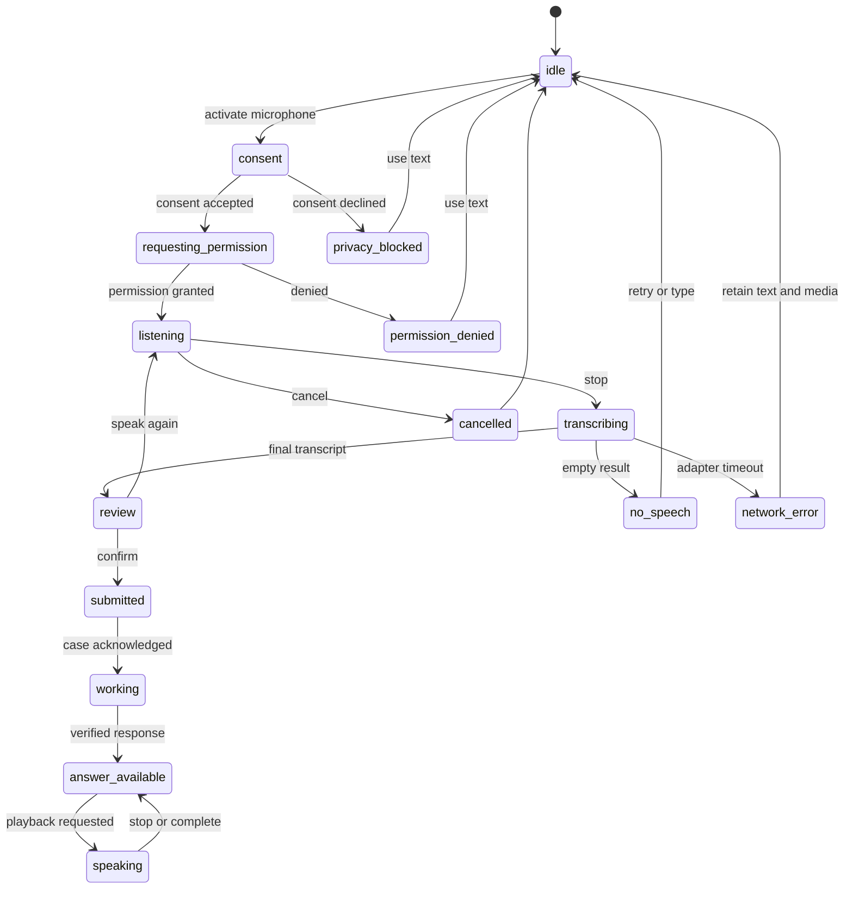

# Voice-First Sol Multi-Agent Blueprint

**Status:** implementation-ready target plan  
**Repository baseline inspected:** 2026-07-29  
**Requested command profile:** “Sol 0.6,” represented by the deployable capability `command.high_reasoning.v1` with preferred model `gpt-5.6-sol`  
**Companion architecture:** [`maintenance-policy-agent-architecture.md`](./maintenance-policy-agent-architecture.md)  
**Delivery command program:** [`ui-agentic-delivery-command-program.md`](./ui-agentic-delivery-command-program.md)  
**Static implementation DAG:** [`voice-first-sol-multi-agent-implementation.graph-contract`](./voice-first-sol-multi-agent-implementation.graph-contract)

## 1. Outcome and architectural decision

The product should feel like one calm maintenance assistant, not a collection of forms or visible agents:

1. The resident speaks or types the problem and may add a photo.
2. The system shows what it heard before submitting it.
3. The system immediately acknowledges the request and reports honest progress.
4. The answer is displayed in Chinese and English and may be read aloud.
5. The user always sees one safe next action and a manual fallback.

Voice is an accessibility and speed layer over the existing interface. It is not the only way to use the product. Text, camera, gallery, keyboard, screen-reader, manual-service, and emergency paths remain fully functional.

The backend decision is:

> **Sol proposes the execution plan. Lower-cost specialists produce typed evidence. Deterministic policy code decides what the system may do.**

“Sol commands” means it emits an accepted, typed plan for the dispatcher. It does not call arbitrary tools, write shared state, charge money, assign a worker, send a notification, or close a job.

The repository does not currently contain a confirmed provider deployment named “Sol 0.6.” The requested command tier is therefore a server-side capability binding:

```text
command.high_reasoning.v1 -> preferred deployment gpt-5.6-sol
```

Startup must probe that deployment. If the probe fails, the system uses a deterministic `safe-core-v1` workflow and discloses degraded mode; it must not silently replace the commander with a weaker model.

## 2. First-principles requirements

| Fundamental fact | Product consequence | Testable rule |
|---|---|---|
| Speaking is faster than typing but recognition is uncertain. | Show an editable transcript before a case or command is submitted. | No consequential intent originates from unconfirmed speech. |
| Spoken output is transient. | Keep the complete answer visible and make playback optional. | Stop, replay, speed, locale, and text-equivalent controls are available. |
| A repair case may contain private media and safety risks. | Consent, privacy, tenant, and emergency checks run before model work. | A denied gate results in no provider call and preserves a safe fallback. |
| Models are probabilistic and providers fail. | Agents emit proposals; schema, policy, and evidence evaluators control visibility. | Malformed, stale, unsafe, or cancelled artifacts cannot advance a case. |
| Most cases do not need every specialist. | Register more than ten roles, but activate only the smallest useful subset. | The dispatcher enforces required/optional tasks, budgets, and cancellation. |
| State, payment, assignment, and external messages have consequences. | Deterministic services remain sole authorities. | No model adapter imports the database or effect-delivery adapters. |
| Users care about resolution, not agent choreography. | Show one conclusion, one next action, safety information, and truthful progress. | Internal model/provider names and traces never appear in client payloads. |

## 3. Repository facts and gaps

The design reuses the project instead of treating it as a generic React application:

- `src/components/diagnosis/InquiryChat.tsx` already supports camera, gallery, text inquiry, image preview, and retake.
- `src/components/diagnosis/DiagnosisWizard.tsx` still performs some browser-side AI/report handoff and must become a client of the server-authoritative case intent.
- `src/pages/WorkerJobPage.tsx` currently calls the plan API directly and still contains Chinese-only presentation paths.
- `src/components/worker/MaintenancePlanCard.tsx` is the structured bilingual visual baseline for worker plans.
- `src/components/VoiceRecordButton.tsx` can capture `MediaRecorder` audio, but it has no transcription, editable review, privacy contract, or spoken feedback. Its silent metadata-only fallback can falsely imply that useful audio was accepted.
- `src/pages/QuickReportPage.tsx` treats voice as an optional attachment and still requires typed description.
- `server/routes/uploads.ts` accepts authenticated voice uploads and report storage has `voice_url`, but there is no ASR, transcript artifact, voice command, or TTS service.
- `server/routes/ai.ts` and `server/services/ai.ts` expose diagnosis, inquiry, planning, material, fault, turnover, problem-solving, and research capabilities.
- Current diagnosis, planning, and vendor claws can mutate reports through separate paths. They are not yet one command plane.
- `server/worker.ts` does not start through the root `dev:all` command.
- Model names are embedded in several agents. `OPENAI_CODEX_MODEL` currently defaults to `gpt-5.5`; no Sol commander adapter or startup capability probe exists.

The earlier policy architecture remains authoritative for `Case`, `AgentRun`, immutable artifacts, joins, decisions, approvals, outbox delivery, version cutover, and financial isolation. This blueprint adds the voice experience, command tier, model routing, and complete specialist registry.

## 4. Voice-first interaction blueprint

### 4.1 Shared interaction shell

Replace scattered input controls with one shared `VoiceComposer`:

- Primary control: **“Speak or type / 说出或输入问题”**.
- Secondary controls: camera, gallery, and progressively disclosed categories.
- During recording: elapsed time, input level, stop, and cancel.
- After recognition: editable transcript, uncertain-word highlighting, confidence hint, language selector, **Confirm and continue**, **Edit**, and **Speak again**.
- During work: truthful stage label, elapsed time, cancel where safe, and a text fallback.
- On answer: concise bilingual summary, safety note, one next action, evidence request when needed, and optional playback.

Do not use a continuous wake word in the initial release. The microphone is requested only after a deliberate user action.

### 4.2 Voice session state



The browser may use capability-detected speech recognition as an optimization. Server ASR requires an approved provider, region, processing purpose, retention policy, and deletion path. The initial privacy-preserving behavior is to submit the confirmed transcript and discard raw local audio unless the user explicitly opts into an approved upload.

### 4.3 Resident journey

1. Present one composer rather than a grid of equal-weight actions.
2. Ask for purpose-specific microphone consent.
3. Record and transcribe without creating a case.
4. Let the resident correct location, symptom, urgency, and uncertain words.
5. Confirm, then create one idempotent case intent.
6. Preserve the existing photo preview, retake, gallery, text, manual support, and emergency paths.
7. Show progress using the neutral `case-progress/v1` contract.
8. Display the verified bilingual answer first; offer TTS only after the text exists.

Camera coaching may speak framing guidance, but a photo answer must still preserve preview, retake, and manual correction.

### 4.4 Worker journey

- Display the structured Chinese and English maintenance plan.
- Add **Listen to plan**, **Repeat**, **Previous step**, **Next step**, **Pause**, and **Stop**.
- Allow speech-to-draft for work notes and evidence captions.
- Require an on-screen confirmation for accept, start, complete, reopen, dispatch, quote, payment, or any other state-changing action.
- Never use TTS as the only channel for a safety instruction or acceptance criterion.

### 4.5 Feedback contract

Every user-facing response has the same order:

1. **What we understood / 我们的理解**
2. **Safety first / 安全提示**, when applicable
3. **Recommended next action / 建议下一步**
4. **What is happening now / 当前进度**
5. **Fallback / 其他方式**, when automation is unavailable

TTS reads a shortened `SpokenResponseProposal`; it does not read raw JSON, provider output, legal conclusions, hidden reasoning, long tool lists, or internal agent status.

### 4.6 Accessibility and privacy invariants

- All functions are keyboard operable, have visible focus, and expose named controls at least 44×44 CSS pixels.
- Recording and TTS status use a restrained live region; do not duplicate an assertive screen reader announcement with automatic speech.
- Respect reduced motion, muted audio, and no-autoplay preferences.
- Locale is explicit (`zh-CN` or `en-US`) and user-correctable; auto-detection is not a policy fact.
- Browser TTS is user-triggered and local; server TTS requires separate purpose-specific consent and sends only the approved short speech artifact to an approved region.
- No raw audio, transcript content, personal media, API key, provider payload, prompt, or hidden reasoning enters analytics, receipts, sockets, or browser logs.
- Media references are opaque, tenant- and case-scoped, expiring identifiers—not public URLs or durable `blob:` values.
- Consent withdrawal and erasure propagate to audio, transcripts, artifacts, queues, caches, and approved processors.

## 5. Runtime command topology

```mermaid
flowchart LR
    UI["Voice, text, photo UI"] --> G["Deterministic auth, consent, privacy<br/>and static emergency gate"]
    G --> ASR["Approved ASR when needed"]
    ASR --> CR["Editable transcript review<br/>and explicit confirmation"]
    G -->|"typed input"| CR
    CR --> CI["Deterministic canonical case input"]
    G -->|"validated photo-only intake"| CI
    CI --> EG["Deterministic emergency classification<br/>on confirmed input"]
    EG --> SOL["Sol commander<br/>command.high_reasoning.v1"]
    SOL --> PV["Deterministic plan, DAG, tool, budget and policy validator"]
    PV --> DP["Dispatcher<br/>leases, budgets, cancellation"]

    DP --> V["Voice and intent workers"]
    DP --> D["Diagnosis and hypothesis workers"]
    DP --> P["Plan, BOM, estimate and fault workers"]
    DP --> K["Retrieval, matching-criteria and completion workers"]

    V --> J["Typed artifact join"]
    D --> J
    P --> J
    K --> J
    J --> EV["Independent critic + deterministic evaluator pack"]
    EV --> SY["Sol synthesis or escalation proposal"]
    SY --> PO["Policy Orchestrator<br/>sole state and decision writer"]
    PO --> R["Safe bilingual display + optional TTS"]
    PO --> H{"Approval required?"}
    H -->|"yes"| A["Authenticated visual approval"]
    A --> O["Transactional outbox"]
    H -->|"no advisory effect"| R
    O --> X["Deterministic delivery adapter"]
```



Sol receives sanitized artifact references, policy capabilities, and available budget. It never receives API keys, unrestricted tools, raw hidden prompts, or permission to mutate shared state.

## 6. Agent registry: one commander plus fourteen specialists

The registry contains fifteen logical model-backed roles. These are capabilities, not fifteen permanent processes and not fifteen mandatory calls.

| ID | Logical role | Capability profile | Typed output | Existing anchor or implementation path | Hard prohibition |
|---|---|---|---|---|---|
| C0 | Sol command and synthesis | `command.high_reasoning.v1` | `SolPlanProposal`, `SynthesisProposal` | new `server/policy/commander/**`; concepts from problem-solving agent | no DB, approval, payment, assignment, notification, or closure |
| W01 | Voice transcription | `audio.asr.fast.v1` | `TranscriptArtifact` | new approved ASR adapter; browser optimization optional | no inferred consent; no raw audio in receipts |
| W02 | Intent and locale normalizer | `text.fast.structured.v1` | `CanonicalIntentProposal` | new adapter over confirmed transcript/text | no case creation or risk clearance |
| W03 | Conversation clarifier | `text.fast.structured.v1` | `ClarifyingQuestionProposal` | diagnosis inquiry adapter | ask one minimal question; no infinite conversation loop |
| W04 | Media quality assessor | `vision.fast.structured.v1` | `EvidenceQualityProposal` | diagnosis/PIPL-adjacent adapter | cannot override privacy or emergency block |
| W05 | Visual/text diagnosis | `vision.fast.structured.v1` | `DiagnosisArtifact` | `server/agents/diagnosis/agent.ts` | no report status, quote, dispatch, or message |
| W06 | Root-cause hypothesis analyst | `reasoning.medium.structured.v1` | `HypothesisArtifact` | MECE/hypothesis/five-why functions | no unsupported certainty |
| W07 | Repair-plan specialist | `reasoning.medium.structured.v1` | `MaintenancePlanProposal` | `server/agents/planning/agent.ts` | no binding quote or safety clearance |
| W08 | Material/BOM specialist | `text.fast.structured.v1` | `MaterialProposal` | `server/agents/material/agent.ts` | no purchase or inventory mutation |
| W09 | Time, cost, and SLA estimator | `text.fast.structured.v1` | `EstimateProposal` | new adapter using accepted plan/BOM | non-binding ranges only |
| W10 | Responsibility/fault adviser | `vision.fast.structured.v1` | `FaultAdvisoryProposal` | `server/agents/fault/agent.ts` | no legal or tenancy decision |
| W11 | Tenant-scoped knowledge retriever | `retrieval.grounded.v1` | `GroundedEvidenceArtifact` | knowledge/web-intel adapter with source isolation | no arbitrary web/tools or cross-tenant sources |
| W12 | Worker matching-criteria analyst | `text.fast.structured.v1` | `MatchCriteriaProposal` | new adapter over diagnosis and plan | no assignment, notification, or price |
| W13 | Bilingual response and speech composer | `translation.speech-script.v1` | `BilingualResponseProposal`, `SpokenResponseProposal` | new low-latency adapter | cannot omit or soften policy safety text |
| W14 | Independent critic and completion analyst | `critic.independent.v1` | `CriticReceipt`, `CompletionProposal`, learning candidate | new evaluator plus turnover concepts | cannot verify its own producing route or close/promote |

The turnover inspector, research swarm, executive analytics, field experiments, and offline learning remain registered auxiliary workflows:

- Turnover inspection reuses W04/W05/W14 with a turnover-specific contract.
- Research and web intelligence remain administrator-only, budget-gated, read-only, and isolated from case PII.
- Executive/analytics services consume redacted facts and receipts; they are not agents in the repair critical path.
- Learning creates candidates offline. A named human promotion gate is required before policy or knowledge changes.

### 6.1 Complete function ownership and migration matrix

“Integrate all functions” means every existing route or service has one target owner, artifact boundary, cutover rule, and fallback. It does not mean converting stable deterministic code into an LLM.

| Current route/service | Target agent or deterministic owner | Target artifact/effect | Cutover and fallback |
|---|---|---|---|
| `/api/v1/ai/diagnose`, `/diagnose/chat`, `/diagnose/inquiry` | W05 diagnosis and W03 clarifier behind the artifact adapter; privacy/emergency gates remain deterministic | `DiagnosisArtifact` or one `ClarifyingQuestionProposal` | Migrated cases call adapters through the dispatcher; compatibility endpoints stay advisory and cannot mutate reports. Retake/text/manual fallback remains. |
| `/api/v1/ai/diagnose/mece`, `/hypothesis`, `/checklist`, `/five-why`, `/solution` | W06 root-cause analyst plus W14 independent critic | `HypothesisArtifact`, evidence request, checklist or solution proposal | Fold into a bounded accepted plan when useful; legacy endpoints remain read-only advisory until clients migrate. Never expose hidden reasoning. |
| `/api/v1/ai/chat` | W03 for case clarification; W13 for safe response composition | typed conversation turn and bilingual response | New cases use case-scoped turns; legacy chat remains compatible and cannot become workflow authority. |
| `/api/v1/ai/problem-solving` and `problemSolvingAgent` | C0 command/synthesis plus W06/W14 bounded roles | `SolPlanProposal`, hypothesis/critic artifacts | Retain the all-in-one endpoint as legacy advisory only; it cannot manufacture leases, decisions, or client-visible provider contracts. |
| `/api/v1/ai/plan` and `planning/agent.ts` | W07 repair-plan specialist | `MaintenancePlanProposal` | `planned` requires evaluator and PolicyDecision; malformed/raw fallback cannot transition a migrated case. |
| `/api/v1/ai/material-bom` and `material/agent.ts` | W08 material/BOM specialist | `MaterialProposal` | Optional enrichment unless join policy requires it; no purchase/inventory write. |
| `/api/v1/ai/fault-attribution` and `fault/agent.ts` | W10 responsibility adviser | `FaultAdvisoryProposal` | Advisory with uncertainty and named human/legal review for consequential use. |
| `/api/v1/ai/turnover-compare` and turnover agent | W04/W05 evidence analysis plus W14 completion critic | turnover evidence and completion/rework proposal | Separate turnover episode; deterministic lifecycle owner decides closure. |
| `/api/v1/ai/research-market`, research swarm, web-intel | Existing admin-only research team behind a dedicated command/budget profile | cited read-only research brief | Never joins a repair case, receives case PII, or uses case budget. Budget/preflight failure returns an honest unavailable state. |
| `reports.ts`, `diagnostics_claw.ts`, `planning_claw.ts`, `vendor_claw.ts` | Policy Orchestrator, dispatcher, and legacy adapter | case transition, `AgentRun`, artifact ingestion, action proposal | Every mutator checks `workflow_engine_version`; legacy claws skip migrated cases. Reconciliation detects dual writers and status drift. |
| `uploads.ts`, `voice_url`, PIPL middleware | deterministic media/privacy service; W01 ASR receives only approved input | opaque media reference and `TranscriptArtifact` | Purpose/tenant/processor/region/TTL gate precedes ASR. Denial preserves text/photo/manual paths and performs no provider call. |
| `matching.ts` and vendor discovery | W12 proposes required skills/SLA; deterministic matcher ranks eligible workers | `MatchCriteriaProposal` then reversible match candidates | Assignment and notification require policy plus visible approval; legacy vendor claw skips migrated cases. |
| `payments.ts` checkout/webhook/orders | deterministic financial boundary only | user-initiated checkout, signed-webhook settlement, immutable ledger | No agent chooses an amount, settles, refunds, or pays out. Existing payment fallback and reconciliation remain. |
| worker portal, accept/start/complete report routes | deterministic lifecycle owner; W14 analyzes completion evidence | acceptance transition or `CompletionProposal` | Visible worker/customer confirmation and case-version check precede state change; failed verification keeps the case non-terminal. |
| messages, notifications, socket emissions | deterministic outbox executor; W13 may draft approved bilingual copy | payload-bound outbox event and delivery receipt | No model sends. Dequeue revalidates decision, approval, tenant, version, hash, epoch, expiry, and kill switch. |
| `knowledge.ts`, `learning.ts`, repair-pattern extraction, `patternCache.ts` | W11 retrieves approved evidence; W14 produces offline learning candidates; promotion service owns publication | cited retrieval artifact or versioned learning candidate | Migrated-case outcomes are read only after verified completion; no self-promotion. Cache invalidates on tenant, consent, policy, or source-version change. |
| analytics, company analytics, executive service | deterministic aggregators and optional read-only summarizer | redacted metric facts and labelled summary | Consume accepted receipts only; unavailable data stays unavailable; no case state or policy write. |
| field experiments, telemetry, AI usage, cache and research budgets | deterministic experiment/telemetry/budget control | cohort assignment, aggregate event, reservation/settlement receipt | No content logging, hidden cohort promotion, cross-tenant borrowing, or budget increase by an agent. |
| auth, assets, community, feedback, reviews, profiles | existing authenticated deterministic route owners | normal domain records and case feedback inputs | Preserve routes and authorization. Agents may read purpose-scoped artifacts only and never become CRUD authority. |

All report, AI, payment, matching, claw, completion, learning, and outbound-message mutators are included in the `workflow_engine_version` cutover audit. A migrated case is rejected if both legacy and policy writers are eligible.

## 7. Deterministic authorities

The following are intentionally not lower-cost model agents:

| Authority | Sole responsibility |
|---|---|
| Auth and tenant gate | identity, role, tenant scope |
| Consent/privacy/media gate | purpose, processor, region, retention, redaction, allow/block |
| Emergency classifier | conservative fixed rules and localized emergency guidance |
| Plan validator | schemas, acyclic task dependencies, allowed roles/tools, budget shares, join completeness |
| Dispatcher | immutable commands, leases, heartbeats, cancellation, fair scheduling, retry caps |
| Policy Orchestrator | compare-and-swap case state, `AgentRun`, join, decision, approval and outbox creation |
| Matching engine | deterministic eligible-worker scoring and reversible proposal |
| Payment boundary | user checkout, signed webhook settlement, ledger, reconciliation |
| Outbox executor | revalidated, idempotent delivery of an already-approved effect |
| Promotion service | versioned human approval for learning, policy, provider, and deployment changes |

No model may write `reports`, `orders`, matches, payments, notifications, approvals, policy, knowledge, or lifecycle state directly.

## 8. Typed command bus

### 8.1 Voice contract

```ts
type VoiceSessionV1 = {
  schema: 'house-maint.voice-session/v1';
  sessionId: string;
  locale: 'zh-CN' | 'en-US';
  consent: {
    version: string;
    accepted: boolean;
    processorKind: 'browser' | 'approved_server' | 'none';
  };
  recognition: {
    state:
      | 'idle' | 'requesting_permission' | 'listening' | 'transcribing'
      | 'review' | 'unavailable' | 'error' | 'cancelled';
    finalText?: string;
    confidence?: number;
    uncertainSpans?: Array<{ start: number; end: number }>;
  };
  feedback: {
    state: 'off' | 'ready' | 'speaking' | 'paused';
    mode: 'browser' | 'approved_server' | 'none';
    displayText?: string;
    spokenText?: string;
    audioRef?: string;
    expiresAt?: string;
  };
  nextAction: 'confirm' | 'edit' | 'retry' | 'type' | 'submit' | 'none';
};
```

Only a confirmed normalized text/intake artifact enters case progress. Browser provider details and raw audio do not.

Browser speech synthesis is local capability use and requires an explicit playback action, but no server processor consent. Server TTS is a separate, opt-in processing purpose; it may receive only an evaluator-approved `SpokenResponseProposal`, never the full case or transcript.

```ts
type TtsRequestV1 = {
  schema: 'house-maint.tts-request/v1';
  requestId: string;
  caseId: string;
  locale: 'zh-CN' | 'en-US';
  spokenResponseArtifactId: string;
  spokenResponseHash: string;
  consentRef: string;
  processorPolicy: {
    purpose: 'maintenance_answer_playback';
    approvedRegion: string;
    retention: 'ephemeral';
    deleteAfterSeconds: number;
  };
};

type TtsAudioArtifactV1 = {
  schema: 'house-maint.tts-audio/v1';
  requestId: string;
  opaqueAudioRef: string;
  locale: 'zh-CN' | 'en-US';
  contentHash: string;
  expiresAt: string;
  deletionState: 'scheduled' | 'deleted';
};
```

The server validates purpose, consent, processor approval, region, TTL, artifact hash, locale, and current policy epoch before TTS. Replay reuses the unexpired opaque reference or creates a newly approved request. Stop revokes playback locally; consent withdrawal or case erasure invalidates the reference and schedules processor deletion. If browser and server TTS are unavailable, the verified bilingual text and deterministic safety templates remain complete.

### 8.2 Sol plan contract

```ts
type SolPlanProposalV1 = {
  schema: 'house-maint.sol-plan/v1';
  planId: string;
  caseId: string;
  caseVersion: number;
  policyEpoch: number;
  objective: string;
  locale: 'zh' | 'en' | 'bilingual';
  riskTier: 'T0' | 'T1' | 'T2' | 'T3' | 'T4';
  inputArtifacts: ArtifactRef[];
  tasks: AgentTaskSpecV1[];
  join: JoinPolicySpecV1;
  proposedBudget: {
    maxCalls: number;
    maxInputTokens: number;
    maxOutputTokens: number;
    maxCostMinor: number;
    currency: 'CNY' | 'USD';
    deadlineAt: string;
  };
  fallbackPlanId: 'safe-core-v1' | 'manual-only-v1';
  escalationReasons: string[];
};
```

Each `AgentTaskSpecV1` names one registry role, dependencies, required/optional status, immutable input artifacts, output schema, allowed tools, denied data classes, timeout, budget share, and at most two attempts.

### 8.3 Worker envelope and receipt

```ts
type AgentTaskEnvelopeV1 = {
  schema: 'house-maint.agent-task/v1';
  runId: string;
  taskId: string;
  roleId: string;
  attempt: 1 | 2;
  caseRef: {
    caseId: string;
    tenantId: string;
    caseVersion: number;
    policyEpoch: number;
  };
  capabilityProfile: string;
  sanitizedInputs: ArtifactRef[];
  outputSchema: string;
  toolGrant: { allow: string[]; deny: string[]; expiresAt: string };
  lease: { leaseToken: string; leaseUntil: string; cancellationToken: string };
  budget: {
    maxInputTokens: number;
    maxOutputTokens: number;
    maxCostMinor: number;
    deadlineAt: string;
  };
};

type AgentRunReceiptV1 = {
  schema: 'house-maint.agent-receipt/v1';
  runId: string;
  taskId: string;
  roleId: string;
  attempt: 1 | 2;
  inputHash: string;
  policyEpoch: number;
  status:
    | 'succeeded' | 'needs_more_evidence' | 'blocked_policy'
    | 'retryable_failure' | 'terminal_failure' | 'cancelled';
  artifact?: ArtifactRef;
  confidence?: number;
  evidenceRefs: string[];
  safetySignals: string[];
  reasonCodes: string[];
  unknowns: string[];
  usage: {
    inputTokens: number;
    outputTokens: number;
    costMinor: number;
    latencyMs: number;
    routeId: string;
  };
};
```

Receipts exclude chain-of-thought, raw provider responses, unrestricted media URLs, personal content, and credentials.

## 9. Capability-based model routing

Durable task contracts use capabilities. Deployment configuration binds them to approved models:

| Capability | Preferred route | Fallback behavior |
|---|---|---|
| `command.high_reasoning.v1` | `gpt-5.6-sol`, after a successful startup probe | deterministic `safe-core-v1`; no silent weak-model downgrade |
| `vision.fast.structured.v1` | approved lower-cost multimodal route; existing Gemini adapter is a migration candidate | retake/manual review if no approved resident route |
| `text.fast.structured.v1` | approved low-latency schema-capable text route | deterministic parsing or omit optional enrichment |
| `reasoning.medium.structured.v1` | approved lower-cost reasoning route | safe partial advisory or manual review |
| `translation.speech-script.v1` | approved low-latency bilingual route | deterministic bilingual templates; display text remains |
| `critic.independent.v1` | route independent from the artifact producer | deterministic evaluator plus human review |
| `audio.asr.fast.v1` | browser-local or approved regional ASR | retain media/text and offer typing; do not fabricate transcript |

The router considers modality, risk, context size, schema reliability, latency, remaining budget, health, tenant policy, provider region, and processor approval. A worker cannot choose its own route or increase its budget.

Routing is driven by a deployment-owned manifest, not scattered model strings:

```ts
type ModelRouteManifestV1 = {
  schema: 'house-maint.model-routes/v1';
  manifestId: string;
  approvedAt: string;
  approvedBy: string;
  routes: Array<{
    routeId: string;
    capability: string;
    providerAdapter: string;
    deployment: string;
    modalities: Array<'text' | 'image' | 'audio'>;
    structuredOutput: 'native_schema' | 'validated_json' | 'none';
    maxInputTokens: number;
    maxOutputTokens: number;
    inputCostMinorPerMillion: number;
    outputCostMinorPerMillion: number;
    currency: 'CNY' | 'USD';
    approvedRegions: string[];
    allowedDataClasses: string[];
    latencyTargetMs: number;
    healthProbe: string;
    enabled: boolean;
  }>;
};
```

The checked-in manifest used by tests contains fake deployments only. A production manifest is loaded server-side, signed/versioned by the deployment owner, and must contain exact context, cost, schema, latency, region, and data-class limits before a real integration test is admitted. Route health does not confer privacy approval.

Initial migration candidates are explicit but are not approvals:

| Capability | Current reusable adapter | Evidence required before enabling |
|---|---|---|
| `command.high_reasoning.v1` | OpenAI Responses-style adapter, configured for `gpt-5.6-sol` only if the capability probe succeeds | endpoint/model availability, schema reliability, context/cost limits, approved region, no-downgrade behavior |
| `vision.fast.structured.v1` | existing Gemini Flash diagnosis/material/fault/turnover adapters | rotated secret, processor/region approval, image retention/deletion, schema/latency/cost replay |
| `text.fast.structured.v1` and `reasoning.medium.structured.v1` | existing DeepSeek/Gemini text adapters | rotated secret, exact deployment, context/cost/schema limits, residency and safety replay |
| `critic.independent.v1` | an approved route independent from the producing route | independence rule, conflict fixtures, cost cap and human fallback |
| `audio.asr.fast.v1` / approved server TTS | no approved server adapter exists yet | processor contract, purpose consent, region, TTL/erasure, audio/text handling and no-content logging proof |

Server configuration points to the approved manifest:

```text
COMMANDER_CAPABILITY=command.high_reasoning.v1
MODEL_ROUTE_MANIFEST_PATH=<server-managed approved manifest path>
MODEL_ROUTE_MANIFEST_SIGNATURE=<server-managed signature reference>
```

Values and credentials belong in the server secret/config layer, never the browser bundle or committed source. Credentials previously exposed in chat or development history must be revoked and replaced before any provider test.

## 10. Execution waves, joins, and budgets

| Wave | Work | Maximum active model tasks |
|---|---|---:|
| 0 | auth, consent, privacy, upload validation, and static emergency guidance during capture | 0 |
| 1 | W01 transcription when needed → editable transcript review → explicit user confirmation; then W02 normalization and W04 evidence quality where applicable | 2 |
| 2 | deterministic canonical-intake validation and emergency classification → C0 command proposal → deterministic plan validation | 1 |
| 3 | W05 diagnosis; W03 clarification or W06 hypothesis only when evidence requires it | 2 |
| 4 | W07 plan plus selected W08–W12 enrichments | 4 per case |
| 5 | W14 independent critic plus deterministic evaluator pack | 1 model critic |
| 6 | W13 concise bilingual display and speech proposal | 1 |
| 7 | deterministic policy decision, approval, state transition, and outbox | 0 |
| later episode | W14 completion evidence and offline learning candidate | 1 |

The minimum useful answer depends on accepted diagnosis, deterministic safety checks, and a concise plan. BOM, responsibility, retrieval, estimate, and matching criteria are optional unless the persisted join policy says otherwise.

Initial control limits:

- Four active model tasks per case.
- Twelve active model tasks globally, adjusted only from measured provider evidence.
- One initial Sol plan and at most one evidence-triggered replan.
- Two attempts per task, only after a changed diagnosis, input, route, or strategy.
- Cancel unstarted optional tasks at 80% of the reserved budget.
- Stop new calls at 100% and return the safest verified partial result.
- Suggested allocation: commander 15%, diagnosis/core plan 40%, enrichment 25%, evaluation/response 15%, recovery reserve 5%.

Sol proposes allocation. Deterministic budget services reserve, enforce, settle, and release it.

## 11. Failure, recovery, and escalation

| Failure | User behavior | Runtime behavior |
|---|---|---|
| microphone denied or unsupported | retain text/photo; show type/gallery/manual choices | no ASR call |
| silence or transcription timeout | preserve any draft; retry or type | discard unverifiable transcript; bounded retry |
| privacy/residency block | explain a privacy-safe alternative | no provider call; audit reason code without content |
| Sol unavailable or invalid plan | show degraded but useful path | use `safe-core-v1`; do not downgrade silently |
| required diagnosis fails | request retake/details or manual support | retry failed node only; no fabricated diagnosis |
| optional enrichment fails | show core answer without it | `partial_advisory`; cancel dependent optional work |
| conflicting required artifacts | show uncertainty and request evidence/review | critic, deterministic conflict policy, then human review or deny |
| stale lease, case version, or policy epoch | no stale result becomes visible | quarantine receipt; re-evaluate current case |
| budget exhausted | return safest verified partial answer | stop scheduling and release unused reservations |
| attempted agent state/effect write | no mutation | reject, quarantine, trip policy alert |
| approval expires or is revoked | request a new visible approval | outbox blocks delivery after revalidation |

Runtime modes are `enabled`, `advisory_only`, `review_only`, and `disabled`, plus a global emergency suspend. Voice, commander, worker capability, provider, tenant, and effect type can be disabled independently.

## 12. Agent Teams command program

### Program

- **Objective:** deliver a voice-first interface and a Sol-led, lower-cost specialist runtime that reduces user effort and time-to-safe-resolution without losing any current function.
- **Non-goals:** wake-word surveillance, autonomous payment/assignment/closure, legal decisions, live provider testing with exposed credentials, or exposing internal agent dialogue.
- **Finite actions:** inspect, freeze contracts, implement isolated foundations, adapt specialists, integrate, independently verify, stage, observe, and rollback.

### Control

- One integration commander owns the static graph state and accepts artifacts.
- Every workstream has one owner, one exclusive write territory, one typed deliverable, one verifier, a finite budget, and a stop condition.
- Strategic contract freeze, shared-schema integration, final verification, and release approval are serial.
- Voice UI, commander/router, agent adapters, and evaluator fixtures can run in bounded parallel only after their contracts are frozen.
- The prior UI and joint-adoption graphs retain their diagnosis, worker, and locale territories until a fresh `voice-territory-handoff` receipt proves their terminal approvals are current, no prior writer lease is active, and the new graph exclusively assumes those exact hashes. The graphs never run overlapping writers.

### Memory

- Graph state: `.agent-state/graphs/voice-first-sol-multi-agent-v1/{state.json,checkpoint.json,events.jsonl}`.
- Node artifacts: `.agent-state/graphs/voice-first-sol-multi-agent-v1/artifacts/`.
- Receipts: `.agent-state/graphs/voice-first-sol-multi-agent-v1/receipts/<node>/<attempt>/`.
- No credentials, raw audio, transcript content, personal photos, or hidden reasoning in command memory.
- Pre-existing dirty-worktree changes are recorded and preserved; a failed task restores only its declared territory.

### Bus

- Delivery agents exchange `house-maint.command/v1` receipts with source hashes, territory, artifact hash, evidence, decision, unknowns, and next action.
- Product agents exchange only `house-maint.agent-task/v1`, immutable artifact references, and `house-maint.agent-receipt/v1`.
- Prose messages do not release a dependency or certify completion.

### I/O

- Inputs: current route/API/lifecycle inventory, prior UI/runtime approval receipts, product policies, synthetic fixtures, approved provider capability configuration.
- Outputs: voice UI, typed command plane, specialist registry/adapters, safe progress/TTS responses, tests, rollback receipts, and staged release decision.

### Verifier

- Implementers do not issue their own final acceptance.
- Deterministic contract, safety, privacy, authority, locale, accessibility, performance, recovery, and sole-writer checks run before independent review.
- Terminal review covers the end-to-end resident and worker journeys, degraded mode, cancellation, stale artifacts, budget exhaustion, and rollback.

### Promotion

- Stage in shadow mode, then advisory-only, then a small internal cohort.
- A named human approves provider/region, voice retention, Sol route, risk-tier exposure, and production egress separately.
- Promotion requires fresh replay, privacy, accessibility, latency, cost, outcome, and rollback evidence.

## 13. Implementation workstreams

The companion static DAG is authoritative. Its bounded owners are:

| ID | Owner | Exclusive territory | Atomic deliverable | Independent verifier |
|---|---|---|---|---|
| T00 | Integration commander | graph state and contract artifacts | inspected baseline and admission receipt | architecture verifier |
| T01 | Voice contract architect | voice contract artifact only | UX, consent, state, locale and fallback contract | integration commander |
| T02 | Command contract architect | command contract artifact only | Sol/task/join/budget/routing contract | integration commander |
| T03 | Security/evaluation architect | safety contract artifact only | privacy, authority, fixture and promotion contract | integration commander |
| T04 | Contract integration owner | architecture-freeze artifact | compatible frozen architecture | independent architecture verifier |
| T04b | Cross-graph handoff owner | handoff receipt only | fresh predecessor approvals, source hashes, retired writer leases, and exclusive voice-extension territory lease | independent quality owner |
| T05 | Cross-plane contract owner | shared voice and command types only | `voice-session/v1`, Sol, task and receipt schemas | contract verifier |
| T06 | Commander/router owner | `server/policy/commander/**`, `server/policy/modelRouter/**` | Sol adapter, validator, registry and capability probes | runtime verifier |
| T07 | Dispatcher owner | policy dispatch/queue/budget territories | accepted plan → leased bounded runs | runtime verifier |
| T08 | Specialist adapter owner | `server/policy/adapters/**` | all current and new capabilities become artifact-only workers | evaluator owner |
| T09 | Voice server owner | server voice route/service/adapter territories | consent-bound ASR/TTS boundary and safe fallback | runtime verifier |
| T10 | Voice foundation owner | `src/components/voice/**`, `src/hooks/useVoiceSession.ts`, `src/services/voice.ts` | accessible shared voice session layer | UI verifier |
| T11 | Resident voice owner | diagnosis/resident integration territory | speak/type/photo → confirmed intent → answer | UI verifier |
| T12 | Worker voice owner | worker integration territory | bilingual plan playback and speech-to-draft notes | UI verifier |
| T13 | Runtime evaluator owner | evaluator and synthetic policy fixture territories | schema/safety/privacy/authority/voice checks | independent runtime verifier |
| T14 | Integration/startup owner | route, socket, locale and worker startup integration | reachable runtime and UI with feature flags | E2E verifier |
| T15 | Independent quality owner | receipts and test output only | fresh unit/integration/E2E/a11y/recovery evidence | human release owner |
| T16 | Human release owner | scoped approval receipt only | staged release or explicit rejection | product owner |

These are bounded ownership roles, not eighteen simultaneously spawned processes. One qualified delivery agent may execute compatible serial roles, while `agent-team` nodes use only their declared fixed subteam. Runtime specialist roles are registered independently and are activated per accepted Sol plan.

## 14. Verification scorecard

The plan is complete only when fresh evidence proves:

- A resident can speak or type, correct the transcript, add/retake a photo, receive a bilingual safe answer, hear an optional concise response, and use manual/emergency fallback.
- A worker can read and listen to the bilingual plan, navigate steps, dictate a draft note, and visibly confirm every state change.
- Permission denial, unsupported browser, silence, cancellation, unmount, network timeout, and failed case submission retain user work.
- No raw audio/transcript content or provider internals appear in analytics, sockets, receipts, or client contracts.
- Sol emits schema-valid bounded plans and cannot access state/effect adapters.
- At least fourteen specialist roles are registered, while a normal case activates only its accepted subset.
- Concurrency, tenant fairness, budget reservations, cancellations, leases, stale-result quarantine, retry caps, safe-core degradation, and kill switches pass synthetic tests.
- Existing diagnosis, inquiry, planning, material, fault, turnover, research, matching, payment, messages, notifications, analytics, knowledge, learning, and worker lifecycle behavior retains an explicit owner or adapter.
- Camera, gallery, text, routes, locales, deep links, sockets, report states, payment callbacks, and manual service keep compatibility.
- The UI passes keyboard, screen-reader, live-region, 320 px, mobile Chrome/WebKit, reduced-motion, and no-autoplay checks.
- Target interaction feedback is under one second after record activation; the ASR target is under three seconds after stop; approved text begins optional speech within one second. Progress becomes visible by two seconds and an honest fallback appears by ten seconds, with thresholds configurable from measured evidence.

## 15. Rollout and immediate command

1. Revoke and replace any provider credentials previously exposed in chat or local history.
2. Run the prior UI, runtime, and client-adoption release gates if their approval receipts do not yet exist.
3. Execute only the baseline and three contract branches of `voice-first-sol-multi-agent-v1`.
4. Freeze `voice-session/v1`, Sol/task/receipt schemas, the capability registry, safety boundaries, and acceptance fixtures.
5. Issue the fresh cross-graph handoff receipt; stop if any predecessor approval is stale or any earlier diagnosis/worker/locale writer lease remains active.
6. Implement shared contracts, commander/router, voice foundation, dispatcher, and adapters in the graph’s declared order.
7. Keep all new behavior behind independent voice, commander, and workflow feature flags in `advisory_only`.
8. Promote only after the independent verification and human release nodes accept fresh evidence.

Open product decisions do not block safe contract work, but they block production promotion: approved Sol endpoint/model availability, ASR/TTS processor and region, raw-audio retention policy, default voice-feedback preference, human-review SLA, and cohort/risk-tier exposure.
