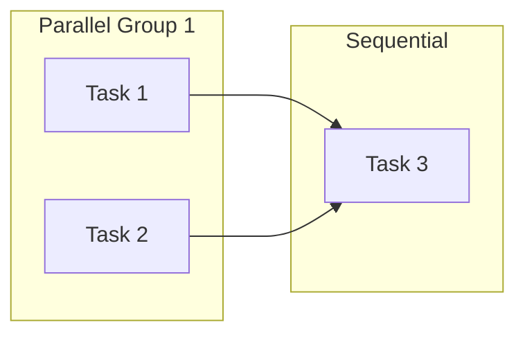

# Atomic Decomposition Skill

Break complex problems into atomic, AI-solvable units with dependency tracking.

## MECE+ Principles

| Principle | Description |
|-----------|-------------|
| **Mutually Exclusive** | No overlapping responsibilities |
| **Collectively Exhaustive** | Complete coverage of the problem |
| **Atomic** | Indivisible units of work |
| **Independent** | Solvable without coordination |

## Decomposition Template

```yaml
problem: "[Problem statement]"

atomic_tasks:
  - id: T1
    action: "[Verb] [Object]"
    input: "[What's needed]"
    output: "[What's produced]"
    agent: "[Assigned agent]"
    deps: []
    
  - id: T2
    deps: [T1]
    # ...
```

## Validation Checklist

Each atomic task must satisfy:

- [ ] Single responsibility (one action verb)
- [ ] Clear input/output contract
- [ ] No implicit dependencies
- [ ] Testable completion criteria
- [ ] < 100 word description

## Dependency Graph Generation



## Common Patterns

### Feature Implementation
```
Analyze → Design → Implement → Test → Document
```

### Bug Fix
```
Reproduce → Diagnose → Fix → Verify → Regress
```

### Refactoring
```
Audit → Plan → Extract → Transform → Validate
```

## Usage

Called by `manager-agent` during objective decomposition:

```yaml
skill: atomic-decomposition
input:
  objective: "[User goal]"
  constraints: "[Limitations]"
output:
  tasks: [atomic task list]
  graph: [dependency mermaid]
```
